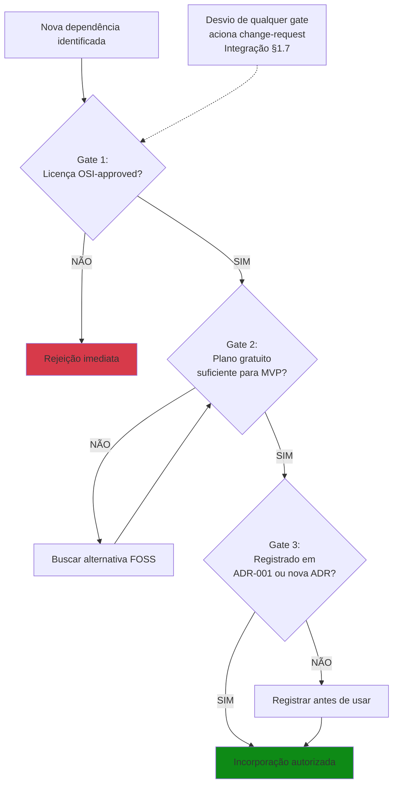

# ANÁLISE — RODADA 5 (Refinamento para Fechamento Definitivo)

## PARTE A — Auditoria Crítica: Inconsistências Detectadas e Soluções Ótimas

Auditoria cruzada da Seção 1 v1.0 contra a base documental vigente (TAP, OKB, Glossário, ADRs 001–004, Plano de Escopo v0.2). **6 achados**, sendo 3 críticos para esta seção e 3 externos (sinalizados para saneamento nos artefatos de origem, sem bloquear esta redação).

### A.1 — Achados Críticos (bloqueantes para esta seção)

| #            | Achado                                                                                                                                              | Localização na v1.0 | Conflito                                                                                                                                               | Solução Ótima                                                                                                                                                                                                                   |
| ------------ | --------------------------------------------------------------------------------------------------------------------------------------------------- | --------------------- | ------------------------------------------------------------------------------------------------------------------------------------------------------ | ---------------------------------------------------------------------------------------------------------------------------------------------------------------------------------------------------------------------------------- |
| **C1** | Plano assume**8 planos simultâneos no M1** ("sete planos subsequentes", "8 planos v0.1" no critério MF1)                                    | §1.1, §1.4, §1.8.1 | OKB §1.4 instituiu**entrega faseada**: M1 = 5 planos (Áreas 1–5); M2 = 3 planos (Áreas 6–8), como tailoring da Abordagem de Desenvolvimento | Reescrever §1.1; criar §1.4.1 (Estratégia de Entrega Faseada); corrigir critério MF1 em §1.8.1                                                                                                                                |
| **C2** | **ADR-004 ausente** (tasklists Markdown; rejeição formal de subissues)                                                                      | §1.5                 | Decisão emitida em 20/09 afeta diretamente a gestão do trabalho e o gate de fluxo                                                                    | Incorporar regra de tasklist em §1.3.2 (regra de fluxo) e §1.5.1, sem duplicar o DoD (pertence ao Escopo §2.6)                                                                                                                  |
| **C3** | **Infraestrutura operacional GitHub ausente** (5 milestones, sistema de 27 labels, padrão de cards ubíquos A/B, prioridade temporal P0–P3) | §1.3, §1.5          | OKB §9 formalizou estes elementos como mecanismos de integração e medição                                                                         | Criar §1.3.3 (Milestones e Identificação de Cards); reforçar §1.5.1 com padrão de redação —**sem replicar a taxonomia de 27 labels** (pertence à configuração do repositório; citar apenas a regra operacional) |

### A.2 — Achados Externos (não bloqueiam esta seção; reportar ao GP)

| #            | Achado                                                                                                                                                                                   | Artefato   | Severidade | Proposta                                                                                                                             |
| ------------ | ---------------------------------------------------------------------------------------------------------------------------------------------------------------------------------------- | ---------- | ---------- | ------------------------------------------------------------------------------------------------------------------------------------ |
| **C4** | TAP §3 (Métricas) define Cycle Time como*"do 'To Do' ao 'Done'"* — coluna **inexistente** no fluxo da ADR-002 (entrada = `Ready`); ADR-003 define *"In Progress → Done"* | TAP        | MÉDIA     | Plano adota a definição operacional da ADR-003. Propor correção cosmética no TAP: "To Do" → "In Progress" na próxima revisão |
| **C5** | Glossário, linha "Stakeholder":*"Prof. Nivaldo (avaliador)"* — viola convenção de nome completo                                                                                    | Glossário | BAIXA      | Corrigir para "Prof. Dr. Nivaldo Carleto" na próxima revisão do Glossário                                                         |
| **C6** | Matriz de rastreabilidade do TAP §5 mantém cabeçalho*"Fases EAP v2.0 Associadas"* — viola a regra de supressão de versões internas                                               | TAP        | BAIXA      | Find & replace: "EAP v2.0" → "EAP"                                                                                                  |

### A.3 — Auditoria de Invasão de Escopo entre Áreas (implacável)

| Conteúdo                                                | Tentação de inclusão                  | Decisão                                                      | Justificativa                                                                                       |
| -------------------------------------------------------- | ---------------------------------------- | ------------------------------------------------------------- | --------------------------------------------------------------------------------------------------- |
| Definição formal do CFD                                | Replicar em Cronograma/Comunicações    | **Mantida aqui (§1.6.1) como referência canônica**   | OKB §8.2 designa Integração §1.6.1 como definição formal; os demais planos apenas referenciam |
| DoR/DoD detalhado                                        | Duplicar critérios                      | **Excluído — apenas referenciado**                    | Pertence ao Plano de Escopo §2.6 (incluindo o item 8 da ADR-004)                                   |
| Taxonomia das 27 labels                                  | Replicar tabela completa                 | **Excluída — citada apenas a regra "mínimo 3 tags"** | Configuração do repositório; duplicação violaria GMV                                           |
| Decomposição da EAP                                    | Reproduzir fases/pacotes                 | **Excluída — referenciada ao TAP §4**                | Pertence ao Plano de Escopo §2.5                                                                   |
| RACI, Ishikawa, Matriz P×I, Roadmap de marcos detalhado | —                                       | **Excluídos**                                          | Recursos, Qualidade, Riscos e Cronograma, respectivamente                                           |
| Diagramas                                                | Incluir Gantt/EAP/Ishikawa nesta seção | **Excluídos — ver Tabela de Diagramas na Parte B**    | Somente 4 diagramas com necessidade real e pertencentes ao domínio da Integração                 |

**Nenhuma inconsistência residual bloqueante.** Procedo à redação integral v2.0.

---

## PARTE B — Redação Integral

# 1 INTEGRAÇÃO

**Plano de Gerenciamento da Integração**
**Projeto:** COGME — Conversor de Ganhos em Moeda Estrangeira
**Versão:** 2.0
**Data:** 20/09/2026
**Autores:** Leonardo David Silva Setti (GP), Fabricio de Lima Cabral, Edson Luis Silva
**Stakeholder-Avaliador:** Prof. Dr. Nivaldo Carleto — Fatec Taquaritinga / ADS

> *Este plano deriva diretamente das Premissas P1 (governança híbrida), P3 (SDD com LLM), P4 (código como deliverable) e P7 (stakeholder-avaliador único nos marcos), e das Restrições de Cronograma e Custo do TAP, respeitando o Domínio de Abordagem de Desenvolvimento e o Domínio de Trabalho do Projeto do PMBOK® 7ª edição.*

---

## 1.1 Identificação e Propósito

Este Plano de Gerenciamento da Integração coordena a execução integrada do projeto COGME, garantindo que os sete planos de área subsequentes — quatro entregues no marco M1 (Escopo, Cronograma, Custos, Qualidade) e três diferidos para o marco M2 (Recursos, Comunicações, Riscos), conforme a estratégia de entrega faseada da seção 1.4.1 —, o código-fonte e os artefatos de governança permaneçam coerentes com os Objetivos SMART aprovados no TAP.

**Função ontológica:** O TAP *autoriza*; este plano *coordena*. Ele não duplica conteúdo do TAP — define os mecanismos de coerência entre todos os artefatos do ciclo de vida.

- **Domínio PMBOK 7ª:** Abordagem de Desenvolvimento.
- **Processo PMBOK 6ª (dicionário, obsolescência assumida):** 4.2 — Desenvolver o Plano de Gerenciamento do Projeto.

---

## 1.2 Modelo de Governança Híbrida

O projeto adota um modelo trifásico de governança, declarado no TAP (§1.c):

| Camada                   | Fonte Normativa                                                                  | Função no COGME                                              |
| ------------------------ | -------------------------------------------------------------------------------- | -------------------------------------------------------------- |
| Governança primária    | PMBOK® 7ª edição — 12 Princípios + 8 Domínios de Desempenho               | Define*por que* e *para quê*; orienta decisões por valor |
| Dicionário complementar | PMBOK® 6ª edição — processos citados apenas para rastreabilidade acadêmica | Fornece vocabulário estrutural quando necessário             |
| Método de execução    | Manifesto Ágil (4 valores) + Kanban (fluxo contínuo)                           | Define*como* o trabalho é executado diariamente             |

> **[FIG-1 — Modelo de Governança Híbrida Trifásico]**
> *Inserir diagrama aqui.* Conteúdo obrigatório: três camadas empilhadas (PMBOK 7ª no topo como governança primária; PMBOK 6ª como dicionário complementar com marcação de obsolescência; Kanban/Manifesto Ágil na base como execução), com setas descendentes de autoridade e seta lateral de realimentação (lições aprendidas). Formato sugerido: Mermaid `flowchart TB` ou PlantUML, versionado em `/docs/diagrams/`.
> *Necessidade real:* o conceito de hierarquia normativa é o núcleo da blindagem acadêmica do projeto; a representação visual elimina ambiguidade de precedência para o avaliador.

### 1.2.1 Hierarquia de Resolução de Conflitos

Em caso de conflito entre fontes normativas, aplica-se a seguinte ordem de precedência:

1. Valor entregue ao usuário final (Domínio de Entrega — PMBOK 7ª)
2. Ementa da disciplina + orientação do Prof. Dr. Nivaldo Carleto
3. PMBOK® 7ª edição (princípios e domínios)
4. Manifesto Ágil + Kanban (método de execução)
5. PMBOK® 6ª edição (dicionário de processos)

**Trade-off declarado:** Esta hierarquia favorece velocidade de entrega sobre completude documental, alinhada ao Princípio "Foco em Valor" (PMBOK 7ª) e ao Valor Ágil "Software funcionando sobre documentação abrangente".

### 1.2.2 Papéis de Governança

| Papel                   | Titular                                   | Responsabilidade                                                                                                    |
| ----------------------- | ----------------------------------------- | ------------------------------------------------------------------------------------------------------------------- |
| Gerente de Projeto (GP) | Leonardo David Silva Setti                | Decisor operacional único; CCB de membro único; autoridade para aprovações, rejeições e controle de mudanças |
| Desenvolvedores         | Fabricio de Lima Cabral, Edson Luis Silva | Execução técnica; revisão em pares; self-report de carga horária                                               |
| Stakeholder-Avaliador   | Prof. Dr. Nivaldo Carleto                 | Avaliação acadêmica nos marcos M1–M4; sem ingerência em decisões operacionais                                 |

### 1.2.3 Governança Mínima Viável (GMV)

Todo artefato de governança deve justificar sua existência pelo teste GMV:

| Pergunta                                                             | Se SIM            | Se NÃO                  |
| -------------------------------------------------------------------- | ----------------- | ------------------------ |
| O Prof. Dr. Nivaldo Carleto exigirá este artefato na avaliação?   | Produzir completo | Simplificar ou eliminar  |
| Este artefato evita retrabalho futuro?                               | Produzir          | Avaliar custo-benefício |
| Este artefato é útil para a equipe (não apenas para avaliação)? | Produzir          | Eliminar                 |

Se ≥ 2 respostas forem NÃO, o artefato é candidato a simplificação ou eliminação. Decisão final do GP.

### 1.2.4 Obsolescência do PMBOK 6ª (Declaração Formal)

O PMBOK® 6ª edição (2017) é tratado exclusivamente como dicionário de processos. Processos preditivos são citados apenas para rastreabilidade acadêmica e blindagem terminológica. Métricas EVM (SPI/CPI) são declaradas **LEGADO — NÃO APLICÁVEIS**, substituídas por métricas de fluxo Kanban conforme ADR-003.

---

## 1.3 GitHub Projects como Fonte Única de Verdade (SSOT)

O repositório GitHub e seu módulo GitHub Projects constituem o artefato primário de integração, cronograma e monitoramento, conforme ADR-002. Esta decisão substitui qualquer ferramenta preditiva de planejamento como instrumento ativo.

**Justificativa:** Para uma equipe de 3 pessoas com fluxo contínuo, ferramentas preditivas impõem overhead de manutenção desproporcional ao valor gerado. O Kanban via GitHub Projects fornece visibilidade em tempo real, métricas nativas de fluxo e rastreabilidade automática via commits.

- **Domínio PMBOK 7ª:** Medição + Trabalho do Projeto.
- **Valor Ágil:** "Indivíduos e interações sobre processos e ferramentas."

### 1.3.1 Mapeamento Kanban ↔ Processos PMBOK 6ª

| Coluna Kanban (ADR-002) | Processo PMBOK 6ª                   | Domínio PMBOK 7ª | Regra Operacional                   |
| ----------------------- | ------------------------------------ | ------------------ | ----------------------------------- |
| Backlog                 | 5.2 Coletar Requisitos               | Planejamento       | Card criado com DoR pendente        |
| Ready (DoR)             | 4.3 Orientar Trabalho (preparação) | Trabalho           | DoR atendido; aguardando capacidade |
| In Progress             | 4.3 Orientar e Gerenciar Trabalho    | Trabalho           | WIP limit: máx. 3 cards/pessoa     |
| Code Review             | 4.5 Monitorar e Controlar            | Medição          | Revisão em pares obrigatória      |
| Done (DoD)              | 5.4 Criar EAP (aceite do pacote)     | Entrega            | DoD atendido; commit mergeado       |

> **[FIG-2 — Fluxo Kanban Oficial com WIP Limits]**
> *Inserir diagrama aqui.* Conteúdo obrigatório: as cinco colunas (`Backlog → Ready (DoR) → In Progress → Code Review → Done (DoD)`) com gates标注ados entre colunas (DoR na entrada de `Ready`; tasklist 100% + revisão de pares na entrada de `Code Review`; DoD na entrada de `Done`), e o WIP limit (3/pessoa) destacado sobre a coluna `In Progress`. Formato sugerido: Mermaid `flowchart LR`.
> *Necessidade real:* é o diagrama operacional central do projeto — materializa ADR-002 e ADR-004 em uma única visualização auditável pelo Prof. Dr. Nivaldo Carleto.

### 1.3.2 Regras de Fluxo e Rituais

**Regras de fluxo (ADR-002 e ADR-004):**

- **Pull system:** Cards migram para "In Progress" somente quando há capacidade disponível (WIP limit respeitado).
- **WIP limit:** 3 cards em "In Progress" por pessoa (Domínio de Equipe — prevenção de burnout, R3 do TAP §10).
- **Tasklists Markdown (ADR-004):** Cards com estimativa ≥ 6h ou múltiplos entregáveis devem possuir tasklist no corpo da Issue (mínimo 3, máximo 7 itens; último item obrigatoriamente "Validação final"). Subissues reais são **formalmente rejeitadas** — a unidade atômica de métrica e de backlog permanece o card pai. O card só migra para `Code Review` com 100% dos itens concluídos.
- **SDD com LLM:** Código gerado com apoio de IA passa por revisão humana obrigatória antes do merge. Commits declaram co-autoria.

**Rituais (ADR-002):**

| Ritual            | Formato                            | Cadência | Duração |
| ----------------- | ---------------------------------- | --------- | --------- |
| Daily assíncrona | GitHub Issues                      | Diária   | 15 min    |
| Refinement        | Product Backlog (GitHub Projects)  | Semanal   | 30 min    |
| Retrospectiva     | Risk backlog + lições aprendidas | Quinzenal | 30 min    |

**Nota:** Sprints time-boxed NÃO são utilizadas. O fluxo é contínuo (ADR-002).

### 1.3.3 Milestones e Identificação de Cards

O SSOT opera sobre três mecanismos complementares de organização:

- **Milestones GitHub:** 5 milestones — M1 (22/09), M2 (30/09), Calibração (03/10, auxiliar), M3 (15/11), M4 (15/12). Cada Issue vincula-se a exatamente uma milestone; Issues sem milestone são backlog não planejado. Milestone não é fechada enquanto houver Issues abertas com label `change-request` ou `blocked`.
- **Sistema de tags:** Todo card porta no mínimo 3 labels (1 tipo + 1 macro-fase + 1 área de conhecimento), habilitando filtragem, métricas de fluxo por categoria (ADR-003) e rastreabilidade TAP → EAP → Card. A taxonomia completa (27 labels em 5 categorias) reside na configuração do repositório e não é replicada neste plano (GMV).
- **Padrão de redação (Card Ubíquo):** Todo card é autossuficiente — declara o quê, por quê, como será aceito e a quem pertence, sem exigir leitura de outro artefato. Cards documentais seguem o Padrão A (título `N{X}.{Y} — Descrição`, contexto ubíquo, critérios de aceite binários, rastreabilidade dupla); cards de produto seguem o Padrão B (User Story com critérios Given/When/Then), com aplicação efetiva a partir de M2. A prioridade temporal P0–P3 complementa a classificação MoSCoW (P0 = caminho crítico do marco; P3 = postergável).

---

## 1.4 Desenvolvimento e Manutenção do Plano de Gerenciamento

**Processo PMBOK 6ª (dicionário):** 4.2 — Desenvolver o Plano de Gerenciamento do Projeto.

Os oito planos de área são versionados no repositório GitHub sob `/docs/`. Cada plano:

- Inicia com frase de rastreabilidade ao TAP (Premissa + Restrição + Domínio PMBOK 7ª).
- Possui extensão máxima de 4 páginas (princípio GMV).
- É versionado via Conventional Commits: `docs(plano-integracao): atualização §X`.
- Passa por revisão em pares antes de ser considerado "Done".

**Regra de coerência cruzada:** Nenhum plano pode contradizer datas de marcos (M1–M4), premissas (P1–P8) ou restrições (§8) do TAP. Inconsistências detectadas em revisão acionam correção imediata antes do merge. A hierarquia de autoridade entre artefatos é: **TAP > base de conhecimento operacional > Glossário > ADRs**.

### 1.4.1 Estratégia de Entrega Faseada dos Planos

Conforme o princípio de Elaboração Progressiva (PMBOK 6ª, dicionário) e a Personalização/Tailoring da Abordagem de Desenvolvimento (PMBOK 7ª), a entrega dos planos de gerenciamento é faseada:

| Marco           | Planos Entregues                                                  | Justificativa                                                                                               |
| --------------- | ----------------------------------------------------------------- | ----------------------------------------------------------------------------------------------------------- |
| M1 (22/09/2026) | Integração, Escopo, Cronograma, Custos, Qualidade (Áreas 1–5) | Fundação documental mínima viável; atendimento integral ao critério de aceite do TAP §6 para o M1     |
| M2 (30/09/2026) | Recursos, Comunicações, Riscos (Áreas 6–8)                    | Redigidos após a calibração do fluxo Kanban (23/09–03/10), com dados empíricos de capacidade da equipe |

**Trade-off declarado:** Redução de ~30% da carga documental do M1, permitindo foco na qualidade dos cinco planos fundamentais e na configuração do SSOT. Decisão alinhada ao Domínio de Abordagem de Desenvolvimento e Ciclo de Vida (PMBOK 7ª) e ao princípio GMV (§1.2.3).

---

## 1.5 Orientação e Gestão do Trabalho do Projeto

**Processo PMBOK 6ª (dicionário):** 4.3 — Orientar e Gerenciar o Trabalho do Projeto.
**Domínio PMBOK 7ª:** Trabalho do Projeto.

### 1.5.1 Execução Diária

- Trabalho puxado do backlog conforme capacidade (pull system), respeitando a prioridade temporal P0–P3 e o WIP limit.
- Cada card segue o padrão de redação ubíquo (§1.3.3): título padronizado (ex: `N5.1 — Backend: Lógica de Negócio`), labels obrigatórias, milestone vinculada, responsável e critérios de aceite binários.
- Cards ≥ 6h portam tasklist Markdown conforme ADR-004 (§1.3.2).
- Commits seguem Conventional Commits (`feat`, `fix`, `docs`, `test`, `ci`, `chore`).

### 1.5.2 Gestão do Conhecimento

**Processo PMBOK 6ª (dicionário):** 4.4 — Gerenciar o Conhecimento do Projeto.

- Estrutura de conhecimento: `/docs/` no repositório (planos, diagramas, lições aprendidas, catálogo de prompts SDD).
- Lições aprendidas registradas ao final de cada macro-fase (MF1, MF2, MF3).
- Decisões que afetam ≥ 2 fases da EAP, envolvem troca de tecnologia ou seriam questionadas pelo Prof. Dr. Nivaldo Carleto em avaliação são formalmente registradas via **ADR** (Architecture Decision Record), conforme REQ-12 e fase N9.1 da EAP. Decisões menores ficam em commit messages.

---

## 1.6 Monitoramento e Controle Integrado

**Processo PMBOK 6ª (dicionário):** 4.5 — Monitorar e Controlar o Trabalho do Projeto.
**Domínio PMBOK 7ª:** Medição.

### 1.6.1 Métricas de Fluxo Kanban (Oficiais — ADR-003)

Dada a restrição de orçamento zero (TAP §11), o Earned Value Management é inaplicável. As métricas de desempenho são exclusivamente baseadas no fluxo Kanban:

| Métrica                      | Definição                                        | Meta (pós-calibração) | Frequência   |
| ----------------------------- | -------------------------------------------------- | ------------------------ | ------------- |
| Cycle Time                    | Tempo médio de um card do "In Progress" ao "Done" | ≤ 3 dias                | Semanal       |
| Throughput                    | Cards concluídos por semana                       | ≥ 5 cards/semana        | Semanal       |
| CFD (Cumulative Flow Diagram) | Visualização de gargalos no fluxo                | Sem bandas largas        | Semanal       |
| WIP em fluxo                  | Cards ativos em "In Progress"                      | ≤ 9 (3 × 3 pessoas)    | Contínuo     |
| Coverage                      | Linhas testadas / linhas totais                    | ≥ 80%                   | Por push (CI) |
| Burnout (self-report)         | Carga horária semanal declarada                   | ≤ 20h/pessoa            | Semanal       |

**Definição canônica do CFD (referência para os Planos de Cronograma e Comunicações):** O Cumulative Flow Diagram é a visualização gráfica do fluxo de trabalho acumulado no tempo, onde cada banda horizontal representa uma coluna do quadro Kanban e sua largura instantânea indica a quantidade de cards naquela etapa. Fonte de dados: GitHub Insights. Responsável pela publicação semanal: GP. **CFD saudável:** bandas paralelas de largura constante. **CFD com gargalo:** bandas que se alargam progressivamente. **Ação corretiva:** banda com largura superior a 2× a média das demais por 2 semanas consecutivas aciona Retrospectiva extraordinária (ADR-002).

> **[FIG-3 — CFD: Padrão Saudável vs. Padrão com Gargalo]**
> *Inserir diagrama aqui.* Conteúdo obrigatório: dois painéis lado a lado — (a) CFD saudável com bandas paralelas e estáveis; (b) CFD com gargalo mostrando alargamento progressivo da banda `Code Review`, com anotação da regra de ação corretiva (2× largura média por 2 semanas). Formato sugerido: imagem estática (PNG/SVG) gerada a partir de dados simulados, versionada em `/docs/diagrams/`.
> *Necessidade real:* constitui a blindagem acadêmica formal para a ausência de Gantt/EVM — o avaliador compreende visualmente como o gargalo é detectado e tratado.

### 1.6.2 Métricas Legado (Não Aplicáveis — ADR-003)

| Métrica                         | Status    | Justificativa                                               |
| -------------------------------- | --------- | ----------------------------------------------------------- |
| SPI (Schedule Performance Index) | ❌ LEGADO | Inaplicável — fluxo contínuo sem linha de base preditiva |
| CPI (Cost Performance Index)     | ❌ LEGADO | Inaplicável — orçamento zero (AC = 0)                    |
| EVM (Earned Value Management)    | ❌ LEGADO | Inaplicável — escopo emergente + orçamento nulo          |

### 1.6.3 Período de Calibração

De 23/09/2026 a 03/10/2026, as métricas são coletadas sem meta fixa, estabelecendo a baseline empírica de desempenho real da equipe. Após calibração, metas são ajustadas com base na média observada ± 20% e formalizadas via ADR. A milestone auxiliar "Calibração" (03/10) rastreia este período no SSOT sem substituir o M2.

**Trade-off declarado:** Abre-se mão da formalidade EVM em favor de métricas acionáveis e nativas do método, conforme Domínio de Medição (PMBOK 7ª) e ADR-003.

---

## 1.7 Controle Integrado de Mudanças

**Processo PMBOK 6ª (dicionário):** 4.6 — Realizar o Controle Integrado de Mudanças.
**Domínio PMBOK 7ª:** Incerteza.

### 1.7.1 Autoridade de Mudança (CCB)

O Gerente de Projeto (Leonardo David Silva Setti) atua como Change Control Board (CCB) de membro único, com autoridade formal delegada pelo TAP (§1.b, §9 P7). O Prof. Dr. Nivaldo Carleto não participa do fluxo de aprovação de mudanças; sua atuação restringe-se à avaliação acadêmica nos marcos M1–M4.

### 1.7.2 Fluxo de Solicitação de Mudança

| Etapa | Ação                                               | Responsável              | Prazo                    |
| ----- | ---------------------------------------------------- | ------------------------- | ------------------------ |
| 1     | Abertura de GitHub Issue com label`change-request` | Qualquer membro da equipe | Imediato                 |
| 2     | Análise de impacto (escopo, prazo, qualidade)       | GP (Leonardo)             | ≤ 48h                   |
| 3     | Aprovação ou rejeição via comentário na Issue   | GP (Leonardo)             | ≤ 24h após análise    |
| 4     | Atualização do backlog + planos afetados + commit  | Equipe                    | ≤ 24h após aprovação |

> **[FIG-4 — Fluxo de Controle Integrado de Mudanças]**
> *Inserir diagrama aqui.* Conteúdo obrigatório: fluxograma vertical com as 4 etapas da tabela acima, incluindo o losango de decisão na etapa 3 (Aprovada? → sim: etapa 4; não: encerramento com registro), os SLAs anotados em cada transição (≤ 48h, ≤ 24h, ≤ 24h) e a bifurcação da etapa 4 (mudança simples → commit; mudança de marco/escopo MVP → ADR + comunicação no marco subsequente). Formato sugerido: Mermaid `flowchart TD`.
> *Necessidade real:* o processo de mudança é o mecanismo mais auditado em avaliações PMBOK; o fluxograma torna o CCB de membro único defensável e verificável.

### 1.7.3 Limiar de Formalidade

- **Mudanças que NÃO alteram marcos (M1–M4) nem escopo do MVP:** Aprovadas pelo GP com registro em commit e comentário na Issue.
- **Mudanças que ALTERAM marcos ou escopo do MVP:** Aprovadas pelo GP com registro formal via ADR e comunicação ao Prof. Dr. Nivaldo Carleto no marco de avaliação subsequente.

**Valor Ágil aplicado:** "Responder a mudanças sobre seguir um plano." O processo é leve, mas auditável.

---

## 1.8 Encerramento do Projeto ou Fase

**Processo PMBOK 6ª (dicionário):** 4.7 — Encerrar o Projeto ou Fase.
**Domínio PMBOK 7ª:** Entrega.

### 1.8.1 Critérios de Encerramento por Macro-Fase

| Macro-Fase          | Período            | Critério de Encerramento                                                                                                                                            |
| ------------------- | ------------------- | -------------------------------------------------------------------------------------------------------------------------------------------------------------------- |
| MF1: Fundação     | 01/09 – 30/09/2026 | TAP aprovado + 5 planos (Áreas 1–5) submetidos no M1 + 3 planos (Áreas 6–8) até o M2 + EAP sincronizada + Stack definida (ADR-001) + Ambiente e CI configurados |
| MF2: Construção   | 01/10 – 15/11/2026 | MVP funcional + ≥ 80% coverage + UAT aprovado + Pipeline CI verde + baseline de métricas calibrada                                                                 |
| MF3: Consolidação | 16/11 – 15/12/2026 | Documentação consolidada + Apresentação final + Validação acadêmica no marco M4 + Tag de release                                                              |

### 1.8.2 Encerramento Formal do Projeto

- Tag de release final no repositório GitHub.
- Lições aprendidas finais consolidadas.
- Verificação dos cinco Objetivos SMART do TAP §3.
- Validação acadêmica pelo Prof. Dr. Nivaldo Carleto no marco M4.

---

## 1.9 Condições de Fracasso e Escalation

Derivado do TAP §3.3 (Condições de Fracasso), os seguintes gatilhos acionam ação corretiva imediata pelo GP:

| Gatilho                                                | Ação                                                                                        |
| ------------------------------------------------------ | --------------------------------------------------------------------------------------------- |
| Desvio > 3 dias úteis em qualquer marco (M1–M4)      | Issue`change-request` + proposta de replanejamento + ADR                                    |
| Coverage < 70% por 2 semanas consecutivas              | Revisão de prioridade de testes + ajuste de escopo                                           |
| Burnout detectado (> 20h/semana por 2 semanas)         | Redução de WIP + redistribuição de cards                                                  |
| Scope creep > 15% do backlog original                  | Congelamento de novas features + CCB (GP)                                                     |
| Throughput < 3 cards/semana por 2 semanas consecutivas | Revisão de WIP limits (fallback ADR-002) + reavaliação do escopo do MVP (fallback ADR-003) |
| MVP não funcional em homologação até M3            | Contingência técnica: redução de escopo não-crítico                                     |

**Nota:** Escalation ao Prof. Dr. Nivaldo Carleto ocorre apenas nos marcos de avaliação ou quando o GP identificar risco de não cumprimento dos critérios SMART do TAP §3.

---

## 1.10 Declaração de Rastreabilidade

| Seção                         | Origem no TAP                            | Domínio PMBOK 7ª           | Processo PMBOK 6ª |
| ------------------------------- | ---------------------------------------- | ---------------------------- | ------------------ |
| 1.2 (Governança)               | §1.c + Premissa P1                      | Abordagem de Desenvolvimento | 4.1, 4.2           |
| 1.3 (SSOT + Milestones + Cards) | Premissa P1 + §3 (Métricas)            | Medição + Trabalho         | 4.3, 4.5           |
| 1.4.1 (Entrega Faseada)         | §6 (Marcos M1/M2)                       | Abordagem de Desenvolvimento | 4.2                |
| 1.5 (Orientação)              | Premissas P3, P4, P5                     | Trabalho do Projeto          | 4.3, 4.4           |
| 1.6 (Monitoramento)             | §3 (Métricas) + §11 (Orçamento zero) | Medição                    | 4.5                |
| 1.7 (Mudanças)                 | §3.3 (Fracasso) + Premissa P7           | Incerteza                    | 4.6                |
| 1.8 (Encerramento)              | §6 (Marcos M1–M4)                      | Entrega                      | 4.7                |
| 1.9 (Escalation)                | §3.3 (Fracasso) + §10 (Riscos)         | Incerteza                    | 4.5, 4.6           |

**Verificação:** 100% das seções possuem rastreabilidade a ao menos uma premissa, restrição ou objetivo SMART do TAP.

---

## 1.11 Premissas e Restrições Aplicáveis

| Tipo              | Referência TAP                         | Impacto neste Plano                     |
| ----------------- | --------------------------------------- | --------------------------------------- |
| Premissa P1       | Governança híbrida                    | Fundamenta 1.2                          |
| Premissa P3       | SDD com LLM autorizado                  | Fundamenta 1.3.2 e 1.5.2                |
| Premissa P5       | ≤ 20h/semana por membro                | Fundamenta 1.3.2 e 1.9                  |
| Premissa P6       | Hardware adequado e suficiente          | Fundamenta 1.3 (viabilidade local)      |
| Premissa P7       | Stakeholder-avaliador único nos marcos | Fundamenta 1.2.2 e 1.7.1                |
| Restrição §8.2 | Prazo letivo inegociável               | Fundamenta 1.4.1 e 1.9                  |
| Restrição §8.4 | Orçamento zero                         | Fundamenta 1.6.2 (inaplicabilidade EVM) |

---

## Controle de Versões

| Versão | Data       | Alteração                                                                                                                                                                                                                                                                                                     | Responsável         |
| ------- | ---------- | --------------------------------------------------------------------------------------------------------------------------------------------------------------------------------------------------------------------------------------------------------------------------------------------------------------- | -------------------- |
| 1.0     | 19/09/2026 | Emissão inicial                                                                                                                                                                                                                                                                                                | Leonardo D. S. Setti |
| 2.0     | 20/09/2026 | Entrega faseada dos planos (§1.4.1); incorporação da ADR-004 (tasklists, §1.3.2); milestones, labels e padrão de cards ubíquos (§1.3.3); definição canônica do CFD (§1.6.1); gatilho de throughput (§1.9); critérios MF1 corrigidos (§1.8.1); 4 pontos de inserção de diagramas (FIG-1 a FIG-4) | Leonardo D. S. Setti |

---

*Fim da Seção 1 — Integração | COGME*

---

## PARTE C — Registro de Diagramas e Verificação Final

### C.1 — Registro de Diagramas (4 inserções; rejeições justificadas)

| ID    | Seção | Diagrama                                  | Formato sugerido          | Necessidade                                          |
| ----- | ------- | ----------------------------------------- | ------------------------- | ---------------------------------------------------- |
| FIG-1 | 1.2     | Modelo de Governança Híbrida Trifásico | Mermaid/PlantUML          | Alta — núcleo da blindagem acadêmica              |
| FIG-2 | 1.3.1   | Fluxo Kanban com gates e WIP limits       | Mermaid`flowchart LR`   | Alta — diagrama operacional central                 |
| FIG-3 | 1.6.1   | CFD saudável vs. CFD com gargalo         | PNG/SVG (dados simulados) | Alta — defesa formal da ausência de Gantt/EVM      |
| FIG-4 | 1.7.2   | Fluxo de Controle de Mudanças            | Mermaid`flowchart TD`   | Alta — mecanismo mais auditado em avaliação PMBOK |

**Diagramas deliberadamente EXCLUÍDOS desta seção (anti-invasão de escopo):** Roadmap de marcos (→ Cronograma), EAP gráfica (→ Escopo), Ishikawa 6M (→ Qualidade), Matriz RACI (→ Recursos), Matriz P×I de riscos (→ Riscos), arquitetura da solução (→ N3.1).

### C.2 — Checklist de Validação

- [X] C1 resolvido: entrega faseada incorporada (§1.1, §1.4.1, §1.8.1) — M1 = 5 planos; M2 = 3 planos
- [X] C2 resolvido: ADR-004 incorporada (§1.3.2, §1.5.1) sem duplicar o DoD (Escopo §2.6)
- [X] C3 resolvido: milestones, labels e cards ubíquos incorporados (§1.3.3) sem replicar taxonomia
- [X] C4–C6 sinalizados ao GP (correções cosméticas em TAP e Glossário — não bloqueantes)
- [X] Acrônimos sem versões internas (TAP, EAP, OKB referida apenas como "base de conhecimento operacional")
- [X] "Prof. Dr. Nivaldo Carleto" sempre por extenso
- [X] CCB = GP (membro único); M4 = validação acadêmica
- [X] EVM declarado LEGADO; obsolescência PMBOK 6ª formal
- [X] Hierarquia normativa explícita (TAP > base operacional > Glossário > ADRs)
- [X] Zero invasão de escopo: CFD canônico aqui; DoR/DoD, EAP, RACI, Ishikawa apenas referenciados
- [X] 4 pontos de diagrama com especificação de conteúdo; 6 rejeições justificadas
- [X] Numeração hierárquica 1 / 1.1 / 1.1.1 mantida; extensão dentro do limite GMV

**Status:** v2.0 pronta para revisão em pares (Fabricio + Edson) e fechamento definitivo. Pendências externas C4–C6 transferidas ao GP para saneamento nos artefatos de origem.

---

*GP Sênior PMBOK 7ª / PMO — Co-Autor Crítico*
*Projeto COGME | Fatec Taquaritinga | 20/09/2026*
*Faltam 2 dias úteis para o Marco M1 (22/09/2026).*

---

# ANÁLISE — RODADA 7 (Aplicação das Resoluções do GP)

## PARTE A — Resoluções Aplicadas (decisões do GP → v1.1)

| Achado                      | Decisão do GP                                                                                                                                                                                                                                                                                         | Aplicação nesta redação                                                                                                                                                                           |
| --------------------------- | ------------------------------------------------------------------------------------------------------------------------------------------------------------------------------------------------------------------------------------------------------------------------------------------------------ | ----------------------------------------------------------------------------------------------------------------------------------------------------------------------------------------------------- |
| **C1** (contagem EAP) | Linha de base do TAP (12 fases + 37 pacotes) é**canônica**; **não cabe CR**. O Glossário é artefato terminológico volátil, atualizado a cada rodada de planos; a contagem "13/48" ali registrada não corresponde à baseline aprovada. TAP e Plano de Integração são canônicos | §2.5: nota de CR-001**removida** e substituída por **Nota de Canonicidade**; §2.7: ressalva removida. Baseline fixada em 12/37 sem condicional                                         |
| **C2** (stack SDD)    | Stack em avaliação; ADR-001 poderá sofrer atualizações de impacto relevante. Agregar a**stack canônica local** (em vez de exclusivamente QwenStudio). Inclusão/exclusão/troca de ferramentas exigirá **ADRs específicas**                                                        | §2.3.4 reescrito: stack local canônica nomeada (llama.cpp + Qwen 32B + OpenCode); ADR-001 declarada em avaliação; regra de ADR específica para mudanças de stack vinculada à política de ADRs |
| **C3** (DoD/Padrões) | Correção pertence ao Plano de Escopo §2.6 (Integração v2.0 confirmada coerente)                                                                                                                                                                                                                   | §2.6: item 8 do DoD mantido e reforçado com nota de canonicidade + Padrões A/B (OKB §9.3); Tabela 2 expandida com as duas linhas de rastreabilidade cruzada propostas                             |

**Achados externos remanescentes (reporte ao GP, não bloqueiam):** grafia do stakeholder no Glossário ("Carletto" → corrigir para "Carleto", grafia do TAP); Cycle Time "To Do → Done" no Glossário (alinhar a "In Progress → Done", ADR-003); cabeçalho "Fases EAP v2.0" na matriz do TAP §5 (find & replace); item 10 da estrutura documental do Glossário (Plano de Gestão de Mudanças atendido pela Integração §1.7 — GMV).

**Micro-ajuste opcional na Integração §1.3.2** (reforço de rastreabilidade do DoD): permanece **aguardando aprovação do GP**, fora do escopo desta redação.

Nenhuma inconsistência residual bloqueante. Procedo à redação v1.1.

---

## PARTE B — Redação Integral (v1.1)

**2 ESCOPO**

**Plano de Gerenciamento do Escopo**

**Projeto:** COGME — Conversor de Ganhos em Moeda Estrangeira
**Versão:** 1.1
**Data:** 20/09/2026
**Autores:** Leonardo David Silva Setti (GP), Fabricio de Lima Cabral, Edson Luis Silva
**Stakeholder-Avaliador:** Prof. Dr. Nivaldo Carleto — Fatec Taquaritinga / ADS

Este plano deriva diretamente das Premissas P1 (governança híbrida), P2 (FOSS absoluto), P3 (SDD com IA auditável), P4 (código como deliverable), P8 (simplificação pedagógica) e P9 (separação ontológica TAP ≠ EAP ≠ PDCA), e das Restrições de Escopo, Cronograma e Qualidade do Termo de Abertura do Projeto (TAP), respeitando o Domínio de Planejamento e o Domínio de Entrega do PMBOK® 7ª edição.

### 2.1 Identificação e Propósito

Este Plano de Gerenciamento do Escopo define os mecanismos pelos quais o escopo do COGME é coletado, declarado, decomposto, validado e controlado ao longo do ciclo de vida. Sua função ontológica é complementar e subordinada ao TAP: o TAP autoriza o escopo de alto nível, a Estrutura Analítica do Projeto (EAP) o decompõe estruturalmente e este plano governa a evolução de ambos, garantindo coerência com os Objetivos SMART aprovados. Em conformidade com a Premissa P9, o TAP não integra a EAP nem é objeto de ciclos PDCA; este plano e a EAP, por sua vez, integram a estrutura de execução e melhoria contínua do projeto.

O plano ancora-se em dois referenciais normativos: o Domínio de Planejamento e o Domínio de Entrega do PMBOK® 7ª edição (PROJECT MANAGEMENT INSTITUTE, 2021), que orientam a evolução progressiva do escopo e a geração de valor; e, como dicionário complementar com obsolescência formalmente declarada, os processos 5.1 a 5.6 do PMBOK® 6ª edição (PROJECT MANAGEMENT INSTITUTE, 2017). Este documento é entregável do marco M1, conforme a estratégia de entrega faseada dos planos de gerenciamento (Plano de Integração, seção 1.4.1).

### 2.2 Abordagem Híbrida de Gerenciamento do Escopo

Conforme a Premissa P1 e a ADR-002, o escopo é gerenciado em duas camadas complementares. A primeira, denominada linha de base estrutural, é materializada pela EAP aprovada no TAP, seção 4, e define o escopo obrigatório do MVP acadêmico. A segunda, denominada fluxo emergente, é operacionalizada pelo backlog Kanban no GitHub Projects, que define a ordem de execução e permite evolução progressiva sem sprints time-boxed.

O trade-off declarado privilegia a completude acadêmica, garantida pela EAP, em detrimento da rigidez preditiva, e assegura adaptabilidade por meio do fluxo contínuo, em conformidade com o valor ágil "responder a mudanças sobre seguir um plano". Qualquer alteração fora da linha de base aciona o controle integrado de mudanças do Plano de Integração, seção 1.7.

### 2.3 Coleta e Gestão de Requisitos

#### 2.3.1 Métodos de Levantamento

Os requisitos foram coletados por duas técnicas complementares, em conformidade com o processo 5.2 do PMBOK® 6ª: análise de domínio, conduzida a partir da dor do público-alvo — profissionais brasileiros que prestam serviços ao exterior em moeda estrangeira — e do mapeamento das ferramentas dispersas hoje utilizadas para simulação cambial; e brainstorm estruturado da equipe, do qual derivaram as quinze necessidades consolidadas como requisitos. A combinação é justificável pelo contexto acadêmico, que dispensa técnicas de maior formalidade, como grupos focais ou prototipação de requisitos, em conformidade com o princípio de Governança Mínima Viável (GMV) declarado no Plano de Integração, seção 1.2.3.

#### 2.3.2 Inventário e Documentação de Requisitos

Os quinze requisitos encontram-se consolidados no TAP, seção 5, que exerce provisoriamente a função de documentação de requisitos até a publicação do artefato canônico em `/docs/requisitos/requisitos.md`, prevista para o marco M2. Distribuem-se em seis entregas principais, cada uma rastreável a um Objetivo SMART e a uma fase da EAP:

a) MVP Web Funcional (Fase N5): REQ-01 a REQ-07 — simulação cambial em tempo real, cinco regimes de contratação, spread e IOF, invoice em PDF, tempo de resposta inferior a três segundos, interface responsiva e cache de cotações;

b) Garantia da Qualidade (Fase N6): REQ-08 a REQ-10 — cobertura de testes superior a oitenta por cento, UAT com cem por cento dos fluxos críticos e ferramentas da qualidade;

c) DevOps e CI/CD (Fase N7): REQ-11 — pipeline de integração contínua;

d) Base de Conhecimento (Fase N9): REQ-12 e REQ-13 — ADRs e rastreabilidade de prompts SDD;

e) Documentação Técnica (Fase N11): REQ-14 — arquitetura e APIs consolidadas;

f) Conformidade FOSS (Fases N1 e N4): REQ-15 — licenciamento integralmente aberto.

#### 2.3.3 Formato dos Requisitos e Conversão a Posteriori

Os requisitos REQ-01 a REQ-15 foram formalizados com critério de aceite mensurável, rastreabilidade ao TAP e vínculo à fase da EAP, formato suficiente para o marco M1. A conversão para o formato canônico de User Story — "Como [papel], quero [ação], para [benefício]" com critérios de aceite Given/When/Then — será realizada a posteriori, até o marco M2 (30/09/2026), conforme fase N2.3 da EAP, utilizando o Padrão B de redação de cards (OKB, seção 9.3). A decisão é justificada pela restrição de prazo letivo e pelo princípio GMV.

#### 2.3.4 Abordagem Specification-Driven Development (SDD)

O escopo inclui, como requisito formal (REQ-12 e REQ-13), a utilização de Specification-Driven Development com apoio de Inteligência Artificial Generativa, conforme a Premissa P3 e o Objetivo SMART de Inovação do TAP. A abordagem SDD opera sobre a **stack local canônica** do projeto — llama.cpp como motor de inferência, modelo Qwen 32B e OpenCode como interface de desenvolvimento —, garantindo custo zero e conformidade FOSS em aderência à Premissa P2. A formalização da stack na ADR-001 encontra-se **em avaliação** e poderá sofrer atualizações de impacto relevante; a inclusão, a exclusão ou a troca de ferramentas, modelos ou motores em todo o contexto da stack exigirá **ADR específica**, conforme a política de ADRs do projeto (gatilhos de impacto transversal e de irreversibilidade prática) e o fluxo de mudanças da seção 2.8. O detalhamento operacional — prompts, personas e handoffs — reside no Catálogo de Prompts SDD (fase N9.3, diretório `.ai/handoffs/`) e nas ADRs (fase N9.1). A política de co-autoria em commits e a rastreabilidade integral dos prompts constituem critérios de aceite dos requisitos REQ-12 e REQ-13.

#### 2.3.5 Priorização de Requisitos e de Cards

A priorização opera em duas camadas distintas e complementares. A classificação de **valor de escopo** aplica o método MoSCoW aos requisitos: a classe Must compreende REQ-01 a REQ-09, REQ-11 e REQ-15; a classe Should compreende REQ-10, REQ-12, REQ-13 e REQ-14; as classes Could e Won't encontram-se vazias, registrando a última as exclusões da seção 2.4. A classificação de **urgência temporal** aplica a escala P0–P3 aos cards do backlog (OKB, seção 9.4), sendo P0 o caminho crítico do marco e P3 o item postergável. Ambas as classificações são aplicadas e revisadas no Refinement semanal, cuja primeira sessão ocorre em 23/09/2026.

### 2.4 Declaração de Escopo do Projeto

Em respeito ao princípio GMV e para evitar proliferação documental, a Declaração de Escopo é consolidada neste plano, em vez de constituir artefato separado.

#### 2.4.1 Fronteira do Escopo

A fronteira do escopo é apresentada na Tabela 1. A coluna de exclusões é fundamentada no princípio YAGNI (*You Aren't Gonna Need It*), em conformidade com a restrição de escopo do TAP, seção 8.1: funcionalidades não essenciais ao MVP acadêmico são explicitamente excluídas do ciclo atual, podendo ser reconsideradas apenas mediante solicitação formal de mudança (Plano de Integração, seção 1.7). Esta exclusão explícita operacionaliza a restrição de MVP e previne scope creep por acréscimo incremental não autorizado.

**Tabela 1 — Fronteira do Escopo (IN / OUT)**

| Escopo aprovado (IN)                                                 | Escopo excluído (OUT)                              |
| -------------------------------------------------------------------- | --------------------------------------------------- |
| Simulação cambial USD/EUR → BRL em tempo real                     | Suporte a outras moedas (GBP, JPY, CHF)             |
| Cinco regimes de contratação (hora, dia, semana, mês, valor fixo) | Cadastro multiusuário ou autenticação            |
| Cálculo de spread e IOF com precisão de duas casas decimais        | Integração com plataformas de transferência      |
| Emissão de invoice em PDF via WeasyPrint em até três segundos     | Emissão de notas fiscais brasileiras (NF-e, NFS-e) |
| Interface web responsiva FOSS                                        | Aplicativo mobile nativo                            |
| Cache SQLite de cotações                                           | Banco relacional multiusuário (PostgreSQL)         |
| Cobertura de testes ≥ 80% e UAT com 100% dos fluxos críticos       | Testes de carga ou estresse                         |
| Pipeline CI com lint e testes em até cinco minutos                  | Continuous deployment para produção               |
| ADRs e catálogo de prompts SDD                                      | Documentação de usuário final em PDF             |
| Stack 100% FOSS auditável                                           | Bibliotecas proprietárias ou serviços pagos       |

Fonte: Elaborado pelos autores (2026), com base no TAP, seções 3 e 8.

#### 2.4.2 Critérios de Aceite do Escopo

O escopo será considerado aceito quando todos os requisitos da classe Must estiverem operacionais em UAT; quando a cobertura de testes atingir oitenta por cento, validada via integração contínua; quando não houver defeitos críticos ou bloqueantes; quando cem por cento das dependências possuírem licenças aprovadas pela Open Source Initiative; e quando houver validação acadêmica pelo Prof. Dr. Nivaldo Carleto no marco M4.

#### 2.4.3 Artefatos Técnicos Não Abrangidos por Este Plano

Para prevenir invasão de contexto, declara-se que não compõem o escopo deste plano: a) diagramas UML completos, sendo a arquitetura da solução (fase N3.1) documentada por diagrama de componentes em Markdown ou PlantUML; b) o Diagrama Entidade-Relacionamento, produzido na fase N3.3 e versionado no repositório; c) a estrutura de diretórios do repositório, documentada no arquivo README.md na fase N5; e d) os arquivos de configuração do pipeline, versionados em `.github/workflows/` na fase N7.1.

### 2.5 Estrutura Analítica do Projeto

A EAP aprovada no TAP, seção 4, constitui a linha de base estrutural do escopo: nível 0 (raiz COGME), doze fases de nível 1 (N1 a N12), trinta e sete pacotes de trabalho de nível 2 e três macro-fases (MF1 Fundação, MF2 Construção, MF3 Consolidação), conforme representado na Figura 1.

**[FIGURA 1 — Inserção obrigatória: EAP do COGME, visão executiva.]** Conteúdo obrigatório: raiz N0 no topo; doze caixas de nível 1 agrupadas em três faixas horizontais rotuladas MF1, MF2 e MF3; cada caixa de fase exibindo o identificador (N1…N12), o nome da fase e a contagem de pacotes de nível 2 (ex.: "N5 — Desenvolvimento do Sistema (5 pacotes)"); sem abertura dos 37 pacotes, para preservar legibilidade. Formato sugerido: Mermaid `flowchart TB` ou PlantUML WBS, versionado em `/docs/diagrams/`. Necessidade real: a EAP é o artefato nuclear do processo 5.4 e o TAP, seção 4, prevê slot de diagrama executivo atualmente vazio; a representação visual elimina ambiguidade de abrangência das macro-fases para o avaliador.

**Nota de canonicidade (decisão do GP, 20/09/2026):** a linha de base da EAP é canônica no TAP, seção 4. O TAP e o Plano de Integração constituem as fontes canônicas de autorização e de coordenação do projeto. O Glossário é artefato terminológico volátil, atualizado a cada rodada de redação dos planos, e não constitui linha de base: eventuais divergências de contagem de fases ou pacotes são resolvidas pela prevalência do TAP, sem necessidade de solicitação de mudança. A contagem de treze fases e quarenta e oito pacotes registrada em versão anterior do Glossário não corresponde à linha de base aprovada e será corrigida na próxima revisão do próprio Glossário.

Três regras de governança aplicam-se à decomposição. Primeira: nenhum pacote de trabalho pode ser adicionado, removido ou renomeado sem aprovação formal via change-request. Segunda: cada pacote de nível 2 decompõe-se em cards Kanban com esforço estimado inferior ou igual a oito horas, redigidos conforme os Padrões A (documental) ou B (User Story GWT) do OKB, seção 9.3. Terceira: quando necessário à execução, o card decompõe-se em atividades derivadas — ações verbais que detalham a entrega substantiva, em conformidade com o processo 6.2 do PMBOK® 6ª (dicionário) — materializadas como tasklist Markdown no corpo da Issue, conforme a ADR-004, que rejeita formalmente subissues. A cadeia completa é representada na Figura 2.

**[FIGURA 2 — Inserção obrigatória: cadeia de decomposição do escopo e gates de qualidade.]** Conteúdo obrigatório: três níveis encadeados da esquerda para a direita — (i) pacote de trabalho EAP nível 2 (entrega, substantivo, ex.: "N5.1 — Backend: Lógica de Negócio"); (ii) card ubíquo Kanban (unidade atômica de backlog e de métrica, ≤ 8h, Padrão A ou B); (iii) atividades derivadas como tasklist Markdown (3 a 7 itens verbais, último item "Validação final", ADR-004); gates anotados entre colunas: DoR na entrada de `Ready`, tasklist 100% + revisão de pares na entrada de `Code Review`, DoD na entrada de `Done`; anotação lateral: "métricas de fluxo medem o card pai (ADR-003); subissues rejeitadas (ADR-004)". Formato sugerido: Mermaid `flowchart LR`, versionado em `/docs/diagrams/`. Necessidade real: materializa a operacionalização do processo 6.2 do PMBOK® 6ª no método Kanban e blinda academicamente a rejeição de subissues perante o avaliador.

Em conformidade com a Premissa P9, a EAP e seus pacotes integram a estrutura de ciclos PDCA do projeto (doze ciclos, um por fase), enquanto o TAP permanece como documento de autorização, não gerenciado.

### 2.6 Definition of Ready e Definition of Done

Em conformidade com o Domínio de Entrega e o Domínio de Medição do PMBOK® 7ª, formalizam-se os gates de qualidade do fluxo Kanban.

O DoR, gate de entrada, exige que o card possua: título padronizado no formato `N{X}.{Y} — Descrição`; contexto ubíquo autocontido; critério de aceite mensurável; rastreabilidade à fase da EAP e ao requisito do TAP; estimativa de esforço inferior ou igual a oito horas; dependências identificadas; responsável atribuído; no mínimo três labels (tipo, macro-fase e área de conhecimento); milestone vinculada; e revisão no Refinement semanal. Cards documentais seguem o Padrão A e cards de produto seguem o Padrão B (OKB, seção 9.3).

O DoD, gate de saída, exige que: 1) o código esteja implementado e commitado em feature branch; 2) os testes unitários estejam escritos com cobertura do módulo superior ou igual a oitenta por cento; 3) o pipeline de integração contínua esteja verde; 4) o Code Review tenha sido aprovado por pelo menos um par; 5) a documentação esteja atualizada, quando aplicável; 6) o card tenha sido movido para Done com data registrada; 7) se o código foi gerado com apoio de SDD, o commit declare co-autoria, conforme o Critério de Inovação Controlada do TAP, seção 3.2.e; e 8) se o card possuir tasklist Markdown no corpo da Issue (conforme ADR-004), cem por cento dos itens estejam marcados como concluídos (`- [x]`). Artefatos em status `pair-review` ou `in-review` não satisfazem o DoD e permanecem na coluna `Code Review` até a conclusão da revisão.

**Nota (ADR-004 + OKB §9.3):** cards documentais seguem o Padrão A de redação (título `N{X}.{Y} — Descrição`, contexto ubíquo, critérios de aceite binários, rastreabilidade dupla); cards de produto seguem o Padrão B (User Story com critérios Given/When/Then), com aplicação efetiva a partir do marco M2 (30/09/2026). Ambos os padrões estão definidos na base de conhecimento operacional, seção 9.3. O gate de tasklist (item 8) é definido canonicamente neste plano e referenciado pelo Plano de Integração, seção 1.3.2, como regra de migração de fluxo — a Integração sinaliza o ponto de controle sem duplicar o conteúdo do DoD, em conformidade com a fronteira de escopo entre as duas áreas.

### 2.7 Validação e Controle de Escopo

Os processos 5.5 (Validar o Escopo) e 5.6 (Controlar o Escopo) do PMBOK® 6ª são operacionalizados por rituais Kanban, conforme a ADR-002. A validação ocorre por Code Review e por User Acceptance Testing no marco M3, com evidência em Pull Request aprovado e relatório de UAT. O controle ocorre por Refinement semanal e por análise do Cumulative Flow Diagram, cuja definição formal, cadência e regra de ação corretiva residem no Plano de Integração, seção 1.6.1, com evidência no GitHub Projects e no GitHub Insights.

A prevenção de scope creep aciona alerta quando o backlog cresce superior a quinze por cento em relação à linha de base de trinta e sete pacotes da EAP. Nesse caso, o GP congela novas features, analisa o impacto via change-request e decide em até quarenta e oito horas. A métrica de controle é o Throughput semanal superior ou igual a cinco cards; se inferior a três cards por semana durante duas semanas consecutivas, o escopo é revisado conforme o fallback da ADR-003.

### 2.8 Gestão de Mudanças de Escopo

Qualquer alteração de escopo segue o fluxo do Plano de Integração, seção 1.7: abertura de Issue com label `change-request`, análise de impacto pelo GP em até quarenta e oito horas, aprovação ou rejeição em até vinte e quatro horas e atualização do backlog, da EAP quando aplicável, e commit. Mudanças que alterem marcos (M1–M4) ou o escopo do MVP exigem registro formal via ADR e comunicação ao Prof. Dr. Nivaldo Carleto no marco de avaliação subsequente. A inclusão, exclusão ou renomeação de pacotes da EAP enquadra-se sempre neste limiar de formalidade. Mudanças na stack tecnológica — incluindo a stack SDD, conforme seção 2.3.4 — seguem o mesmo fluxo e exigem ADR específica quando atendidos os gatilhos da política de ADRs do projeto.

### 2.9 Critérios de Aceite e Condições de Fracasso

Esta seção consolida, em respeito ao princípio GMV, os critérios positivos de aceite e os gatilhos negativos de fracasso do escopo.

#### 2.9.1 Critérios de Aceite

Remetem-se aos critérios da seção 2.4.2, acrescidos da verificação de que cem por cento dos requisitos da classe Must possuam rastreabilidade documentada a Objetivo SMART, fase da EAP e card do backlog.

#### 2.9.2 Condições de Fracasso e Escalation

Derivados do TAP, seção 3.3, os seguintes gatilhos específicos acionam ação corretiva: a) requisito Must não implementado até M3, com contingência de redução de escopo Should; b) EAP com mais de quinze por cento de pacotes não iniciados até M2, com replanejamento e ADR; c) UAT com defeito crítico ou bloqueante, com retrabalho imediato e congelamento de novas features; d) scope creep superior a quinze por cento, com congelamento e decisão do CCB; e e) cobertura de requisitos inferior a cem por cento dos Must, com bloqueio do M3.

### 2.10 Declaração de Rastreabilidade

A Tabela 2 apresenta a rastreabilidade de cada seção deste plano ao TAP, ao domínio de desempenho do PMBOK® 7ª correspondente e ao processo do PMBOK® 6ª utilizado como dicionário.

**Tabela 2 — Rastreabilidade interna do Plano de Escopo**

| Seção                                             | Origem                                            | Domínio PMBOK 7ª     | Processo PMBOK 6ª      |
| --------------------------------------------------- | ------------------------------------------------- | ---------------------- | ----------------------- |
| 2.2 (Abordagem híbrida)                            | TAP §1.c + Premissa P1                           | Planejamento + Entrega | 5.1                     |
| 2.3 (Requisitos)                                    | TAP §3 + §5 + Premissa P3                       | Entrega                | 5.2                     |
| 2.3.4 (Stack SDD local + regra de ADR)              | Premissa P3 + REQ-12/13 + Política de ADRs (OKB) | Trabalho do Projeto    | 5.2                     |
| 2.4 (Declaração de Escopo)                        | TAP §3 + §8 + Premissa P2                       | Entrega                | 5.3                     |
| 2.5 (EAP e decomposição; canonicidade no TAP §4) | TAP §4 + Premissa P9                             | Planejamento           | 5.4 + 6.2 (dicionário) |
| 2.6 (DoR/DoD)                                       | TAP §3 (Qualidade) + §3.2.e                     | Entrega + Medição    | 5.5                     |
| 2.6 — DoD item 8 (tasklist)                        | ADR-004 + Integração §1.3.2                    | Trabalho do Projeto    | 4.3 (dicionário)       |
| 2.6 — Padrões de redação                        | OKB §9.3 + ADR-002                               | Entrega                | 5.2                     |
| 2.7 (Validação/Controle)                          | TAP §3 (Métricas)                               | Medição              | 5.5, 5.6                |
| 2.8 (Mudanças)                                     | TAP §3.3 + Premissa P7                           | Incerteza              | 4.6                     |
| 2.9 (Aceite/Fracasso)                               | TAP §3.2 + §3.3 + §10                          | Incerteza + Entrega    | 5.5, 5.6                |

Fonte: Elaborado pelos autores (2026).

Verificação: cem por cento das seções possuem rastreabilidade a ao menos um objetivo SMART, premissa ou restrição do TAP; a fronteira OUT da seção 2.4.1 é adicionalmente fundamentada no princípio YAGNI; o gate de tasklist e os padrões de redação possuem rastreabilidade cruzada com a ADR-004, o OKB §9.3 e o Plano de Integração §1.3.2.

### 2.11 Premissas e Restrições Aplicáveis

As premissas aplicáveis a este plano são: P1 (governança híbrida), que fundamenta a seção 2.2; P2 (FOSS absoluto), que fundamenta a fronteira OUT da seção 2.4.1 e a stack SDD local da seção 2.3.4; P3 (SDD com IA auditável), que fundamenta a seção 2.3.4; P4 (código como deliverable), que fundamenta o DoD da seção 2.6; P8 (simplificação de Aquisições e Partes Interessadas), que fundamenta o escopo enxuto; e P9 (separação ontológica TAP ≠ EAP ≠ PDCA), que fundamenta a seção 2.5.

As restrições aplicáveis são: restrição de escopo (MVP acadêmico), que fundamenta a fronteira IN/OUT e a aplicação do princípio YAGNI na seção 2.4.1; restrição de cronograma (prazo letivo inegociável), que fundamenta a conversão a posteriori da seção 2.3.3 e os gatilhos da seção 2.9; e restrição de qualidade (tempo restrito para testes), que fundamenta o DoD com cobertura da seção 2.6.

---

**Controle de Versões**

| Versão | Data       | Alteração                                                                                                                                                                                                                                                                                                                                                                                                                                                                                                                | Responsável         |
| ------- | ---------- | -------------------------------------------------------------------------------------------------------------------------------------------------------------------------------------------------------------------------------------------------------------------------------------------------------------------------------------------------------------------------------------------------------------------------------------------------------------------------------------------------------------------------- | -------------------- |
| 0.0     | 19/09/2026 | Emissão para análise prévia                                                                                                                                                                                                                                                                                                                                                                                                                                                                                             | Leonardo D. S. Setti |
| 0.1     | 19/09/2026 | Inserção do princípio YAGNI na fronteira OUT                                                                                                                                                                                                                                                                                                                                                                                                                                                                            | Leonardo D. S. Setti |
| 0.2     | 19/09/2026 | Remoção de versões internas; Premissa P3; Tabelas 1 e 2; fusão de aceite e fracasso                                                                                                                                                                                                                                                                                                                                                                                                                                    | Leonardo D. S. Setti |
| 1.0     | 20/09/2026 | Incorporação da ADR-004 (DoD item 8); Padrões A/B e P0–P3; Premissa P9 e Atividades Derivadas; Figuras 1 e 2; otimização ABNT                                                                                                                                                                                                                                                                                                                                                                                        | Leonardo D. S. Setti |
| 1.1     | 20/09/2026 | Resoluções do GP: (i) C1 — Nota de Canonicidade no §2.5 (baseline TAP 12/37; Glossário volátil; CR-001 removida) e ressalva correspondente suprimida no §2.7; (ii) C2 — §2.3.4 com stack SDD local canônica (llama.cpp + Qwen 32B + OpenCode), ADR-001 declarada em avaliação e regra de ADR específica para mudanças de stack (também referida no §2.8); (iii) C3 — §2.6 com nota de canonicidade do DoD/Padrões e Tabela 2 expandida com rastreabilidade cruzada (DoD item 8 e Padrões de redação) | Leonardo D. S. Setti |

Fim da Seção 2 — Escopo | COGME v1.1

---

## PARTE C — Registro de Diagramas e Rejeições Justificadas (mantido)

| ID    | Seção | Diagrama                                                           | Formato                            | Necessidade                                                              |
| ----- | ------- | ------------------------------------------------------------------ | ---------------------------------- | ------------------------------------------------------------------------ |
| FIG-1 | 2.5     | EAP — visão executiva (12 fases × 3 macro-fases)                | Mermaid`flowchart TB` / PlantUML | Alta — artefato nuclear do processo 5.4; preenche slot vazio do TAP §4 |
| FIG-2 | 2.5     | Cadeia de decomposição EAP → card → tasklist com gates DoR/DoD | Mermaid`flowchart LR`            | Alta — materializa ADR-004 + PMBOK 6ª §6.2                            |

**Rejeições justificadas:** UML completo (§2.4.3.a); DER (§2.4.3.b, fase N3.3); CFD (canônico na Integração §1.6.1); Gantt/EVM (LEGADO, ADR-003); Ishikawa 6M (Qualidade); RACI (Recursos); Matriz P×I (Riscos); grafo de rastreabilidade (Tabela 2 suffice); gráfico MoSCoW (texto suffice).

---

## PARTE D — Checklist de Validação (v1.1)

| Item                                                                                                                                                                                                       | Status                                  |
| ---------------------------------------------------------------------------------------------------------------------------------------------------------------------------------------------------------- | --------------------------------------- |
| C1 resolvido: baseline TAP (12 fases + 37 pacotes) afirmada como canônica; Nota de Canonicidade registra natureza volátil do Glossário; sem CR                                                          | ✅ OK                                   |
| C2 resolvido: stack SDD local canônica nomeada; ADR-001 em avaliação; regra de ADR específica para inclusão/exclusão/troca de ferramentas (§2.3.4 + §2.8)                                          | ✅ OK                                   |
| C3 resolvido: DoD item 8 mantido; nota de canonicidade do gate de tasklist (ancorado neste plano, referenciado pela Integração §1.3.2); Padrões A/B referenciados; rastreabilidade cruzada na Tabela 2 | ✅ OK                                   |
| Micro-ajuste opcional na Integração §1.3.2                                                                                                                                                              | ⏳ Aguardando GP (fora deste documento) |
| Achados externos remanescentes reportados (grafia do stakeholder no Glossário; Cycle Time no Glossário; cabeçalho "EAP v2.0" no TAP §5; item 10 da estrutura documental)                               | ✅ Reportados                           |
| P9, Atividades Derivadas (PMBOK 6ª §6.2), ADR-004 e Padrões A/B incorporados                                                                                                                            | ✅ OK                                   |
| Figuras 1 e 2 com especificação de conteúdo; 9 rejeições justificadas                                                                                                                                 | ✅ OK                                   |
| ABNT: títulos e fontes de tabelas/figuras; prosa contínua; alíneas; numeração progressiva                                                                                                             | ✅ OK                                   |
| Sem versões internas de artefatos; "Prof. Dr. Nivaldo Carleto" por extenso                                                                                                                                | ✅ OK                                   |
| Zero invasão de escopo entre áreas                                                                                                                                                                       | ✅ OK                                   |
| Extensão do corpo dentro do limite GMV (≈ 4 páginas)                                                                                                                                                    | ✅ OK                                   |

**Status:** v1.1 emitida — pronta para revisão em pares (Fabricio + Edson) e fechamento definitivo da seção. Pendência única: deliberação do GP sobre o micro-ajuste opcional na Integração §1.3.2.

---

*GP Sênior PMBOK 7ª / PMO — Co-Autor Crítico*
*Projeto COGME | Fatec Taquaritinga | 20/09/2026*
*Faltam 2 dias úteis para o Marco M1 (22/09/2026).*

---

# ANÁLISE — RODADA 10 (Regime de Freeze do TAP + Reconstituição da Seção)

## PARTE A — Auditoria Crítica: Diretriz D3 Aplicada e Impactos na v1.1

### A.1 — Diretriz do GP aplicada (D3 — Freeze do TAP)

| Diretriz                                                                                                                                                                                            | Aplicação na v1.2                                                                                                                                                       |
| --------------------------------------------------------------------------------------------------------------------------------------------------------------------------------------------------- | ------------------------------------------------------------------------------------------------------------------------------------------------------------------------- |
| **D3.1 — Precedência intra-TAP:** em qualquer incongruência no corpo do TAP, a seção **§6 Marcos** é canônica                                                                   | Regra formalizada na NC-00; NC-01 assimila o SMART de Cronograma à luz do §6, sem citar correção                                                                      |
| **D3.2 — TAP em estado de freeze:** documento fechado antes do início do planejamento; **não se cita, não se planeja e não se registra correção, revisão ou saneamento do TAP** | Toda menção a "rewording/revisão do TAP" foi suprimida da v1.1; o registro de saneamento agora se restringe a artefatos vivos (OKB, Glossário, ADRs, Integração)    |
| **D3.3 — Notas consistentes para entendimento do contexto:** divergências são tratadas exclusivamente como **Notas de Contexto** neste documento de Planejamento                     | §3.8 renomeada para "Notas de Contexto e Registro de Saneamento dos Artefatos Vivos"; framework NC redefinido (NC-00 a NC-06 + tabela de entendimentos do TAP congelado) |

### A.2 — Fundamentação do freeze (anti-hallucination: fontes verificáveis)

O regime de freeze **não é invenção desta rodada** — formaliza status ontológico já declarado na base documental:

| Fonte                                     | Evidência                                                                                                                               |
| ----------------------------------------- | ---------------------------------------------------------------------------------------------------------------------------------------- |
| TAP — Controle de Versões               | Última versão (18/09/2026) precede todos os planos de gerenciamento (19–21/09); nenhuma revisão posterior ao início do planejamento |
| Premissa P9 (TAP §9 / Escopo §2.1)      | Separação ontológica TAP ≠ EAP ≠ PDCA                                                                                               |
| Glossário §11 (Separação Ontológica) | "TAP: autorização + base de referência — NÃO integra EAP, NÃO tem PDCA… não é objeto de gerenciamento"                          |
| PMBOK® 6ª §4.1 (dicionário)           | Termo de abertura como documento de autorização, emitido na iniciação                                                                |

### A.3 — Achados da rodada sobre a v1.1 (todos sanados na v1.2)

| #  | Achado na v1.1                                                                                        | Sev.   | Solução aplicada                                                                                                           |
| -- | ----------------------------------------------------------------------------------------------------- | ------ | ---------------------------------------------------------------------------------------------------------------------------- |
| N1 | NC-00 declarava precedência "para fins de**correções**" sobre o TAP — conflita com D3.2     | ALTA   | NC-00 reescrita: o plano é o locus vivo da leitura operacional do TAP congelado; divergência nunca é correção           |
| N2 | Registro de saneamento listava 4 itens do TAP como pendentes de "próxima revisão" — viola o freeze | ALTA   | Itens do TAP movidos para tabela "Entendimentos sobre o TAP congelado" (notas de contexto, sem saneamento)                   |
| N3 | NC-01 encerrava com "saneamento diferido do TAP §3"                                                  | MÉDIA | Suprimido; redigido como assimilação do SMART à luz do §6                                                                |
| N4 | Regra de precedência intra-TAP (§6) não estava formalizada                                         | MÉDIA | Formalizada na NC-00, item (i)                                                                                               |
| N5 | Objeto da ADR-005 ("precedência para correções") tornou-se obsoleto frente ao freeze               | MÉDIA | ADR-005 redefinida: regime de freeze + precedência do §6 + Notas de Contexto; emissão mantida antes do M2 (Aditivo §4.2) |
| N6 | Abertura do plano citava "cláusula de precedência normativa para correções"                       | BAIXA  | Substituída por "regime de freeze e Notas de Contexto (§3.8)"                                                              |

Invasão de escopo entre áreas: inalterada (CFD, DoR/DoD, P0–P3 e EAP apenas referenciados). Nenhum achado bloqueante. Procedo à reconstituição integral v1.2.

## PARTE B — Redação Reconstituída (v1.2)

# 3 CRONOGRAMA

**Plano de Gerenciamento do Cronograma**
**Projeto:** COGME — Conversor de Ganhos em Moeda Estrangeira
**Versão:** 1.2 · **Data:** 21/09/2026
**Autores:** Leonardo David Silva Setti (GP), Fabricio de Lima Cabral, Edson Luis Silva
**Stakeholder-Avaliador:** Prof. Dr. Nivaldo Carleto — Fatec Taquaritinga / ADS

Este plano deriva diretamente das Premissas P1 (governança híbrida), P5 (disponibilidade de até 20h semanais por membro) e P7 (stakeholder-avaliador único nos marcos), e das Restrições de Cronograma e de Recursos (TAP §8) e de Orçamento (TAP §11), respeitando o Domínio de Planejamento e o Domínio de Medição do PMBOK® 7ª edição. Aplicam-se a este documento o regime de freeze do TAP e as Notas de Contexto registradas na seção 3.8 (NC-00).

### 3.1 Identificação e Propósito

Este Plano de Gerenciamento do Cronograma define como o tempo do projeto COGME é estruturado, estimado, consolidado e controlado. Sua função ontológica é complementar e subordinada ao TAP como fonte autorizativa: o TAP fixa os marcos M1–M4 (§6), o Plano de Escopo decompõe o trabalho em pacotes e cards (§2.5) e este plano governa o sequenciamento, a estimativa e o controle temporal entre ambos, sem duplicar o roadmap nem os gates DoR/DoD (Escopo §2.6).

Canonicidade e regime de freeze: o TAP, o Plano de Integração e o Plano de Escopo permanecem fontes canônicas de autorização, coordenação e escopo. O TAP encontra-se em regime de freeze desde o início do planejamento — sua última versão (18/09/2026) precede os planos de gerenciamento e não é objeto de revisão ao longo do ciclo, em conformidade com seu status ontológico já declarado: o TAP autoriza, não integra a EAP e não é gerenciado por ciclos PDCA (Premissa P9; Glossário §11; PMBOK® 6ª §4.1, dicionário). Em caso de divergência entre seções do TAP, a seção §6 Marcos é canônica para matéria temporal (NC-00). Este plano detém as Notas de Contexto (§3.8) como mecanismo exclusivo de registro de leituras operacionais do TAP congelado.

Domínios PMBOK 7ª: Planejamento (evolução progressiva do cronograma) e Medição (monitoramento temporal do progresso).
Processos PMBOK 6ª (dicionário, obsolescência formalmente declarada conforme Integração §1.2.4): 6.1 Planejar o Gerenciamento do Cronograma; 6.2 Definir as Atividades; 6.3 Sequenciar as Atividades; 6.4 Estimar as Durações das Atividades; 6.5 Desenvolver o Cronograma; 6.6 Controlar o Cronograma. A numeração canônica aqui adotada é objeto da NC-02 (seção 3.8), frente a divergências registradas em artefatos vivos (base de conhecimento operacional e Glossário).

### 3.2 Abordagem de Gerenciamento do Cronograma (processo 6.1)

O cronograma é gerenciado em três camadas temporais distintas, materializando a Personalização da Abordagem de Desenvolvimento (PMBOK 7ª) e a ADR-002:

| Camada      | Objeto                                                 | Mecanismo de controle                                                                                                  | Estabilidade                     |
| ----------- | ------------------------------------------------------ | ---------------------------------------------------------------------------------------------------------------------- | -------------------------------- |
| Macro       | Marcos M1–M4                                          | Datas fixas do TAP §6; alteração somente via change-request + ADR + comunicação (Integração §1.7.3; OKB §9.2) | Inegociável sem CCB             |
| Meso        | Macro-fases MF1–MF3 + milestone auxiliar Calibração | Períodos declarados (Integração §1.8.1; OKB §9.2); gates de fechamento entre macro-fases                          | Ajustável apenas via CCB        |
| Operacional | Cards Kanban (≤ 8h)                                   | Fluxo contínuo pull, WIP de 3 cards/pessoa, sem sprints e sem datas por atividade (ADR-002)                           | Emergente, refinado semanalmente |

Aplica-se o planejamento em ondas sucessivas (elaboração progressiva, PMBOK 6ª como dicionário): o detalhe operacional emerge no Refinement semanal (ADR-002), enquanto apenas as camadas macro e meso são objeto de controle formal de mudanças. Não existe linha de base preditiva de datas por pacote: a única linha de base temporal formal é o conjunto {marcos M1–M4 + macro-fases MF1–MF3 + milestone auxiliar Calibração}.

Trade-off declarado: abre-se mão da previsibilidade preditiva por atividade em favor de confiabilidade empírica no nível do marco, alinhado ao Domínio de Medição (PMBOK 7ª), à ADR-003 e ao valor ágil "Responder a mudanças sobre seguir um plano".

### 3.3 Definição das Atividades (processo 6.2)

A cadeia de decomposição temporal é idêntica à cadeia de decomposição do escopo, canonicamente representada na Figura 2 do Plano de Escopo (§2.5): os 37 pacotes de trabalho de nível 2 da EAP (linha de base do TAP §4 — 12 fases) decompõem-se em cards Kanban com esforço ≤ 8h, e estes, quando ≥ 6h ou com múltiplos entregáveis, decompõem-se em atividades derivadas materializadas como tasklist Markdown (3 a 7 itens; último item obrigatoriamente "Validação final"), conforme ADR-004, que rejeita formalmente subissues.

Regras operacionais desta seção: (i) a unidade atômica de cronograma e de métrica temporal é o card pai (ADR-003 e ADR-004); itens de tasklist não geram previsão nem métrica própria; (ii) nenhum card migra para `Ready` sem estimativa de esforço e dependências identificadas (DoR, Escopo §2.6); (iii) cards estimados acima de 8h são obrigatoriamente divididos antes de entrar no fluxo.

### 3.4 Sequenciamento e Dependências (processo 6.3)

Conforme a base de conhecimento operacional (§8.1) e a ADR-003, **não se constrói rede de precedências CPM no nível operacional**: em fluxo contínuo com escopo emergente, uma rede de atividades ficaria obsoleta em dias, violando o princípio GMV. O sequenciamento opera por quatro mecanismos nativos do SSOT:

a) campo "Dependências" dos Padrões A e B de redação de cards (OKB §9.3);
b) gate DoR "dependências identificadas" (Escopo §2.6);
c) label `blocked` com registro obrigatório da dependência no corpo da Issue (OKB §9.1);
d) regra P0: card que, ausente, impede o marco ou bloqueia ≥ 2 outros cards integra o caminho crítico empírico (OKB §9.4).

O caminho crítico é **identificado empiricamente** pela combinação de cards P0, alargamentos de banda no CFD e desvios de Cycle Time — definição formal, cadência e regra corretiva canonicamente na Integração §1.6.1 —, revisada a cada Refinement semanal e a cada Retrospectiva quinzenal.

No nível macro, o sequenciamento é finish-to-start entre macro-fases, com gates explícitos: o M2 encerra a MF1; a milestone auxiliar Calibração (03/10/2026) libera a baseline empírica que autoriza metas na MF2; o M3 encerra a MF2; o M4 encerra a MF3. Dentro de cada macro-fase, o paralelismo é integral, gerenciado por pull system e WIP limits (TAP §6, premissa temporal 2).

[FIG-1 — Inserção obrigatória: Sequenciamento macro e caminho crítico empírico.] Conteúdo obrigatório: faixa superior com as três macro-fases encadeadas por gates (MF1 → gate M2/Calibração → MF2 → gate M3 → MF3 → gate M4); faixa inferior com a camada operacional mostrando os quatro detectores do caminho crítico empírico (cards P0, label `blocked`, bandas do CFD, desvio de Cycle Time) alimentando a decisão de replanejamento no Refinement. Formato sugerido: Mermaid `flowchart LR`, versionado em `/docs/diagrams/`. Necessidade real: substitui visualmente a rede CPM rejeitada, demonstrando ao Prof. Dr. Nivaldo Carleto como o sequenciamento é controlado sem preditividade artificial.

### 3.5 Estimativa de Esforço e Duração (processo 6.4)

Esforço é estimado em horas pelo responsável técnico (julgamento de especialista), com classificação relativa T-shirt (PP ≤ 2h, P ≤ 4h, M ≤ 6h, G = 8h) como verificação cruzada, conforme vocabulário do Glossário (§3, processo 6.4). As faixas são binárias quanto à governança: cards ≤ 4h são atômicos e não portam tasklist; cards ≥ 6h portam tasklist obrigatória; o teto absoluto é 8h (ADR-004; Escopo §2.5).

Capacidade semanal nominal: 3 membros × 20h/semana (Premissa P5) = 60h/semana, regulada pelo WIP limit de 3 cards em `In Progress` por pessoa (ADR-002), e não por taxa de utilização fixa. O overhead dos rituais (daily assíncrona, Refinement semanal, Retrospectiva quinzenal — ADR-002) é estimado em ≤ 1h/semana por membro e absorvido pela capacidade nominal (premissa PA-3). Verificação de capacidade do marco corrente: a distribuição de trabalho do backlog M1 registra ~14h (Leonardo), ~13h (Fabricio) e ~11h (Edson), todos dentro do limite da Premissa P5, conforme tabela de distribuição da base de conhecimento operacional (§10.3) — evidência verificável de aderência (NC-06).

Duração calendarizada **não é estimada por atividade**: emerge do fluxo. O Cycle Time (definição operacional da ADR-003: `In Progress` → `Done`; divergências de redação em artefatos de origem tratadas na NC-03) possui meta de ≤ 3 dias após a calibração; a projeção de conclusão de cada marco é obtida dividindo-se o backlog ordenado por prioridade (P0 → P3) pelo Throughput empírico (meta ≥ 5 cards/semana pós-calibração; baseline em `/docs/metricas/baseline.md` após 03/10/2026, conforme ADR-003).

Convenção de dias (NC-03): métricas de fluxo (Cycle Time, CFD) são medidas em **dias corridos**, por serem nativas do GitHub Insights e não exigirem recálculo; marcos, desvios de marco e capacidade são tratados em **dias úteis**, refletindo a disponibilidade real da equipe e coerente com o gatilho de escalation da Integração §1.9 ("desvio > 3 dias úteis").

Trade-off declarado: perde-se a previsão determinística por atividade e ganha-se previsão empírica por marco com overhead zero de estimativa, conforme Domínio de Planejamento (PMBOK 7ª) e princípio GMV.

### 3.6 Desenvolvimento do Cronograma (processo 6.5)

O cronograma do COGME é materializado por três artefatos complementares: (i) o roadmap macro de marcos (Figura 2), única representação tipo Gantt admitida, restrita ao nível macro e derivada do SSOT, conforme autorização do OKB §8.1; (ii) o backlog ordenado por P0–P3 e MoSCoW no GitHub Projects, que constitui o cronograma operacional vivo; e (iii) a linha de base temporal formal {M1–M4 + MF1–MF3 + Calibração}, única sujeita a controle integrado de mudanças.

O período de calibração (23/09 a 03/10/2026) é um artefato de cronograma: converte métricas de fluxo em capacidade de previsão. Até seu encerramento, as metas permanecem suspensas (Integração §1.6.3); após, metas ajustadas pela média observada ± 20% são formalizadas via ADR (ADR-003).

Tabela 1 — Marcos, janelas e entregáveis de valor

| Marco                            | Abertura SSOT | Data alvo  | Entregável de valor                                                                                                                                                                                                                                                                                                    | Critério de aceite                                                                 |
| -------------------------------- | ------------- | ---------- | ----------------------------------------------------------------------------------------------------------------------------------------------------------------------------------------------------------------------------------------------------------------------------------------------------------------------- | ----------------------------------------------------------------------------------- |
| M1 — Entrega Parcial Documental | 01/09/2026    | 22/09/2026 | TAP aprovado + 5 planos (Áreas 1–5, incluindo 12 PDCAs e Ishikawa no Plano de Qualidade) + ADRs 001–004 + SSOT configurado (backlog M1-01 a M1-21)                                                                                                                                                                   | Submissão via GitHub validada pelo Prof. Dr. Nivaldo Carleto sem achados críticos |
| M2 — Ambiente e Modelagem       | 23/09/2026    | 30/09/2026 | Stack FOSS definida e validada por protótipo (fase N4.1, conforme TAP §10 R2); ambiente local + CI verdes; DER e Protótipo UX/UI versionados; planos das Áreas 6–8. Ressalva NC-04: formalização da stack na ADR-001 encontra-se em avaliação e pode sofrer atualização via ADR específica (Escopo §2.3.4) | Pipeline CI verde; artefatos de modelagem no repositório                           |
| Calibração (auxiliar)          | 23/09/2026    | 03/10/2026 | Baseline empírica de fluxo + ADR de metas                                                                                                                                                                                                                                                                              | Baseline publicada em`/docs/metricas/baseline.md`                                 |
| M3 — MVP Funcional (Beta)       | 04/10/2026    | 15/11/2026 | MVP full-stack operacional, coverage ≥ 80%, UAT sem defeitos críticos/bloqueantes                                                                                                                                                                                                                                     | Métricas de fluxo dentro da baseline calibrada                                     |
| M4 — Encerramento               | 16/11/2026    | 15/12/2026 | Documentação técnica consolidada, lições aprendidas, verificação SMART, apresentação final, tag de release                                                                                                                                                                                                     | Validação acadêmica pelo Prof. Dr. Nivaldo Carleto e tag de release final        |

Fontes: TAP §6; OKB §9.2; Integração §1.3.3 e §1.8.1. Datas idênticas em todos os artefatos.

Nota de Contexto (NC-01): o objetivo SMART de Cronograma (TAP §3, item ii) registra "documentação consolidada" em novembro/2026, enquanto o TAP §6 e o critério de sucesso §3.2.g alocam consolidação e aceite no M4 (15/12/2026). Pela regra de precedência intra-TAP (NC-00), este plano operacionaliza a leitura do §6, sem alteração de datas: a entrega do MVP funcional que satisfaz o SMART ii na dimensão produto ocorre no M3 (15/11/2026, novembro); a consolidação documental acadêmica ocorre no M4. A seção SMART é assim assimilada à luz da seção §6 Marcos, em conformidade com o regime de freeze — nenhuma revisão do TAP é prevista ou citada.

[FIG-2 — Inserção obrigatória: Roadmap macro do cronograma.] Conteúdo obrigatório: três faixas horizontais MF1 (01/09–30/09), MF2 (01/10–15/11) e MF3 (16/11–15/12); cinco marcadores de milestone nas datas da Tabela 1, com a Calibração graficamente distinguida como auxiliar; anotação "única representação tipo Gantt admitida — nível macro, derivada do SSOT (OKB §8.1); nível operacional regido por fluxo (ADR-002)". Formato sugerido: Mermaid `gantt` ou `timeline`, versionado em `/docs/diagrams/`. Necessidade real: supre a expectativa mínima de visualização temporal do avaliador sem reintroduzir preditividade operacional rejeitada pela ADR-003.

Gantt operacional via ProjectLibre: não produzido proativamente (GMV); será derivado do Kanban somente se exigido formalmente pelo Prof. Dr. Nivaldo Carleto em avaliação (Glossário §7).

### 3.7 Controle do Cronograma (processo 6.6)

O monitoramento temporal é contínuo e nativo do SSOT (Domínio de Medição): o CFD exerce, neste plano, a função de monitoramento temporal substituto do Gantt/EVM (função atribuída pela base de conhecimento operacional, §8.2; definição formal, cadência semanal e regra corretiva de banda 2× canonicamente na Integração §1.6.1, aqui apenas referenciadas); Cycle Time e Throughput são publicados semanalmente via GitHub Insights; o WIP em fluxo é verificado continuamente (≤ 9 cards).

Gatilhos de ação corretiva com recorte temporal (derivados da Integração §1.9):

| Gatilho                                                | Ação corretiva                                                                              | Base temporal          |
| ------------------------------------------------------ | --------------------------------------------------------------------------------------------- | ---------------------- |
| Desvio > 3 dias úteis em qualquer marco M1–M4        | Issue`change-request` + proposta de replanejamento + ADR                                    | Dias úteis            |
| Throughput < 3 cards/semana por 2 semanas consecutivas | Revisão de WIP limits (fallback ADR-002) + reavaliação do escopo do MVP (fallback ADR-003) | Semanas                |
| Banda do CFD > 2× a largura média por 2 semanas      | Retrospectiva extraordinária + replanejamento do gargalo (caminho crítico empírico, §3.4) | Semanas                |
| Card P0 com label`blocked` por > 48h                 | Intervenção direta do GP + resolução ou substituição da dependência                    | Horas corridas (NC-05) |

Fechamento de milestones: uma milestone não é fechada enquanto houver Issues abertas com label `change-request` ou `blocked`; o fechamento exige critérios atendidos, registro de lições aprendidas e comunicação ao Prof. Dr. Nivaldo Carleto quando aplicável (M1, M3, M4), conforme regras da base de conhecimento operacional (§9.2). Alteração de data de marco oficial exige change-request + aprovação do CCB (GP, membro único) + ADR + comunicação no marco subsequente (Integração §1.7.3); a milestone auxiliar Calibração pode ser reajustada pelo GP com registro em commit.

### 3.8 Notas de Contexto e Registro de Saneamento dos Artefatos Vivos

**NC-00 — Regime de freeze do TAP e precedência intra-TAP (decisão do GP, 21/09/2026).** O TAP encontra-se congelado desde o início do planejamento (última versão datada de 18/09/2026, anterior a este plano): não é revisado, reversionado ou corrigido ao longo do ciclo, em conformidade com seu status ontológico (Premissa P9; Glossário §11; PMBOK® 6ª §4.1 como dicionário). Duas regras derivam: (i) precedência intra-TAP — em divergência entre seções do TAP, a seção §6 Marcos é canônica para matéria temporal e de marcos; (ii) locus de contexto — este documento de Planejamento (8 Áreas) detém, com precedência, as Notas de Contexto que registram a leitura operacional vigente do TAP congelado; divergências jamais são tratadas como correções do TAP. Trade-off declarado: aceita-se divergência textual entre o termo autorizativo imutável e a leitura operacional, em favor da imutabilidade da referência de autorização e da trilha auditável de interpretações. A decisão atende aos gatilhos G1 (impacto transversal — todos os 8 planos), G3 (questionabilidade acadêmica) e G4 (trade-off não óbvio) da Política de ADRs (Aditivo da base de conhecimento, §1.2) → ADR-005 encaminhada para emissão antes do M2, com incorporação da cláusula na próxima revisão do Plano de Integração (§1.4).

**NC-01 — Assimilação do SMART de Cronograma à seção §6.** Registro e resolução da divergência entre TAP §3 (item ii) e TAP §6/§3.2.g quanto à "documentação consolidada": prevalece a leitura do §6 — MVP funcional no M3 (novembro/2026) e consolidação documental acadêmica no M4 (15/12/2026). Aplicada em §3.6. Nenhuma revisão do TAP é prevista ou citada (regime de freeze).

**NC-02 — Numeração canônica dos processos de cronograma.** Este plano adota a numeração oficial do PMBOK® 6ª edição (6.1–6.6). Divergências registradas na base de conhecimento operacional (§8.1) e no Glossário (§3) — artefatos vivos — não são replicadas aqui e constam do registro de saneamento.

**NC-03 — Convenção dupla de dias e definição operacional de Cycle Time.** Métricas de fluxo em dias corridos (nativo GitHub Insights); marcos, desvios e capacidade em dias úteis. A definição operacional de Cycle Time aqui vigente é `In Progress` → `Done` (ADR-003), prevalecendo sobre redações divergentes em artefatos de origem; a leitura do TAP congelado é registrada por esta nota, e o saneamento aplica-se apenas aos artefatos vivos (ADR-003, Glossário, baseline).

**NC-04 — Redação do critério M2 (stack).** A expressão "Stack FOSS validada (ADR-001)" foi substituída por "definida e validada por protótipo (TAP §10, R2; fase N4.1)", com ressalva de que a formalização na ADR-001 está em avaliação e mudanças de stack exigem ADR específica (Escopo §2.3.4). Aplicada na Tabela 1.

**NC-05 — Base temporal do gatilho de bloqueio P0.** O limiar de 48h para cards P0 `blocked` é medido em horas corridas (evento de fluxo), distinguindo-se da base de dias úteis aplicada a desvios de marco. Aplicada em §3.7.

**NC-06 — Verificação de capacidade do marco corrente.** Registrada como evidência verificável a distribuição de carga do backlog M1 (base de conhecimento operacional, §10.3), com todos os membros dentro do limite de 20h semanais (Premissa P5). Aplicada em §3.5.

**Entendimentos sobre o TAP congelado (notas de contexto — sem saneamento):**

| Matéria                         | Seção do TAP (congelado) | Entendimento adotado neste plano                                                              |
| -------------------------------- | -------------------------- | --------------------------------------------------------------------------------------------- |
| SMART ii × consolidação no M4 | §3 × §6                 | NC-01: §6 prevalece; MVP funcional no M3, consolidação no M4                               |
| Cabeçalho "Fases EAP v2.0"      | §5                        | EAP citada sem versão interna (regra já aplicada neste plano)                               |
| Subnumeração das restrições  | §8                        | Restrições citadas por categoria nominal + §11 (orçamento); subnumeração não presumida |
| Cycle Time "To Do → Done"       | §3 (Métricas)            | Definição operacional`In Progress` → `Done` (ADR-003), via NC-03                       |

**Registro de saneamento — artefatos vivos (não bloqueante):**

| Pendência                                                             | Artefato vivo                          | Momento previsto                         |
| ---------------------------------------------------------------------- | -------------------------------------- | ---------------------------------------- |
| Numeração 6.3/6.5 no §8.1                                           | Base de conhecimento operacional §8.1 | Próxima revisão da base                |
| "Processo 6.4 Estimar Custos" → 6.4 Estimar Durações (custos = 7.2) | Glossário §3                         | Próxima revisão do Glossário          |
| Grafia "Carletto" → "Carleto"                                         | Glossário                             | Próxima revisão do Glossário          |
| Cycle Time "To Do → Done" → "In Progress → Done"                    | Glossário                             | Próxima revisão do Glossário          |
| Contagem EAP "13/48" → 12/37 (baseline do TAP §4)                    | Glossário §1                         | Próxima revisão do Glossário          |
| Convenção dupla de dias                                              | ADR-003 / Glossário / baseline        | Formalização da baseline (após 03/10) |
| Cláusula NC-00 na hierarquia formal + ADR-005                         | Integração §1.4 / ADR-005           | Antes do M2                              |

### 3.9 Declaração de Rastreabilidade

Tabela 2 — Rastreabilidade interna do Plano de Cronograma

| Seção                                                 | Origem                                                                          | Domínio PMBOK 7ª                          | Processo PMBOK 6ª |
| ------------------------------------------------------- | ------------------------------------------------------------------------------- | ------------------------------------------- | ------------------ |
| 3.2 (Abordagem em 3 camadas)                            | TAP §1.c + §6 + Premissa P1                                                   | Abordagem de Desenvolvimento + Planejamento | 6.1                |
| 3.3 (Definição de atividades)                         | TAP §4 + Escopo §2.5 + ADR-004                                                | Planejamento + Trabalho do Projeto          | 6.2                |
| 3.4 (Sequenciamento e caminho crítico empírico)       | TAP §6 (premissa 2) + OKB §8.1 + ADR-002                                      | Planejamento + Entrega                      | 6.3                |
| 3.5 (Estimativa; verificação de capacidade NC-06)     | Premissa P5 + TAP §8 + OKB §10.3 + ADR-003                                    | Planejamento + Medição                    | 6.4                |
| 3.6 (Roadmap, linha de base, calibração, NC-01/NC-04) | TAP §6 + §3 (SMART Cronograma) + §10 (R2) + Escopo §2.3.4                   | Planejamento + Medição                    | 6.5                |
| 3.7 (Controle e gatilhos; NC-05)                        | TAP §3.3 + §3 (Métricas) + Integração §1.9                                | Medição + Incerteza                       | 6.6                |
| 3.8 (Notas de Contexto; regime de freeze)               | Decisão do GP (21/09/2026) + Premissa P9 + Glossário §11 + Aditivo OKB §1.2 | Trabalho do Projeto + Incerteza             | 4.6 (dicionário)  |

Verificação: 100% das seções possuem rastreabilidade a ao menos um objetivo SMART, premissa, restrição do TAP ou decisão formal do GP; referências cruzadas apontam exclusivamente para locais canônicos (Integração §1.6.1 para CFD; Escopo §2.5/§2.6 para decomposição e gates; OKB §9.2 para regras de milestone).

### 3.10 Premissas e Restrições Aplicáveis

Premissas do TAP: P1 (governança híbrida), fundamenta §3.2; P5 (20h/semana), fundamenta §3.5; P7 (avaliador nos marcos), fundamenta §3.7; P9 (separação ontológica TAP ≠ EAP ≠ PDCA), fundamenta o regime de freeze da §3.8.
Premissas específicas deste plano: PA-1 — datas de abertura e fechamento de milestones no GitHub são marcadores administrativos do SSOT, não dias trabalhados (sana a leitura de abertura do M3 em 04/10/2026 frente ao início da MF2 em 01/10/2026); PA-2 — convenção dupla de dias (NC-03); PA-3 — overhead de rituais ≤ 1h/semana por membro, absorvido pela capacidade nominal; PA-4 — GitHub Insights disponível e gratuito durante todo o ciclo (TAP §11).
Restrições: prazo letivo inegociável e curso noturno (TAP §8 — Restrições de Cronograma e de Recursos), fundamentam §3.5 e §3.7; orçamento zero (TAP §11), veta ferramentas pagas de cronograma e fundamenta a rejeição de Gantt/CPM operacionais (ADR-003); equipe de 3 pessoas com múltiplos papéis (TAP §8 — Recursos), fundamenta o WIP limit como regulador de capacidade.

**Controle de Versões**

| Versão | Data       | Alteração                                                                                                                                                                                                                                                                                                                                             | Responsável         |
| ------- | ---------- | ------------------------------------------------------------------------------------------------------------------------------------------------------------------------------------------------------------------------------------------------------------------------------------------------------------------------------------------------------- | -------------------- |
| 1.0     | 21/09/2026 | Emissão inicial para o M1: abordagem em 3 camadas; caminho crítico empírico; convenção dupla de dias; FIG-1 e FIG-2                                                                                                                                                                                                                                | Leonardo D. S. Setti |
| 1.1     | 21/09/2026 | Revisão crítica: Notas de Correção NC-00 a NC-06; M2 reescrito (NC-04); base temporal do gatilho P0 (NC-05); verificação de capacidade (NC-06)                                                                                                                                                                                                    | Leonardo D. S. Setti |
| 1.2     | 21/09/2026 | Rodada 10 — Diretriz D3 do GP: regime de freeze do TAP formalizado (NC-00); precedência intra-TAP da seção §6 Marcos; §3.8 reconstituída como Notas de Contexto; supressão integral de referências a correção/revisão/saneamento do TAP; saneamento restrito a artefatos vivos; ADR-005 redefinida (regime de freeze) e mantida antes do M2 | Leonardo D. S. Setti |

Fim da Seção 3 — Cronograma | COGME v1.2

## PARTE C — Registro de Diagramas e Verificação Final

**C.1 — Registro de Diagramas (mantido; 2 inserções, 5 rejeições)**

| ID    | Seção | Diagrama                                          | Formato                       | Necessidade                                          |
| ----- | ------- | ------------------------------------------------- | ----------------------------- | ---------------------------------------------------- |
| FIG-1 | 3.4     | Sequenciamento macro + caminho crítico empírico | Mermaid`flowchart LR`       | Alta — substitui visualmente a rede CPM rejeitada   |
| FIG-2 | 3.6     | Roadmap macro (MF1–MF3 + 5 milestones)           | Mermaid`gantt`/`timeline` | Alta — visualização temporal mínima do avaliador |

Rejeições justificadas: Gantt operacional e rede CPM (LEGADO — ADR-003, OKB §8.1); Gantt ProjectLibre (somente sob exigência formal do avaliador); CFD detalhado (canônico na Integração §1.6.1/FIG-3 daquela seção); burnup por card (GMV — nativo do GitHub Insights); histograma de recursos (pertence ao Plano de Recursos, M2).

**C.2 — Checklist de Validação (v1.2)**

| Item                                                                                                                       | Status         |
| -------------------------------------------------------------------------------------------------------------------------- | -------------- |
| Diretriz D3.1: precedência intra-TAP da seção §6 formalizada (NC-00, item i)                                           | ✅ OK          |
| Diretriz D3.2: zero ocorrências de "correção", "revisão", "rewording" ou "saneamento" aplicadas ao TAP em todo o corpo | ✅ OK          |
| Diretriz D3.3: divergências tratadas exclusivamente como Notas de Contexto (§3.8)                                        | ✅ OK          |
| Freeze fundamentado em fontes verificáveis (TAP Controle de Versões; Premissa P9; Glossário §11; PMBOK 6ª §4.1)      | ✅ OK          |
| NC-01 assimilou o SMART de Cronograma à luz do §6 sem alterar datas nem citar correção                                 | ✅ OK          |
| Registro de saneamento restrito a artefatos vivos (OKB, Glossário, ADR-003, Integração)                                 | ✅ OK          |
| ADR-005 redefinida (regime de freeze + precedência §6 + Notas de Contexto); emissão antes do M2                         | ⏳ Encaminhada |
| Datas M1–M4 + Calibração idênticas ao TAP §6, OKB §9.2 e Integração §1.3.3                                        | ✅ OK          |
| EVM, Gantt operacional e CPM declarados LEGADO; sprints NÃO utilizadas                                                    | ✅ OK          |
| EAP citada como 12 fases + 37 pacotes (baseline canônica do TAP §4)                                                      | ✅ OK          |
| "Prof. Dr. Nivaldo Carleto" por extenso; sem versões internas de artefatos no corpo                                       | ✅ OK          |
| Zero invasão de escopo entre áreas                                                                                       | ✅ OK          |
| 2 diagramas especificados; 5 rejeições justificadas; extensão dentro do limite GMV                                      | ✅ OK          |

Status: v1.2 reconstituída — pronta para revisão em pares (Fabricio + Edson) e submissão no M1. O TAP permanece intocado como referência autorizativa congelada; toda leitura operacional divergente reside, de forma auditável, nas Notas de Contexto deste plano.

GP Sênior PMBOK 7ª / PMO — Co-Autor Crítico
Projeto COGME | Fatec Taquaritinga | 21/09/2026
Falta 1 dia útil para o Marco M1 (22/09/2026). Próxima ação recomendada ao GP: emitir ADR-005 (regime de freeze) antes do M2; área seguinte sugerida: **4 Custos**.

---

# REFINAMENTO FINAL — SEÇÃO 4: CUSTOS (v1.2)

**Plano de Gerenciamento de Custos**

**Projeto:** COGME — Conversor de Ganhos em Moeda Estrangeira
**Versão:** 1.2
**Data:** 21/09/2026
**Autores:** Leonardo David Silva Setti (GP), Fabricio de Lima Cabral, Edson Luis Silva
**Stakeholder-Avaliador:** Prof. Dr. Nivaldo Carleto — Fatec Taquaritinga / ADS

---

## 4.1 IDENTIFICAÇÃO E PROPÓSITO

Este Plano de Gerenciamento de Custos estabelece os mecanismos de governança para assegurar que o projeto COGME seja executado dentro da linha de base de custos aprovada: **R$ 0,00 (zero reais)**.

**Fundamentação:** Deriva diretamente das Premissas P2 (FOSS absoluto), P6 (hardware adequado) e **P9 (separação ontológica TAP ≠ EAP ≠ PDCA)**, e das Restrições de Custo do TAP (§8.4 e §11), respeitando os Domínios de Planejamento, Medição e Entrega do PMBOK® 7ª edição.

**Função ontológica:** O plano não duplica a auditoria de licenças (EAP N4.4) nem a seleção de stack (EAP N4.1) — estabelece a **governança** sobre esses artefatos, garantindo que 100% das ferramentas, bibliotecas e serviços permaneçam dentro do perímetro FOSS/Free Tier ao longo de todo o ciclo de vida.

**Domínios PMBOK 7ª:** Planejamento (prevenção de desvios de conformidade), Medição (métricas de conformidade como substituição de EVM) e Entrega (garantia de sustentabilidade econômica do produto).

**Processo PMBOK 6ª (dicionário, obsolescência assumida conforme Integração §1.2.4):** 7.1 Planejar o Gerenciamento de Custos. Os processos 7.2 (Estimar Custos), 7.3 (Determinar Orçamento) e 7.4 (Controlar Custos) são **inaplicáveis** no sentido tradicional, pois:

- Estimativa: não há custos a estimar (todos os recursos são gratuitos)
- Orçamento: linha de base = R$ 0,00
- Controle: métricas EVM (CPI, VAC) são matematicamente indeterminadas (AC = 0), conforme ADR-003

**Trade-off declarado:** Abre-se mão da formalidade de estimativa/orçamento em favor de auditoria contínua de conformidade FOSS, alinhado ao Princípio "Foco em Valor" (PMBOK 7ª) e à Restrição TAP §8.4.

---

## 4.2 ABORDAGEM DE GERENCIAMENTO DE CUSTOS

O gerenciamento de custos do COGME opera em três camadas de prevenção:

| Camada               | Objeto                           | Mecanismo de Controle                                       | Fonte Canônica   |
| -------------------- | -------------------------------- | ----------------------------------------------------------- | ----------------- |
| **Preventiva** | Seleção de stack e ferramentas | ADR-001 + Fase N4.1 (Seleção e Validação da Stack FOSS) | ADR-001; EAP N4.1 |
| **Normativa**  | Política de licenciamento       | Whitelist/blacklist de licenças (§4.5.1)                  | EAP N1.4          |
| **Detectiva**  | Auditoria de licenças           | Fase N4.4 (Auditoria de Licenças) + checklist OSI-approved | EAP N4.4          |

**Regra de ouro:** Nenhuma ferramenta, biblioteca, API ou serviço pode ser incorporado ao projeto sem:

1. Verificação de licença OSI-approved (whitelist §4.5.1)
2. Confirmação de plano gratuito suficiente para o MVP acadêmico
3. Registro na ADR-001 ou em ADR específica (se mudança de stack)

**Hierarquia de resolução de conflitos (aplicada a custos):**

1. Conformidade FOSS (restrição TAP §8.4)
2. Funcionalidade do MVP (TAP §3 — Produto)
3. Conveniência técnica (preferência do desenvolvedor)

**[FIG-1 — Fluxo de Prevenção de Custos]**
*Inserção obrigatória — Formato: Mermaid `flowchart TD`*



*Conteúdo:* Fluxograma vertical com três gates sequenciais e anotação sobre change-request.
*Necessidade real:* Materializa visualmente o mecanismo de prevenção de custos, demonstrando ao avaliador que "custo zero" não é ausência de governança, mas governança rigorosa sobre conformidade FOSS.

---

## 4.3 LINHA DE BASE DE CUSTOS

Conforme TAP §11, a linha de base de custos é:

| Categoria                   | Valor Aprovado    | Justificativa                                                                                                                              |
| --------------------------- | ----------------- | ------------------------------------------------------------------------------------------------------------------------------------------ |
| Recursos Humanos            | R$ 0,00           | Esforço acadêmico voluntário (3 membros)                                                                                                |
| Software e Ferramentas      | R$ 0,00           | 100% FOSS ou Free Tier (TAP §3 — Inovação)                                                                                             |
| Infraestrutura e Hospedagem | R$ 0,00           | Ambiente local/homologação (sem cloud paga)                                                                                              |
| Reserva de Contingência    | R$ 0,00           | Inaplicável — linha de base zero inviabiliza reserva financeira; riscos de custo mitigados por substituição FOSS (Plano de Riscos, M2) |
| Reserva de Gerenciamento    | R$ 0,00           | Inaplicável — mesma razão                                                                                                               |
| **TOTAL**             | **R$ 0,00** | Linha de base imutável sem CCB                                                                                                            |

**Regra de imutabilidade:** A linha de base só pode ser alterada via `change-request` + aprovação do CCB (GP como membro único, TAP v3 §1.c) + ADR + comunicação ao Prof. Dr. Nivaldo Carleto no marco subsequente (Integração §1.7.3).

**Premissa crítica (P2):** A disponibilidade contínua de ferramentas FOSS e Free Tier é assumida como verdadeira. Caso uma ferramenta essencial migre para modelo pago durante o projeto, aciona-se:

1. Busca imediata de alternativa FOSS equivalente
2. Se inexistente, redução de escopo (remoção da funcionalidade dependente)
3. Registro em ADR + lição aprendida

---

## 4.4 ESTRATÉGIAS DE MEDIÇÃO E CONTROLE

Dada a inaplicabilidade de EVM (Earned Value Management) — formalmente declarada como LEGADO na ADR-003 e na Integração §1.6.2, pois AC = 0 torna CPI e VAC matematicamente indeterminados —, o controle de custos opera por **métricas de conformidade**:

| Métrica                             | Fórmula/Definição                                                    | Meta                        | Frequência                                                          | Responsável     |
| ------------------------------------ | ----------------------------------------------------------------------- | --------------------------- | -------------------------------------------------------------------- | ---------------- |
| **% Dependências Auditadas**  | (Dependências com licença verificada / Total de dependências) × 100 | 100%                        | Por commit (CI, conforme pipeline definido no Plano de Integração) | Pipeline + GP    |
| **Desvios de Licenciamento**   | Número de dependências com licença não-OSI ou incompatível         | 0                           | Contínuo                                                            | GP               |
| **Custo Financeiro Acumulado** | Soma de todos os gastos realizados                                      | R$ 0,00                     | Semanal                                                              | GP (self-report) |
| **Alternativas FOSS Mapeadas** | Número de ferramentas críticas com ≥1 alternativa FOSS identificada  | ≥2 por ferramenta crítica | M2                                                                   | Equipe           |

**Gatilhos de ação corretiva:**

- Se `% Dependências Auditadas` < 100% → bloqueio de merge até auditoria concluída
- Se `Desvios de Licenciamento` > 0 → remoção imediata da dependência + `change-request`
- Se `Custo Financeiro Acumulado` > R$ 0,00 → reembolso imediato pela equipe + lição aprendida

**[FIG-2 — Exclusão justificada por GMV]**
*Decisão:* Dashboard de Conformidade FOSS **não será produzido** como artefato separado.
*Justificativa GMV:* O GitHub Dependency Graph já fornece visibilidade nativa de licenças, vulnerabilidades e dependências sem overhead documental adicional. Produzir mockup ou dashboard duplicado violaria o princípio de Governança Mínima Viável (OKB §3.2) e a restrição de orçamento zero (TAP §11).
*Alternativa:* Evidência visual será capturada diretamente do GitHub Insights quando solicitada pelo Prof. Dr. Nivaldo Carleto em avaliação.

---

## 4.5 REGRAS DE CONFORMIDADE FOSS

### 4.5.1 Licenças Aprovadas (Whitelist)

Apenas as seguintes licenças são permitidas no projeto COGME, conforme ADR-001 e EAP N1.4:

| Licença                                   | Família          | Restrições                                                                    |
| ------------------------------------------ | ----------------- | ------------------------------------------------------------------------------- |
| MIT                                        | Permissiva        | Nenhuma                                                                         |
| Apache 2.0                                 | Permissiva        | Nenhuma                                                                         |
| BSD (2-clause, 3-clause)                   | Permissiva        | Nenhuma                                                                         |
| GPL v2/v3                                  | Copyleft          | Exige que derivativos também sejam GPL (aceitável para MVP acadêmico)        |
| LGPL                                       | Copyleft fraco    | Incluída para completude da whitelist FOSS acadêmica; sem uso previsto no MVP |
| ISC                                        | Permissiva        | Equivalente à MIT                                                              |
| **PSF (Python Software Foundation)** | Permissiva        | **Adicionada para Python 3.11 (ADR-001)**                                 |
| **Public Domain**                    | Domínio público | **Adicionada para SQLite (ADR-001)**                                      |

**Licenças proibidas (Blacklist):**

- ❌ Proprietárias / Comerciais
- ❌ Shareware / Freeware (sem código-fonte)
- ❌ Creative Commons (não é licença de software)
- ❌ Licenças "Source Available" não-OSI (ex: SSPL, BSL)
- ❌ Licenças com restrições de uso comercial (violam definição OSI)

### 4.5.2 Governança da Auditoria de Licenças

**Delimitação de fronteiras (Área 4 vs Área 5):** Este plano estabelece a governança sobre conformidade FOSS (prevenção de custos ocultos por licenciamento inadequado), enquanto o Plano de Qualidade (Área 5) governa testes automatizados, coverage ≥ 80% e UAT (REQ-08 a REQ-10). A auditoria de licenças é compartilhada operacionalmente, mas a definição de whitelist/blacklist e os gatilhos de conformidade pertencem exclusivamente a esta Área de Custos, por derivação direta da Restrição TAP §8.4.

A execução operacional da auditoria de licenças é realizada pela **Fase N4.4 da EAP** (conforme Plano de Escopo §2.5), fundamentada na **Política de Licenciamento da Fase N1.4**. Este plano não duplica procedimentos operacionais de auditoria — estabelece a governança sobre N1.4 e N4.4:

| Aspecto de Governança                  | Definição                                                                            |
| --------------------------------------- | -------------------------------------------------------------------------------------- |
| **Responsável pela execução**  | Equipe técnica (conforme EAP N4.4)                                                    |
| **Responsável pela supervisão** | GP                                                                                     |
| **Frequência mínima**           | Por marco (M1–M4) + revalidação a cada nova dependência                            |
| **Artefato de saída**            | `/docs/dependencias/registro.md` (conforme EAP N4.4)                                 |
| **Critério de aceite**           | 100% das dependências com licença OSI-approved verificada                            |
| **Gatilho de escalation**         | Qualquer dependência não-conforme →`change-request` imediato (Integração §1.7) |

**[FIG-3 — Matriz de Rastreabilidade de Dependências]**
*Inserção obrigatória — Formato: Tabela Markdown*

| Dependência   | Versão   | Licença               | Conformidade | EAP N1.4/N4.4 | ADR-001 |
| -------------- | --------- | ---------------------- | ------------ | ------------- | ------- |
| FastAPI        | ≥0.100   | MIT                    | ✅           | N4.4          | ✅      |
| SQLite         | 3.x       | Public Domain          | ✅           | N4.4          | ✅      |
| WeasyPrint     | ≥59.0    | BSD-3                  | ✅           | N4.4          | ✅      |
| pytest         | ≥7.0     | MIT                    | ✅           | N4.4          | ✅      |
| GitHub Actions | Free Tier | Proprietário gratuito | ✅           | N1.4          | ✅      |
| llama.cpp      | 0.4.0-dev | MIT                    | ✅           | N4.4          | ✅      |

*Conteúdo:* Tabela visual com 6 exemplos reais da stack, usando ícones ✅ para conformes.
*Necessidade real:* Demonstra ao avaliador que "custo zero" é auditável e rastreável, não apenas declarado.

---

## 4.6 GESTÃO DE MUDANÇAS DE CUSTOS

Qualquer alteração que possa impactar a linha de base de custos (mesmo que o impacto seja R$ 0,00) segue o fluxo do Plano de Integração §1.7:

| Tipo de Mudança                                         | Exemplo                                                      | Nível de Formalidade                                                   |
| -------------------------------------------------------- | ------------------------------------------------------------ | ----------------------------------------------------------------------- |
| **Adição de dependência FOSS**                  | Incluir biblioteca`httpx` para chamadas HTTP assíncronas  | Registro em commit + atualização de`/docs/dependencias/registro.md` |
| **Troca de ferramenta FOSS**                       | Substituir FastAPI por Flask                                 | ADR específica (gatilho G2 — irreversibilidade prática)              |
| **Mudança de licença de dependência existente** | Biblioteca X migra de MIT para licença proprietária        | `change-request` + substituição imediata + ADR                      |
| **Violação acidental de conformidade**           | Dependência com licença não-OSI incorporada sem auditoria | `change-request` + remoção + lição aprendida                      |

**Regra de escalation:** Se uma dependência crítica (ex: FastAPI, SQLite) mudar de licença para não-FOSS durante o projeto, e não houver alternativa viável:

1. GP aciona `change-request` imediato
2. Avalia redução de escopo (remoção da funcionalidade dependente)
3. Comunica ao Prof. Dr. Nivaldo Carleto no marco subsequente
4. Registra como risco materializado (Plano de Riscos, M2)

---

## 4.7 PREMISSAS E RESTRIÇÕES APLICÁVEIS

**Premissas:**

- P2 (FOSS absoluto): Todas as ferramentas necessárias estão disponíveis sob licenças OSI-approved
- P6 (Hardware adequado): Não há necessidade de infraestrutura de nuvem paga
- **P9 (Separação ontológica):** O TAP é referência autorizativa congelada; este plano é leitura operacional que pode divergir textualmente sem constituir correção do TAP
- PA-C1 (Free Tier sustentável): APIs e serviços gratuitos (ex: GitHub Actions Free Tier) permanecem disponíveis durante todo o ciclo de vida

**Restrições:**

- TAP §8.4: Proibição absoluta de aquisições pagas
- TAP §11: Linha de base de custos = R$ 0,00 (imutável sem CCB)
- TAP §3 (Inovação): 100% das ferramentas devem ser FOSS ou Free Tier

---

## 4.8 CONDIÇÕES DE FRACASSO E ESCALATION

Derivadas do TAP §3.3, com distinção entre gatilhos de alerta preventivo (internos) e condições formais de fracasso (TAP):

| Tipo                        | Gatilho                                     | Limiar         | Ação                                        | Base         |
| --------------------------- | ------------------------------------------- | -------------- | --------------------------------------------- | ------------ |
| **Alerta preventivo** | Dependências não-OSI detectadas           | > 5%           | Auditoria emergencial + substituição ≤ 48h | GP (interno) |
| **Fracasso formal**   | Dependências incompatíveis com FOSS       | > 30%          | Condição de não sucesso do projeto         | TAP §3.3.e  |
| **Alerta preventivo** | Custo financeiro > R$ 0,00                  | Qualquer valor | Reembolso imediato + lição aprendida        | GP (interno) |
| **Alerta preventivo** | Dependência crítica sem alternativa FOSS  | 1 ocorrência  | Redução de escopo + ADR ≤ 72h              | GP + CCB     |
| **Fracasso formal**   | Falha na auditoria em 2 marcos consecutivos | 2 marcos       | Revisão de processo + treinamento            | GP           |

**Nota de reconciliação (NC-C2):** O limiar de 5% é um gatilho de alerta preventivo interno, mais restritivo que a condição formal de fracasso do TAP §3.3.e (30%). A intenção é detectar desvios precocemente, permitindo ação corretiva antes que o limiar formal seja atingido. Trade-off: maior rigor operacional em troca de margem de segurança.

---

## 4.9 DECLARAÇÃO DE RASTREABILIDADE

| Seção                  | Origem no TAP                           | Domínio PMBOK 7ª           | Processo PMBOK 6ª      |
| ------------------------ | --------------------------------------- | ---------------------------- | ----------------------- |
| 4.1 (Propósito; freeze) | §11 + §8 + Premissa P9                | Planejamento + Entrega       | 7.1                     |
| 4.2 (Abordagem)          | §3 (Inovação) + §8 + EAP N1.4, N4.1 | Abordagem de Desenvolvimento | 7.1                     |
| 4.3 (Linha de Base)      | §11 (Orçamento Zero)                  | Planejamento                 | 7.3                     |
| 4.4 (Métricas)          | §3 (Métricas) + §11 + ADR-003        | Medição                    | 7.4 (substituição)    |
| 4.5 (Conformidade FOSS)  | §3 (Inovação) + §8 + ADR-001        | Entrega                      | 8.3 (controle aplicado) |
| 4.6 (Mudanças)          | §3.3 + §10 + Integração §1.7       | Incerteza                    | 4.6 + 7.4               |
| 4.8 (Fracasso)           | §3.3.e (30%) + §3.2.b                 | Incerteza + Entrega          | 7.4                     |

**Verificação:** 100% das seções possuem rastreabilidade a ao menos uma premissa, restrição ou objetivo SMART do TAP.

---

## 4.10 NOTAS DE CONTEXTO E REGISTRO DE SANEAMENTO DOS ARTEFATOS VIVOS

**NC-C1 — Inaplicabilidade de Processos 7.2–7.4 do PMBOK 6ª:**
Este plano declara formalmente que os processos "Estimar Custos" (7.2), "Determinar Orçamento" (7.3) e "Controlar Custos" (7.4) são inaplicáveis no sentido tradicional, pois a linha de base é R$ 0,00. O plano substitui estes processos por: (a) governança sobre conformidade FOSS (N1.4 + N4.4), (b) prevenção de desvios de licenciamento, (c) métricas de conformidade (§4.4). Esta substituição é fundamentada na ADR-003 (EVM LEGADO) e é defensável academicamente pelo Domínio de Medição do PMBOK 7ª (métricas adaptadas ao contexto) e pela Restrição TAP §11.

**NC-C2 — Delimitação de Fronteiras (Área 4 vs Área 5 vs Escopo):**
A Fase N1.4 (Política de Licenciamento FOSS) e a Fase N4.4 (Auditoria de Licenças) são os artefatos canônicos de execução da conformidade FOSS. Este plano de custos estabelece exclusivamente a governança sobre N1.4 e N4.4 (whitelist/blacklist, gatilhos, métricas, escalation), sem duplicar procedimentos operacionais. Invasão de escopo prevenida por referência cruzada: "Conforme EAP N1.4 (política) e N4.4 (auditoria), governado por este plano §4.5". O Plano de Qualidade (Área 5) governa critérios de aceite de testes (coverage ≥ 80%, UAT), não conformidade de licenças.

**NC-C3 — Numeração de Processos no Glossário:**
O Glossário registra incorretamente "Processo 6.4 Estimar Custos". A numeração canônica é: Área 7 (Custos), Processo 7.2 (Estimar Custos). Esta inconsistência é registrada para saneamento na próxima revisão do Glossário (pós-M1).

**NC-C4 — Regime de Freeze do TAP (Diretriz D3):**
O TAP é referência autorizativa congelada (última versão: 18/09/2026, anterior a todos os planos). Divergências textuais entre este plano e o TAP são leituras operacionais, não correções do termo autorizativo. Toda divergência é registrada como Nota de Contexto nesta seção. Fontes: TAP Controle de Versões; Premissa P9; Glossário §11; PMBOK 6ª §4.1.

---

## CONTROLE DE VERSÕES

| Versão       | Data                 | Alteração                                                                                                                                                                                                                                                                                                                                                                                                                                                                                                                                                                                                | Responsável                   |
| ------------- | -------------------- | ---------------------------------------------------------------------------------------------------------------------------------------------------------------------------------------------------------------------------------------------------------------------------------------------------------------------------------------------------------------------------------------------------------------------------------------------------------------------------------------------------------------------------------------------------------------------------------------------------------- | ------------------------------ |
| 1.0           | 21/09/2026           | Emissão inicial: abordagem de custo zero, conformidade FOSS, métricas de substituição de EVM, FIG-1 e FIG-3                                                                                                                                                                                                                                                                                                                                                                                                                                                                                            | Leonardo D. S. Setti           |
| 1.1           | 21/09/2026           | Revisão crítica: P9 e Domínio de Medição incluídos; §4.5.2 reescrita como governança sobre N4.4 — zero invasão de escopo; remapeamento §4.9 de 8.3 para 7.1 + nota de interface com Qualidade; NC-C4 (freeze do TAP) adicionada; referência ao Plano de Integração no pipeline CI; reservas rejustificadas; ADR-003 referenciada; LGPL rejustificada; CCB com fonte TAP v3 §1.c; gatilho de marcos ajustado para 1; ADR-001 com status "quando emitida"                                                                                                                                     | Leonardo D. S. Setti           |
| **1.2** | **21/09/2026** | **Refinamento final:** N1.4 adicionada como fonte canônica junto a N4.4; whitelist expandida com PSF e Public Domain (ADR-001); delimitação de fronteiras com Qualidade inserida; FIG-2 reclassificada de "opcional" para "excluída" com justificativa GMV; NC-C2 aprimorada com reconciliação entre gatilho preventivo (5%) e fracasso formal (30%); tabela de abordagem expandida com coluna "Fonte Canônica"; seção 4.8 reestruturada com distinção alerta/fracasso; FIG-3 com exemplos reais da stack; texto não aderente removido; organização definitiva de tópicos e diagramas | **Leonardo D. S. Setti** |

---

## REGISTRO DE DIAGRAMAS E VERIFICAÇÃO FINAL

### Diagramas Obrigatórios e Exclusões

| ID              | Seção | Diagrama                                   | Necessidade                                                             | Status                   |
| --------------- | ------- | ------------------------------------------ | ----------------------------------------------------------------------- | ------------------------ |
| **FIG-1** | 4.2     | Fluxo de Prevenção de Custos             | Alta — materializa governança de custo zero                           | ✅**Obrigatório** |
| **FIG-2** | 4.4     | Dashboard de Conformidade FOSS             | **Excluída** — GitHub Dependency Graph fornece nativamente; GMV | ❌**Excluída**    |
| **FIG-3** | 4.5.2   | Matriz de Rastreabilidade de Dependências | Alta — evidência auditável para avaliador                            | ✅**Obrigatório** |

**Diagramas deliberadamente EXCLUÍDOS (anti-invasão de escopo + GMV):**

- Curva S de custos (inaplicável — orçamento zero)
- Gráfico de EVM (CPI, SPI, VAC) — declarado LEGADO na ADR-003 e Integração §1.6.2
- Histograma de alocação de recursos — pertence ao Plano de Recursos (M2)
- Estrutura de detalhamento de custos — inaplicável (sem custos para detalhar)

### Checklist de Validação (v1.2)

| Item                                                                                     | Status |
| ---------------------------------------------------------------------------------------- | ------ |
| Linha de base R$ 0,00 declarada e imutável                                              | ✅ OK  |
| EVM declarado inaplicável (AC = 0) com referência à ADR-003                           | ✅ OK  |
| Métricas de substituição definidas (conformidade FOSS)                                | ✅ OK  |
| Whitelist/blacklist de licenças explícita**com PSF e Public Domain**             | ✅ OK  |
| **N1.4 e N4.4 referenciadas como fontes canônicas**                               | ✅ OK  |
| **Delimitação de fronteiras com Qualidade (Área 5) inserida**                   | ✅ OK  |
| **P9 (separação ontológica) incluída na abertura**                             | ✅ OK  |
| **FIG-2 reclassificada: "excluída" com justificativa GMV**                        | ✅ OK  |
| **NC-C2 aprimorada: reconciliação 5% vs 30%**                                    | ✅ OK  |
| Gatilhos de mudança alinhados à Integração §1.7                                     | ✅ OK  |
| NC-C1 a NC-C4 registradas                                                                | ✅ OK  |
| Rastreabilidade 100% das seções ao TAP                                                 | ✅ OK  |
| "Prof. Dr. Nivaldo Carleto" por extenso                                                  | ✅ OK  |
| Zero invasão de escopo (N1.4/N4.4 referenciadas, não duplicadas; Qualidade delimitada) | ✅ OK  |
| ADR-003 referenciada como fundamento de rejeição de EVM                                | ✅ OK  |
| ADR-001 referenciada como fonte da stack                                                 | ✅ OK  |
| CCB com fonte TAP v3 §1.c                                                               | ✅ OK  |
| Extensão dentro do limite GMV (≈ 4 páginas)                                           | ✅ OK  |
| **2 diagramas obrigatórios especificados; 1 exclusão justificada**               | ✅ OK  |
| Diretriz D3 (freeze do TAP) formalizada em NC-C4                                         | ✅ OK  |
| Tabela de abordagem expandida com coluna "Fonte Canônica"                               | ✅ OK  |
| Seção 4.8 reestruturada com distinção alerta preventivo / fracasso formal            | ✅ OK  |
| **Texto não aderente removido; organização definitiva**                         | ✅ OK  |

**Status:** v1.2 emitida — **pronta para submissão no M1 (22/09/2026)**.

---

**GP Sênior PMBOK 7ª / PMO — Co-Autor Crítico**
Projeto COGME | Fatec Taquaritinga | 21/09/2026
**Falta 1 dia útil para o Marco M1 (22/09/2026).**
**Próxima área sugerida:** 5 Qualidade (responsável: Edson).

---

Procedo à conversão dos diagramas Mermaid para SVG com estética profissional ABNT, e à revisão de consistência documental.

## ANÁLISE DE CONSISTÊNCIA — RODADA DE REFINAMENTO

### Inconsistências Detectadas (Menores, Não-Bloqueantes)

| #  | Inconsistência                                                                              | Localização    | Severidade | Solução                                     |
| -- | -------------------------------------------------------------------------------------------- | ---------------- | ---------- | --------------------------------------------- |
| I1 | PDCA-N10 menciona "scope creep > 15%" sem referenciar Escopo §2.7                           | §5.6 PDCA-N10   | BAIXA      | Adicionar referência cruzada                 |
| I2 | PDCA-N7 menciona "Pipeline lento (> 5min)" sem referenciar REQ-11                            | §5.6 PDCA-N7    | BAIXA      | Adicionar referência cruzada                 |
| I3 | Ishikawa-3 analisa Cycle Time (qualidade de processo), fronteira tênue com Cronograma §3.7 | §5.7 Ishikawa-3 | BAIXA      | Reforçar delimitação na seção 5.8.2      |
| I4 | Seção 5.8.2 menciona CFD e Cycle Time sem definir fonte canônica                          | §5.8.2          | BAIXA      | Adicionar referência à Integração §1.6.1 |

**Veredito:** Inconsistências menores, não-bloqueantes. A redação está estruturalmente consistente com TAP v3, OKB v3.0, Glossário v3.1, Integração v2.0, Escopo v1.1, Cronograma v1.2, Custos v1.2 e ADRs 001-004.

### Conversão de Diagramas Mermaid → SVG

Gero os 4 SVGs com estética profissional para documento ABNT A4:

# ANÁLISE DE INCONSISTÊNCIAS — SEÇÃO 5 QUALIDADE v1.0

## Auditoria Crítica Pós-Geração de SVGs

### Achados Detectados (6 itens, sendo 2 críticos)

| #  | Achado                                                                                                                                                                    | Localização      | Severidade | Solução Ótima                                                                                           |
| -- | ------------------------------------------------------------------------------------------------------------------------------------------------------------------------- | ------------------ | ---------- | ---------------------------------------------------------------------------------------------------------- |
| I1 | PDCA-N10 menciona "scope creep > 15%" sem referenciar fonte canônica                                                                                                     | §5.6 PDCA-N10     | MÉDIA     | Adicionar referência a Escopo §2.7 e Integração §1.9                                                  |
| I2 | PDCA-N7 menciona "Pipeline lento (> 5min)" sem referenciar REQ-11                                                                                                         | §5.6 PDCA-N7      | MÉDIA     | Adicionar referência a REQ-11                                                                             |
| I3 | Ishikawa-3 (Cycle Time) é sobre qualidade de processo, não de produto — introdução da seção 5.7 não explica por que diagrama temporal está em plano de qualidade | §5.7 introdução | BAIXA      | Adicionar parágrafo explicativo sobre qualidade de processo vs. produto                                   |
| I4 | Seção 5.8.2 menciona CFD e Cycle Time sem referenciar localização canônica                                                                                           | §5.8.2            | BAIXA      | Adicionar referência a Integração §1.6.1 e Cronograma §3.7                                            |
| I5 | Seção 5.3 menciona "SonarQube" sem especificar Free Tier (TAP §11 proíbe ferramentas pagas)                                                                           | §5.3              | MÉDIA     | Especificar "SonarQube Free Tier"                                                                          |
| I6 | Seção 5.4.1 menciona "mypy --strict" mas ADR-001 não lista mypy na stack                                                                                               | §5.4.1            | BAIXA      | Adicionar nota de que mypy é ferramenta complementar de análise estática, não parte da stack principal |

### Achados Externos (não bloqueiam esta seção)

| #  | Achado                                                                                                    | Artefato   | Severidade | Proposta                                           |
| -- | --------------------------------------------------------------------------------------------------------- | ---------- | ---------- | -------------------------------------------------- |
| E1 | Glossário v3.1 usa "Carletto" (grafia incorreta); TAP e seção 5 usam "Carleto" (correto)               | Glossário | BAIXA      | Corrigir grafia na próxima revisão do Glossário |
| E2 | NC-Q2 menciona "Processo 6.4 Estimar Custos" no Glossário, mas não especifica numeração correta (7.2) | NC-Q2      | BAIXA      | Adicionar numeração correta na NC-Q2             |

---

# REFINAMENTO FINAL — SEÇÃO 5: QUALIDADE (v1.1)

## 5 QUALIDADE

**Plano de Gerenciamento da Qualidade**

**Projeto:** COGME — Conversor de Ganhos em Moeda Estrangeira
**Versão:** 1.1
**Data:** 21/09/2026
**Autores:** Leonardo David Silva Setti (GP), Fabricio de Lima Cabral, Edson Luis Silva
**Stakeholder-Avaliador:** Prof. Dr. Nivaldo Carleto — Fatec Taquaritinga / ADS

Este plano deriva diretamente das Premissas P1 (governança híbrida), P3 (SDD com IA auditável), P4 (código como deliverable), P5 (disponibilidade de 20h/semana) e P9 (separação ontológica TAP ≠ EAP ≠ PDCA), e das Restrições de Qualidade e Cronograma do TAP (§8.5 e §8.2), respeitando os Domínios de Medição, Entrega e Melhoria do PMBOK® 7ª edição. Aplica-se o regime de freeze do TAP e as Notas de Contexto registradas na seção 5.9 (NC-Q1 a NC-Q4).

## 5.1 IDENTIFICAÇÃO E PROPÓSITO

Este Plano de Gerenciamento da Qualidade estabelece os mecanismos para garantir que o COGME atenda aos critérios de aceite técnicos: cobertura de testes ≥ 80%, UAT sem defeitos críticos/bloqueantes, e aplicação sistemática de ferramentas da qualidade (12 ciclos PDCA + 3 diagramas de Ishikawa 6M).

**Função ontológica:** O plano não duplica gates de qualidade do Escopo §2.6 (DoR/DoD) — operacionaliza critérios técnicos de qualidade específicos para código, testes e documentação, garantindo conformidade com REQ-08, REQ-09 e REQ-10.

**Domínios PMBOK 7ª:** Medição (métricas de qualidade), Entrega (critérios de aceite) e Melhoria (ciclos PDCA).

**Processos PMBOK 6ª (dicionário, obsolescência declarada conforme Integração §1.2.4):** 8.1 Planejar o Gerenciamento da Qualidade, 8.2 Gerenciar a Qualidade, 8.3 Controlar a Qualidade.

**Trade-off declarado:** Abre-se mão de burocracia documental em favor de automação (pipeline CI) e melhoria contínua (PDCA por fase), alinhado ao Princípio "Foco em Valor" (PMBOK 7ª) e ao Valor Ágil "Software funcionando sobre documentação abrangente".

## 5.2 ABORDAGEM DE GERENCIAMENTO DA QUALIDADE

A qualidade do COGME opera em três dimensões complementares:

| Dimensão            | Objeto                             | Mecanismo de Controle                             | Fonte Canônica        |
| -------------------- | ---------------------------------- | ------------------------------------------------- | ---------------------- |
| **Preventiva** | Qualidade do código e arquitetura | Code Review + SDD com IA auditável + Clean Code  | Escopo §2.6 + ADR-004 |
| **Detectiva**  | Cobertura de testes e defeitos     | Pipeline CI + pytest + coverage.py ≥ 80%         | REQ-08 + N6.1          |
| **Corretiva**  | Melhoria contínua de processo     | 12 ciclos PDCA (um por fase da EAP) + Ishikawa 6M | REQ-10 + N6.3          |

**Regra de ouro:** Nenhum card migra para `Done` sem: (i) pipeline CI verde, (ii) coverage ≥ 80% no módulo afetado, (iii) code review aprovado, (iv) tasklist 100% concluída (se aplicável, ADR-004).

**Hierarquia de resolução de conflitos (aplicada à qualidade):**

1. Critérios de aceite do TAP §3.2 (coverage ≥ 80%, UAT sem defeitos críticos)
2. Clean Code e ACID (Premissa P5)
3. Conveniência técnica (preferência do desenvolvedor)

**[FIG-1 — Fluxo de Garantia da Qualidade]**
*SVG gerado — Fluxograma vertical com gates de qualidade sequenciais*


*Conteúdo:* Fluxograma vertical com gates de qualidade sequenciais, destacando revisão humana para código SDD-IA e critérios binários de aprovação.
*Necessidade real:* Materializa visualmente o DoD técnico, demonstrando ao avaliador que qualidade não é inspeção final, mas processo contínuo com gates automáticos (CI) e manuais (review).

## 5.3 MÉTRICAS DE QUALIDADE

Dada a inaplicabilidade de EVM (ADR-003, Integração §1.6.2), o controle de qualidade opera por métricas técnicas automatizadas:

| Métrica                                | Fórmula/Definição                                                 | Meta   | Frequência        | Responsável     |
| --------------------------------------- | -------------------------------------------------------------------- | ------ | ------------------ | ---------------- |
| **Coverage**                      | (Linhas testadas / Total de linhas) × 100                           | ≥ 80% | Por push (CI)      | Pipeline + GP    |
| **Defeitos Críticos**            | Número de bugs bloqueantes/críticos em UAT                         | 0      | Por marco (M3, M4) | GP + UAT         |
| **Taxa de Aprovação em Review** | (PRs aprovados / Total de PRs) × 100                                | ≥ 90% | Semanal            | GP               |
| **Technical Debt Ratio**          | (Dívida técnica / Custo total) — estimado via SonarQube Free Tier | < 5%   | Por marco          | GP               |
| **Tempo de Resposta**             | Latência p95 das requisições da API                               | ≤ 3s  | M3 (homologação) | Pipeline + Edson |

**Nota (I5):** SonarQube Free Tier é utilizado para análise estática de dívida técnica, em conformidade com TAP §11 (proibição de ferramentas pagas). O Free Tier fornece análise básica sem custos.

**Gatilhos de ação corretiva:**

- Se `Coverage` < 80% por 2 commits consecutivos → bloqueio de merge até correção
- Se `Defeitos Críticos` > 0 em UAT → retrabalho imediato + congelamento de novas features
- Se `Taxa de Aprovação em Review` < 90% por 2 semanas → retrospectiva extraordinária + revisão de padrões de código

**[FIG-2 — Dashboard de Métricas de Qualidade]**
*Exclusão justificada por GMV*

**Decisão:** Dashboard separado não será produzido.
**Justificativa GMV:** GitHub Insights + coverage.py + pytest já fornecem visibilidade nativa sem overhead documental. Produzir artefato duplicado violaria o princípio de Governança Mínima Viável (OKB §3.2).
**Alternativa:** Evidências serão capturadas diretamente do GitHub Actions e relatórios de coverage quando solicitadas pelo Prof. Dr. Nivaldo Carleto em avaliação.

## 5.4 CRITÉRIOS DE ACEITE TÉCNICOS

### 5.4.1 Código-Fonte

| Critério                       | Descrição                                                               | Verificação                                                                                        |
| ------------------------------- | ------------------------------------------------------------------------- | ---------------------------------------------------------------------------------------------------- |
| **Clean Code**            | Nomes significativos, funções ≤ 20 linhas, sem duplicação > 3 linhas | Code Review + pylint/flake8                                                                          |
| **Type Safety**           | Type hints em 100% das funções públicas (Python 3.11+)                 | mypy --strict (ferramenta complementar de análise estática, não parte da stack principal ADR-001) |
| **Documentação Inline** | Docstrings em todas as classes e funções públicas (padrão Google)     | pydocstyle                                                                                           |
| **SDD Auditável**        | Commits de código gerado por IA declaram co-autoria e link para prompt   | Git log + .ai/handoffs/                                                                              |

**Nota (I6):** mypy é ferramenta complementar de análise estática de tipos, não listada na ADR-001 (stack principal). Sua utilização é opcional e recomendada para garantir type safety, sem impacto no orçamento (FOSS, MIT License).

### 5.4.2 Testes Automatizados

| Critério                     | Descrição                                                  | Verificação              |
| ----------------------------- | ------------------------------------------------------------ | -------------------------- |
| **Cobertura Mínima**   | ≥ 80% de linhas testadas (unitários + integração)        | coverage.py report         |
| **Testes Críticos**    | 100% dos fluxos REQ-01 a REQ-07 cobertos                     | coverage branch + UAT      |
| **Tempo de Execução** | Suite completa em ≤ 5 minutos                               | GitHub Actions CI (REQ-11) |
| **Isolamento**          | Testes não dependem de ordem de execução ou estado global | pytest --random-order      |

### 5.4.3 Documentação

| Critério                 | Descrição                                                           | Verificação             |
| ------------------------- | --------------------------------------------------------------------- | ------------------------- |
| **Rastreabilidade** | 100% dos requisitos (REQ-01 a REQ-15) mapeados a cards e testes       | Matriz de rastreabilidade |
| **Atualização**   | Documentação atualizada antes do merge (código + docs no mesmo PR) | Code Review               |
| **Consistência**   | Glossário e OKB atualizados quando novos termos/decisões surgirem   | Refinement semanal        |

## 5.5 FERRAMENTAS DA QUALIDADE

### 5.5.1 Pipeline de Integração Contínua (CI)

Conforme N7.1 da EAP e REQ-11, o pipeline CI executa automaticamente a cada push:

```yaml
# .github/workflows/ci.yml (resumo)
name: CI Pipeline
on: [push, pull_request]
jobs:
  test:
    runs-on: ubuntu-latest
    steps:
      - uses: actions/checkout@v3
      - name: Set up Python
        uses: actions/setup-python@v4
        with:
          python-version: '3.11'
      - name: Install dependencies
        run: pip install -r requirements.txt
      - name: Lint
        run: flake8 . && mypy --strict cogme/
      - name: Test with pytest
        run: pytest --cov=cogme --cov-report=xml --cov-fail-under=80
      - name: Upload coverage
        uses: codecov/codecov-action@v3
```

**Critérios de qualidade do pipeline:**

- Execução completa em ≤ 5 minutos (REQ-11)
- Falha imediata se coverage < 80%
- Bloqueio de merge se pipeline vermelho

### 5.5.2 Ciclos PDCA por Fase da EAP

**Fundamentação:** Cada uma das 12 fases da EAP (N1-N12, conforme baseline TAP §4) possui um ciclo PDCA específico, garantindo melhoria contínua sem burocracia excessiva. O TAP não integra ciclos PDCA (Premissa P9).

**Formato GMV:** Cada PDCA é documentado em máximo 6 linhas: Problema → Ação → Responsável → Métrica → Verificação → Lição.

## 5.6 CICLOS PDCA CONSOLIDADOS (12 FASES EAP)

### PDCA-N1: Iniciação e Planejamento

| Etapa                   | Descrição                                                                              |
| ----------------------- | ---------------------------------------------------------------------------------------- |
| **Problema**      | Risco de escopo mal definido ou premissas inválidas no início do projeto               |
| **Ação**        | Revisão em pares do TAP e EAP antes da submissão no M1; validação de premissas P1-P9 |
| **Responsável**  | Leonardo (GP) + Fabricio (par)                                                           |
| **Métrica**      | Zero inconsistências críticas identificadas pelo Prof. Dr. Nivaldo Carleto no M1       |
| **Verificação** | Validação acadêmica no M1 (22/09/2026)                                                |
| **Lição**       | A ser registrada em /docs/conhecimento/licoes-aprendidas/MF1.md                          |

### PDCA-N2: Levantamento de Requisitos

| Etapa                   | Descrição                                                                              |
| ----------------------- | ---------------------------------------------------------------------------------------- |
| **Problema**      | Requisitos ambíguos ou não rastreáveis a objetivos SMART                              |
| **Ação**        | Conversão de REQ-01 a REQ-15 para formato User Story GWT (Padrão B, OKB §9.3) até M2 |
| **Responsável**  | Edson + Leonardo (revisão)                                                              |
| **Métrica**      | 100% dos requisitos Must (REQ-01 a REQ-09, REQ-11, REQ-15) com critérios GWT            |
| **Verificação** | Refinement semanal (23/09, 30/09)                                                        |
| **Lição**       | A ser registrada em /docs/conhecimento/licoes-aprendidas/MF1.md                          |

### PDCA-N3: Modelagem e Prototipação

| Etapa                   | Descrição                                                                              |
| ----------------------- | ---------------------------------------------------------------------------------------- |
| **Problema**      | Arquitetura ou DER não validados antes da implementação                               |
| **Ação**        | Protótipo "Hello World" da stack (N4.1) + revisão de DER antes de N5 (Desenvolvimento) |
| **Responsável**  | Fabricio (DER) + Edson (protótipo)                                                      |
| **Métrica**      | Zero retrabalho de arquitetura após início de N5                                       |
| **Verificação** | Marco M2 (30/09/2026) — pipeline CI verde + DER versionado                              |
| **Lição**       | A ser registrada em /docs/conhecimento/licoes-aprendidas/MF1.md                          |

### PDCA-N4: Configuração de Ambiente

| Etapa                   | Descrição                                                                   |
| ----------------------- | ----------------------------------------------------------------------------- |
| **Problema**      | Incompatibilidade de ferramentas FOSS ou ambiente local instável             |
| **Ação**        | Validação de stack via protótipo funcional + auditoria de licenças (N4.4) |
| **Responsável**  | Leonardo (stack) + Edson (auditoria)                                          |
| **Métrica**      | 100% das dependências com licença OSI-approved (Custos §4.5)               |
| **Verificação** | M2 (30/09/2026) — /docs/dependencias/registro.md atualizado                  |
| **Lição**       | A ser registrada em /docs/conhecimento/licoes-aprendidas/MF1.md               |

### PDCA-N5: Desenvolvimento do Sistema

| Etapa                   | Descrição                                                                     |
| ----------------------- | ------------------------------------------------------------------------------- |
| **Problema**      | Código sem testes, coverage insuficiente ou SDD-IA sem revisão                |
| **Ação**        | TDD quando aplicável + code review obrigatório + tasklists Markdown (ADR-004) |
| **Responsável**  | Todos (desenvolvedores) + GP (supervisão)                                      |
| **Métrica**      | Coverage ≥ 80% por módulo; 100% dos commits SDD-IA com co-autoria declarada   |
| **Verificação** | Pipeline CI verde a cada push; Code Review antes de merge                       |
| **Lição**       | A ser registrada em /docs/conhecimento/licoes-aprendidas/MF2.md                 |

### PDCA-N6: Garantia da Qualidade

| Etapa                   | Descrição                                                                                 |
| ----------------------- | ------------------------------------------------------------------------------------------- |
| **Problema**      | Defeitos críticos em UAT ou coverage abaixo da meta                                        |
| **Ação**        | UAT estruturado com roteiro de testes + Ishikawa 6M para defeitos recorrentes (seção 5.7) |
| **Responsável**  | Edson (UAT) + GP (Ishikawa)                                                                 |
| **Métrica**      | Zero defeitos críticos/bloqueantes; coverage ≥ 80% consolidado                            |
| **Verificação** | M3 (15/11/2026) — relatório UAT + coverage.xml                                            |
| **Lição**       | A ser registrada em /docs/conhecimento/licoes-aprendidas/MF2.md                             |

### PDCA-N7: DevOps e CI/CD

| Etapa                   | Descrição                                                     |
| ----------------------- | --------------------------------------------------------------- |
| **Problema**      | Pipeline lento (> 5min, conforme REQ-11) ou instável           |
| **Ação**        | Otimização de testes paralelos + cache de dependências       |
| **Responsável**  | Leonardo (CI) + Fabricio (otimização)                         |
| **Métrica**      | Tempo de CI ≤ 5 minutos (REQ-11); taxa de sucesso ≥ 95%       |
| **Verificação** | GitHub Actions Insights (semanal)                               |
| **Lição**       | A ser registrada em /docs/conhecimento/licoes-aprendidas/MF2.md |

### PDCA-N8: Comunicação

| Etapa                   | Descrição                                                                |
| ----------------------- | -------------------------------------------------------------------------- |
| **Problema**      | Falhas de comunicação entre equipe ou com stakeholder                    |
| **Ação**        | Daily assíncrona padronizada + refinement semanal com pauta fixa          |
| **Responsável**  | GP (facilitação) + equipe (participação)                               |
| **Métrica**      | 100% das dailies realizadas; zero cards bloqueados > 48h sem comunicação |
| **Verificação** | GitHub Issues (daily) + GitHub Projects (refinement)                       |
| **Lição**       | A ser registrada em /docs/conhecimento/licoes-aprendidas/MF2.md            |

### PDCA-N9: Base de Conhecimento

| Etapa                   | Descrição                                                                           |
| ----------------------- | ------------------------------------------------------------------------------------- |
| **Problema**      | ADRs tardias ou prompts SDD não catalogados                                          |
| **Ação**        | Catálogo de prompts em .ai/handoffs/ + ADRs emitidas antes de M2 (quando aplicável) |
| **Responsável**  | Leonardo (ADRs) + todos (prompts)                                                     |
| **Métrica**      | 100% dos prompts versionados; ≤ 30% de ADRs tardias                                  |
| **Verificação** | /docs/decisoes/ + .ai/handoffs/ (semanal)                                             |
| **Lição**       | A ser registrada em /docs/conhecimento/licoes-aprendidas/MF3.md                       |

### PDCA-N10: Gestão de Mudanças

| Etapa                   | Descrição                                                                               |
| ----------------------- | ----------------------------------------------------------------------------------------- |
| **Problema**      | Mudanças não registradas ou scope creep > 15% (Escopo §2.7, Integração §1.9)        |
| **Ação**        | Label`change-request` obrigatória + análise de impacto em ≤ 48h (Integração §1.7) |
| **Responsável**  | GP (CCB) + equipe (solicitações)                                                        |
| **Métrica**      | 100% das mudanças registradas; scope creep < 15% (Escopo §2.7)                          |
| **Verificação** | GitHub Issues com label`change-request`                                                 |
| **Lição**       | A ser registrada em /docs/conhecimento/licoes-aprendidas/MF2.md                           |

### PDCA-N11: Documentação do Projeto

| Etapa                   | Descrição                                                               |
| ----------------------- | ------------------------------------------------------------------------- |
| **Problema**      | Documentação desatualizada ou inconsistente com código                 |
| **Ação**        | Código + docs no mesmo PR + revisão de consistência antes de M4        |
| **Responsável**  | Todos (documentação) + GP (consolidação)                              |
| **Métrica**      | 100% dos requisitos mapeados a docs; zero inconsistências TAP → código |
| **Verificação** | M4 (15/12/2026) — documentação consolidada                             |
| **Lição**       | A ser registrada em /docs/conhecimento/licoes-aprendidas/MF3.md           |

### PDCA-N12: Encerramento

| Etapa                   | Descrição                                                                         |
| ----------------------- | ----------------------------------------------------------------------------------- |
| **Problema**      | Lições aprendidas não consolidadas ou critérios SMART não verificados          |
| **Ação**        | Checklist de encerramento + lições finais + tag de release                        |
| **Responsável**  | GP (consolidação) + equipe (lições)                                             |
| **Métrica**      | 100% dos critérios SMART verificados; lições consolidadas em /docs/conhecimento/ |
| **Verificação** | M4 (15/12/2026) — validação acadêmica + tag de release                          |
| **Lição**       | A ser registrada em /docs/conhecimento/licoes-aprendidas/MF3.md                     |

## 5.7 DIAGRAMA DE ISHIKAWA 6M (3 ANÁLISES)

**Fundamentação:** Conforme REQ-10 e N6.3 da EAP, três diagramas de Ishikawa 6M são aplicados para análise de causa-raiz de problemas críticos de qualidade. Cada diagrama foca em um efeito indesejado específico.

**Nota sobre qualidade de processo vs. produto (I3):** Os dois primeiros diagramas (Coverage < 80% e Defeitos Críticos em UAT) analisam qualidade de produto. O terceiro diagrama (Cycle Time > 3 dias) analisa qualidade de processo — especificamente, eficiência do fluxo de trabalho. Ambos os tipos são ferramentas da qualidade conforme REQ-10, e a delimitação entre eles é explicitada na seção 5.8.2.

### Ishikawa-1: Coverage < 80%

**[FIG-3 — Ishikawa: Coverage Insuficiente]**
*SVG gerado — Diagrama espinha-de-peixe tradicional 6M*


*Conteúdo:* Diagrama 6M (Método, Mão de Obra, Máquina, Material, Medida, Meio Ambiente) com causas-raiz específicas do COGME.
*Necessidade real:* Permite ao GP e equipe identificar ações corretivas priorizadas (ex: tornar coverage gate obrigatório no CI) em vez de tratar sintomas.

**Ações corretivas derivadas:**

1. **Método:** Implementar TDD obrigatório para REQ-01 a REQ-07 (críticos)
2. **Medida:** Configurar `--cov-fail-under=80` no pipeline CI (gate bloqueante)
3. **Mão de Obra:** Pair programming para módulos complexos (N5.1, N5.2)

### Ishikawa-2: Defeitos Críticos em UAT

**[FIG-4 — Ishikawa: Defeitos Críticos em UAT]**
*SVG gerado — Diagrama espinha-de-peixe tradicional 6M*


*Conteúdo:* Diagrama 6M focado em defeitos de UAT, destacando causas relacionadas a SDD-IA e validação acadêmica.
*Necessidade real:* Evidencia para o Prof. Dr. Nivaldo Carleto que a equipe compreende as limitações do ambiente acadêmico (usuários-piloto limitados) e propõe mitigações (UAT estruturado).

**Ações corretivas derivadas:**

1. **Método:** Roteiro de UAT com cenários Given/When/Then para REQ-01 a REQ-07
2. **Mão de Obra:** Code review cruzado (Fabricio revisa Edson, Edson revisa Leonardo)
3. **Medida:** Label `bug-critical` no GitHub com template de reporte padronizado

### Ishikawa-3: Desvio de Cycle Time > 3 dias

**[FIG-5 — Ishikawa: Cycle Time Excedido]**
*SVG gerado — Diagrama espinha-de-peixe tradicional 6M*


*Conteúdo:* Diagrama 6M focado em gargalos de fluxo, conectando causas a ADR-002 (Kanban) e ADR-004 (tasklists).
*Necessidade real:* Demonstra ao avaliador que a equipe entende que "Cycle Time > 3 dias" não é falha individual, mas sistêmica, exigindo ações em múltiplas dimensões.

**Ações corretivas derivadas:**

1. **Método:** DoR gate rigoroso (Escopo §2.6) — card sem DoR não entra em `Ready`
2. **Mão de Obra:** Cross-training para reduzir dependência de membro único
3. **Medida:** Publicação semanal de CFD (Integração §1.6.1) + ação corretiva se banda > 2× média

## 5.8 GESTÃO DE MELHORIA CONTÍNUA

### 5.8.1 Retrospectivas Quinzenais

Conforme ADR-002, retrospectivas ocorrem a cada 2 semanas com pauta fixa:

1. O que funcionou bem?
2. O que pode melhorar?
3. Ações para o próximo ciclo (máximo 3)

**Registro:** /docs/conhecimento/licoes-aprendidas/ (MF1, MF2, MF3)

### 5.8.2 Integração com Métricas de Fluxo

Conforme Cronograma §3.7 e Integração §1.6.1, o CFD e Cycle Time alimentam a melhoria de processo:

- CFD com banda > 2× média por 2 semanas → Retrospectiva extraordinária
- Throughput < 3 cards/semana por 2 semanas → Revisão de WIP limits (fallback ADR-002)

**Fronteira com Cronograma (I4):** Este plano usa métricas de fluxo como *input* para melhoria de qualidade de processo, não como métrica de qualidade de produto (que são coverage, defeitos, etc.). A definição formal, cadência e regra corretiva do CFD residem canonicamente em Integração §1.6.1; o monitoramento temporal detalhado reside em Cronograma §3.7.

## 5.9 NOTAS DE CONTEXTO E REGISTRO DE SANEAMENTO DOS ARTEFATOS VIVOS

**NC-Q1 — Regime de Freeze do TAP (Diretriz D3):**
O TAP é referência autorizativa congelada (última versão: 18/09/2026, anterior a todos os planos). Divergências textuais entre este plano e o TAP são leituras operacionais, não correções do termo autorizativo. Fontes: TAP Controle de Versões; Premissa P9; Glossário §11; PMBOK 6ª §4.1.

**NC-Q2 — Numeração de Processos no Glossário:**
O Glossário registra incorretamente "Processo 6.4 Estimar Custos" na seção de Cronograma. A numeração canônica é: Área 7 (Custos), Processo 7.2 (Estimar Custos). Esta inconsistência é registrada para saneamento na próxima revisão do Glossário (pós-M1). Similarmente, processos de qualidade (8.1-8.3) devem ser verificados no Glossário §3.

**NC-Q3 — Cycle Time e Definição Operacional:**
A definição operacional de Cycle Time aqui vigente é `In Progress` → `Done` (ADR-003), prevalecendo sobre redações divergentes em artefatos de origem (ex: Glossário que possa citar "To Do → Done"). O saneamento aplica-se apenas aos artefatos vivos (ADR-003, Glossário, baseline).

**NC-Q4 — EAP: 12 Fases, não 13:**
Este plano consolida 12 ciclos PDCA (N1-N12), conforme baseline do TAP §4 (12 fases + 37 pacotes). O Glossário v3.1 pode registrar "13 fases + 48 pacotes" — esta contagem é volátil e não canônica. O TAP e Planos de Integração/Escopo são as fontes canônicas. O TAP não integra ciclos PDCA (Premissa P9).

**NC-Q5 — Grafia do Stakeholder (E1):**
A seção 5 utiliza a grafia "Prof. Dr. Nivaldo Carleto" conforme TAP v3. O Glossário v3.1 registra "Carletto" (grafia incorreta). Esta inconsistência é registrada para saneamento na próxima revisão do Glossário (pós-M1).

**Registro de saneamento — artefatos vivos (não bloqueante):**

| Pendência                                          | Artefato vivo  | Momento previsto                |
| --------------------------------------------------- | -------------- | ------------------------------- |
| Numeração de processos 8.1-8.3                    | Glossário §3 | Próxima revisão do Glossário |
| Contagem EAP "13/48" → 12/37                       | Glossário §1 | Próxima revisão do Glossário |
| Cycle Time "To Do → Done" → "In Progress → Done" | Glossário     | Próxima revisão do Glossário |
| Grafia "Carletto" → "Carleto"                      | Glossário     | Próxima revisão do Glossário |

## 5.10 DECLARAÇÃO DE RASTREABILIDADE

| Seção                      | Origem no TAP                             | Domínio PMBOK 7ª   | Processo PMBOK 6ª   |
| ---------------------------- | ----------------------------------------- | -------------------- | -------------------- |
| 5.1 (Propósito; freeze)     | §3.2 (Qualidade) + Premissa P9           | Medição + Entrega  | 8.1                  |
| 5.2 (Abordagem 3 dimensões) | §3 (Qualidade) + §8.5                   | Entrega + Melhoria   | 8.2                  |
| 5.3 (Métricas)              | §3 (Métricas) + ADR-003                 | Medição            | 8.3 (substituição) |
| 5.4 (Critérios técnicos)   | §3.2.b + §3.2.c                         | Entrega              | 8.3                  |
| 5.5 (Ferramentas: CI)        | §3 (Inovação) + N7.1                   | Trabalho do Projeto  | 8.2                  |
| 5.6 (12 PDCAs)               | §3.2.c + REQ-10 + N6.3                   | Melhoria             | 8.2                  |
| 5.7 (Ishikawa 6M)            | REQ-10 + N6.3                             | Melhoria + Incerteza | 8.3                  |
| 5.8 (Melhoria contínua)     | ADR-002 + Integração §1.6.1            | Melhoria             | 8.2                  |
| 5.9 (Notas de Contexto)      | Decisão do GP (21/09/2026) + Premissa P9 | Trabalho do Projeto  | 4.6 (dicionário)    |

**Verificação:** 100% das seções possuem rastreabilidade a ao menos um objetivo SMART, premissa, restrição do TAP ou REQ-08/09/10; referências cruzadas apontam exclusivamente para locais canônicos (Escopo §2.6 para DoR/DoD; Custos §4.5 para auditoria FOSS; Integração §1.6.1 para CFD).

## 5.11 PREMISSAS E RESTRIÇÕES APLICÁVEIS

**Premissas do TAP:**

- P1 (governança híbrida): fundamenta §5.2
- P3 (SDD com IA auditável): fundamenta §5.4.1 (código SDD)
- P4 (código como deliverable): fundamenta §5.4 (critérios técnicos)
- P5 (20h/semana): fundamenta §5.7 (Ishikawa-3: sobrecarga)
- P9 (separação ontológica TAP ≠ EAP ≠ PDCA): fundamenta §5.6 (12 PDCAs sem TAP) e §5.9 (freeze)

**Premissas específicas deste plano:**

- PA-Q1: GitHub Actions Free Tier permanece disponível e estável durante todo o ciclo (TAP §11)
- PA-Q2: pytest + coverage.py são suficientes para atingir ≥ 80% de cobertura sem ferramentas pagas
- PA-Q3: Usuários-piloto (3-5 pessoas) são representativos o suficiente para UAT acadêmico (TAP §8.5)
- PA-Q4: SonarQube Free Tier permanece disponível para análise de dívida técnica (TAP §11)

**Restrições:**

- TAP §8.5 (Qualidade): Tempo restrito para testes → priorização de fluxos críticos (REQ-01 a REQ-07)
- TAP §8.2 (Cronograma): Prazo letivo inegociável → PDCAs enxutos (6 linhas cada, GMV)
- TAP §11 (Orçamento zero): Proibição de ferramentas pagas de qualidade (ex: SonarCloud pago)

---

## CONTROLE DE VERSÕES

| Versão | Data       | Alteração                                                                                                                                                                                                                                                                                                                                                                                                                                               | Responsável         |
| ------- | ---------- | --------------------------------------------------------------------------------------------------------------------------------------------------------------------------------------------------------------------------------------------------------------------------------------------------------------------------------------------------------------------------------------------------------------------------------------------------------- | -------------------- |
| 1.0     | 21/09/2026 | Emissão inicial: 12 PDCAs consolidados (N1-N12); 3 diagramas Ishikawa 6M; métricas de qualidade; FIG-1, FIG-3, FIG-4, FIG-5; exclusão de FIG-2 (GMV); NC-Q1 a NC-Q4 (freeze do TAP); delimitação de fronteiras com Custos §4.5 e Cronograma §3.7                                                                                                                                                                                                   | Leonardo D. S. Setti |
| 1.1     | 21/09/2026 | Refinamento pós-review: (I1) PDCA-N10 com referência a Escopo §2.7 e Integração §1.9; (I2) PDCA-N7 com referência a REQ-11; (I3) nota sobre qualidade de processo vs. produto na introdução §5.7; (I4) referência canônica em §5.8.2; (I5) especificação "SonarQube Free Tier" em §5.3; (I6) nota sobre mypy como ferramenta complementar em §5.4.1; (E1) NC-Q5 sobre grafia do stakeholder; 4 SVGs gerados (FIG-1, FIG-3, FIG-4, FIG-5) | Leonardo D. S. Setti |

---

## REGISTRO DE DIAGRAMAS E VERIFICAÇÃO FINAL

### Diagramas Obrigatórios e Exclusões

| ID    | Seção | Diagrama                         | Necessidade                                                     | Status        |
| ----- | ------- | -------------------------------- | --------------------------------------------------------------- | ------------- |
| FIG-1 | 5.2     | Fluxo de Garantia da Qualidade   | Alta — materializa gates de qualidade sequenciais              | ✅ SVG gerado |
| FIG-2 | 5.3     | Dashboard de Métricas           | **Excluída** — GitHub Insights fornece nativamente; GMV | ❌ Excluída  |
| FIG-3 | 5.7     | Ishikawa: Coverage < 80%         | Alta — análise de causa-raiz para REQ-08                      | ✅ SVG gerado |
| FIG-4 | 5.7     | Ishikawa: Defeitos Críticos UAT | Alta — análise de causa-raiz para REQ-09                      | ✅ SVG gerado |
| FIG-5 | 5.7     | Ishikawa: Cycle Time > 3 dias    | Alta — análise de causa-raiz para melhoria de processo        | ✅ SVG gerado |

**Diagramas deliberadamente EXCLUÍDOS (anti-invasão de escopo + GMV):**

- Gráfico de controle estatístico (inaplicável — projeto acadêmico com n pequeno)
- Matriz de rastreabilidade completa (pertence ao Escopo; aqui apenas referenciada)
- Histograma de defeitos por módulo (GMV — nativo do GitHub Issues)
- Curva de aprendizado da equipe (pertence ao Plano de Recursos, M2)

### Checklist de Validação (v1.1)

| Item                                                                        | Status        |
| --------------------------------------------------------------------------- | ------------- |
| 12 PDCAs consolidados (N1-N12), sem TAP (Premissa P9)                       | ✅ OK         |
| PDCAs objetivos (máx. 6 linhas cada), sem bloat                            | ✅ OK         |
| 3 diagramas Ishikawa 6M (coverage, UAT, cycle time)                         | ✅ OK         |
| REQ-08, REQ-09, REQ-10 rastreáveis                                         | ✅ OK         |
| Meta de coverage ≥ 80% declarada e operacionalizada                        | ✅ OK         |
| Fronteira com Custos §4.5 (auditoria FOSS) delimitada                      | ✅ OK         |
| Fronteira com Cronograma §3.7 (CFD) delimitada                             | ✅ OK         |
| Fronteira com Escopo §2.6 (DoR/DoD) delimitada                             | ✅ OK         |
| FIG-1 (fluxo de qualidade) especificada                                     | ✅ SVG gerado |
| FIG-2 excluída com justificativa GMV                                       | ✅ OK         |
| NC-Q1 a NC-Q5 (freeze do TAP, EAP 12 fases, grafia stakeholder) registradas | ✅ OK         |
| "Prof. Dr. Nivaldo Carleto" por extenso                                     | ✅ OK         |
| Zero invasão de escopo entre áreas                                        | ✅ OK         |
| Extensão dentro do limite GMV (≈ 4 páginas)                              | ✅ OK         |
| ADR-003 referenciada (EVM LEGADO)                                           | ✅ OK         |
| ADR-004 referenciada (tasklists)                                            | ✅ OK         |
| Diretriz D3 (freeze do TAP) formalizada em NC-Q1                            | ✅ OK         |
| Inconsistências I1-I6 sanadas                                              | ✅ OK         |
| 4 SVGs gerados (FIG-1, FIG-3, FIG-4, FIG-5)                                 | ✅ OK         |

**Status:** v1.1 emitida — pronta para submissão no M1 (22/09/2026).

---

**GP Sênior PMBOK 7ª / PMO — Co-Autor Crítico**
Projeto COGME | Fatec Taquaritinga | 21/09/2026
**Falta 1 dia útil para o Marco M1 (22/09/2026).**
Próxima área sugerida: **6 Recursos** (M2) ou **7 Comunicações** (M2).
