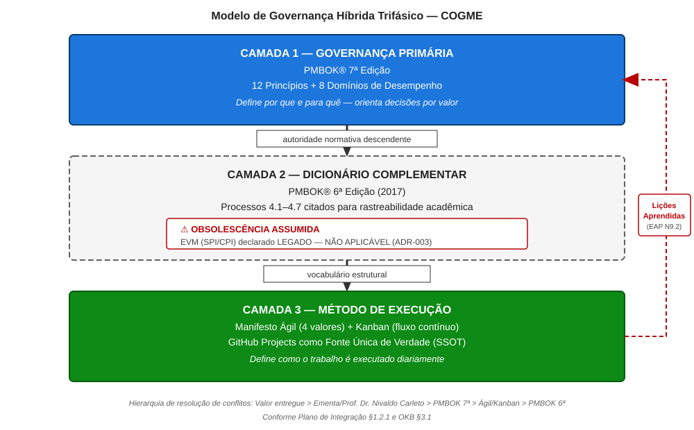
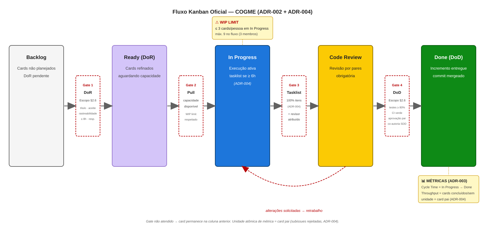
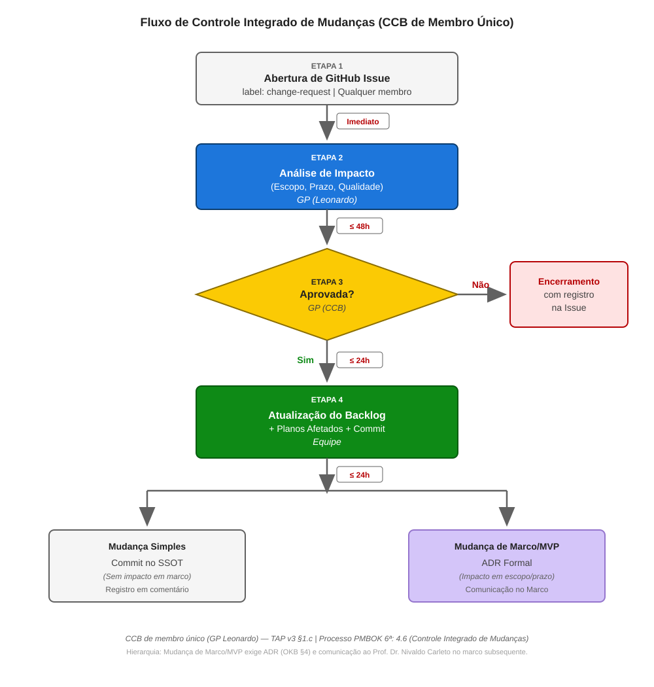

# 1 INTEGRAÇÃO

**Plano de Gerenciamento da Integração**
**Projeto:** COGME — Conversor de Ganhos em Moeda Estrangeira
**Versão:** 2.0
**Data:** 20/09/2026
**Autores:** Leonardo David Silva Setti (GP), Fabricio de Lima Cabral, Edson Luis Silva
**Stakeholder-Avaliador:** Prof. Dr. Nivaldo Carleto — Fatec Taquaritinga / ADS

> *Este plano deriva diretamente das Premissas P1 (governança híbrida), P3 (SDD com LLM), P4 (código como deliverable) e P7 (stakeholder-avaliador único nos marcos), e das Restrições de Cronograma e Custo do TAP, respeitando o Domínio de Abordagem de Desenvolvimento e o Domínio de Trabalho do Projeto do PMBOK® 7ª edição.*

---

## 1.1 Identificação e Propósito

Este Plano de Gerenciamento da Integração coordena a execução integrada do projeto COGME, garantindo que os sete planos de área subsequentes — quatro entregues no marco M1 (Escopo, Cronograma, Custos, Qualidade) e três diferidos para o marco M2 (Recursos, Comunicações, Riscos), conforme a estratégia de entrega faseada da seção 1.4.1 —, o código-fonte e os artefatos de governança permaneçam coerentes com os Objetivos SMART aprovados no TAP.

**Função ontológica:** O TAP *autoriza*; este plano *coordena*. Ele não duplica conteúdo do TAP — define os mecanismos de coerência entre todos os artefatos do ciclo de vida.

- **Domínio PMBOK 7ª:** Abordagem de Desenvolvimento.
- **Processo PMBOK 6ª (dicionário, obsolescência assumida):** 4.2 — Desenvolver o Plano de Gerenciamento do Projeto.

---

## 1.2 Modelo de Governança Híbrida

O projeto adota um modelo trifásico de governança, declarado no TAP (§1.c):

| Camada                   | Fonte Normativa                                                                  | Função no COGME                                              |
| ------------------------ | -------------------------------------------------------------------------------- | -------------------------------------------------------------- |
| Governança primária    | PMBOK® 7ª edição — 12 Princípios + 8 Domínios de Desempenho               | Define*por que* e *para quê*; orienta decisões por valor |
| Dicionário complementar | PMBOK® 6ª edição — processos citados apenas para rastreabilidade acadêmica | Fornece vocabulário estrutural quando necessário             |
| Método de execução    | Manifesto Ágil (4 valores) + Kanban (fluxo contínuo)                           | Define*como* o trabalho é executado diariamente             |

**Figura 1 — Modelo de governança híbrida trifásico do projeto COGME**

Fonte: Elaborado pelos autores (2026).

Nota: A hierarquia normativa é descendente: PMBOK® 7ª (governança primária) → PMBOK® 6ª (dicionário complementar, com obsolescência formalmente declarada) → Manifesto Ágil + Kanban (método de execução via GitHub Projects como SSOT). A seta pontilhada vermelha representa o fluxo de realimentação por lições aprendidas (EAP N9.2).

### 1.2.1 Hierarquia de Resolução de Conflitos

Em caso de conflito entre fontes normativas, aplica-se a seguinte ordem de precedência:

1. Valor entregue ao usuário final (Domínio de Entrega — PMBOK 7ª)
2. Ementa da disciplina + orientação do Prof. Dr. Nivaldo Carleto
3. PMBOK® 7ª edição (princípios e domínios)
4. Manifesto Ágil + Kanban (método de execução)
5. PMBOK® 6ª edição (dicionário de processos)

**Trade-off declarado:** Esta hierarquia favorece velocidade de entrega sobre completude documental, alinhada ao Princípio "Foco em Valor" (PMBOK 7ª) e ao Valor Ágil "Software funcionando sobre documentação abrangente".

### 1.2.2 Papéis de Governança

| Papel                   | Titular                                   | Responsabilidade                                                                                                    |
| ----------------------- | ----------------------------------------- | ------------------------------------------------------------------------------------------------------------------- |
| Gerente de Projeto (GP) | Leonardo David Silva Setti                | Decisor operacional único; CCB de membro único; autoridade para aprovações, rejeições e controle de mudanças |
| Desenvolvedores         | Fabricio de Lima Cabral, Edson Luis Silva | Execução técnica; revisão em pares; self-report de carga horária                                               |
| Stakeholder-Avaliador   | Prof. Dr. Nivaldo Carleto                 | Avaliação acadêmica nos marcos M1–M4; sem ingerência em decisões operacionais                                 |

### 1.2.3 Governança Mínima Viável (GMV)

Todo artefato de governança deve justificar sua existência pelo teste GMV:

| Pergunta                                                             | Se SIM            | Se NÃO                  |
| -------------------------------------------------------------------- | ----------------- | ------------------------ |
| O Prof. Dr. Nivaldo Carleto exigirá este artefato na avaliação?   | Produzir completo | Simplificar ou eliminar  |
| Este artefato evita retrabalho futuro?                               | Produzir          | Avaliar custo-benefício |
| Este artefato é útil para a equipe (não apenas para avaliação)? | Produzir          | Eliminar                 |

Se ≥ 2 respostas forem NÃO, o artefato é candidato a simplificação ou eliminação. Decisão final do GP.

### 1.2.4 Obsolescência do PMBOK 6ª (Declaração Formal)

O PMBOK® 6ª edição (2017) é tratado exclusivamente como dicionário de processos. Processos preditivos são citados apenas para rastreabilidade acadêmica e blindagem terminológica. Métricas EVM (SPI/CPI) são declaradas **LEGADO — NÃO APLICÁVEIS**, substituídas por métricas de fluxo Kanban conforme ADR-003.

---

## 1.3 GitHub Projects como Fonte Única de Verdade (SSOT)

O repositório GitHub e seu módulo GitHub Projects constituem o artefato primário de integração, cronograma e monitoramento, conforme ADR-002. Esta decisão substitui qualquer ferramenta preditiva de planejamento como instrumento ativo.

**Justificativa:** Para uma equipe de 3 pessoas com fluxo contínuo, ferramentas preditivas impõem overhead de manutenção desproporcional ao valor gerado. O Kanban via GitHub Projects fornece visibilidade em tempo real, métricas nativas de fluxo e rastreabilidade automática via commits.

- **Domínio PMBOK 7ª:** Medição + Trabalho do Projeto.
- **Valor Ágil:** "Indivíduos e interações sobre processos e ferramentas."

### 1.3.1 Mapeamento Kanban ↔ Processos PMBOK 6ª

| Coluna Kanban (ADR-002) | Processo PMBOK 6ª                   | Domínio PMBOK 7ª | Regra Operacional                   |
| ----------------------- | ------------------------------------ | ------------------ | ----------------------------------- |
| Backlog                 | 5.2 Coletar Requisitos               | Planejamento       | Card criado com DoR pendente        |
| Ready (DoR)             | 4.3 Orientar Trabalho (preparação) | Trabalho           | DoR atendido; aguardando capacidade |
| In Progress             | 4.3 Orientar e Gerenciar Trabalho    | Trabalho           | WIP limit: máx. 3 cards/pessoa     |
| Code Review             | 4.5 Monitorar e Controlar            | Medição          | Revisão em pares obrigatória      |
| Done (DoD)              | 5.4 Criar EAP (aceite do pacote)     | Entrega            | DoD atendido; commit mergeado       |

**Figura 2 — Fluxo Kanban oficial do projeto COGME com gates de qualidade e WIP limits**

Fonte: Elaborado pelos autores (2026).

Nota: As cinco colunas materializam a ADR-002; os quatro gates (retângulos tracejados vermelhos) materializam os critérios de DoR e DoD do Plano de Escopo §2.6 e a regra de tasklist da ADR-004. Gate não atendido implica permanência do card na coluna anterior. O limite de WIP (3 cards/pessoa; máximo 9 no fluxo) visa à prevenção de burnout (TAP §10, R3). A linha pontilhada entre Code Review e In Progress representa o retorno por alterações solicitadas. Métricas de fluxo conforme ADR-003, com unidade de medida no card pai (subissues formalmente rejeitadas).

### 1.3.2 Regras de Fluxo e Rituais

**Regras de fluxo (ADR-002 e ADR-004):**

- **Pull system:** Cards migram para "In Progress" somente quando há capacidade disponível (WIP limit respeitado).
- **WIP limit:** 3 cards em "In Progress" por pessoa (Domínio de Equipe — prevenção de burnout, R3 do TAP §10).
- **Tasklists Markdown (ADR-004):** Cards com estimativa ≥ 6h ou múltiplos entregáveis devem possuir tasklist no corpo da Issue (mínimo 3, máximo 7 itens; último item obrigatoriamente "Validação final"). Subissues reais são **formalmente rejeitadas** — a unidade atômica de métrica e de backlog permanece o card pai. O card só migra para `Code Review` com 100% dos itens concluídos.
- **SDD com LLM:** Código gerado com apoio de IA passa por revisão humana obrigatória antes do merge. Commits declaram co-autoria.

**Rituais (ADR-002):**

| Ritual            | Formato                            | Cadência | Duração |
| ----------------- | ---------------------------------- | --------- | --------- |
| Daily assíncrona | GitHub Issues                      | Diária   | 15 min    |
| Refinement        | Product Backlog (GitHub Projects)  | Semanal   | 30 min    |
| Retrospectiva     | Risk backlog + lições aprendidas | Quinzenal | 30 min    |

**Nota:** Sprints time-boxed NÃO são utilizadas. O fluxo é contínuo (ADR-002).

### 1.3.3 Milestones e Identificação de Cards

O SSOT opera sobre três mecanismos complementares de organização:

- **Milestones GitHub:** 5 milestones — M1 (22/09), M2 (30/09), Calibração (03/10, auxiliar), M3 (15/11), M4 (15/12). Cada Issue vincula-se a exatamente uma milestone; Issues sem milestone são backlog não planejado. Milestone não é fechada enquanto houver Issues abertas com label `change-request` ou `blocked`.
- **Sistema de tags:** Todo card porta no mínimo 3 labels (1 tipo + 1 macro-fase + 1 área de conhecimento), habilitando filtragem, métricas de fluxo por categoria (ADR-003) e rastreabilidade TAP → EAP → Card. A taxonomia completa (27 labels em 5 categorias) reside na configuração do repositório e não é replicada neste plano (GMV).
- **Padrão de redação (Card Ubíquo):** Todo card é autossuficiente — declara o quê, por quê, como será aceito e a quem pertence, sem exigir leitura de outro artefato. Cards documentais seguem o Padrão A (título `N{X}.{Y} — Descrição`, contexto ubíquo, critérios de aceite binários, rastreabilidade dupla); cards de produto seguem o Padrão B (User Story com critérios Given/When/Then), com aplicação efetiva a partir de M2. A prioridade temporal P0–P3 complementa a classificação MoSCoW (P0 = caminho crítico do marco; P3 = postergável).

---

## 1.4 Desenvolvimento e Manutenção do Plano de Gerenciamento

**Processo PMBOK 6ª (dicionário):** 4.2 — Desenvolver o Plano de Gerenciamento do Projeto.

Os oito planos de área são versionados no repositório GitHub sob `/docs/`. Cada plano:

- Inicia com frase de rastreabilidade ao TAP (Premissa + Restrição + Domínio PMBOK 7ª).
- Possui extensão máxima de 4 páginas (princípio GMV).
- É versionado via Conventional Commits: `docs(plano-integracao): atualização §X`.
- Passa por revisão em pares antes de ser considerado "Done".

**Regra de coerência cruzada:** Nenhum plano pode contradizer datas de marcos (M1–M4), premissas (P1–P8) ou restrições (§8) do TAP. Inconsistências detectadas em revisão acionam correção imediata antes do merge. A hierarquia de autoridade entre artefatos é: **TAP > base de conhecimento operacional > Glossário > ADRs**.

### 1.4.1 Estratégia de Entrega Faseada dos Planos

Conforme o princípio de Elaboração Progressiva (PMBOK 6ª, dicionário) e a Personalização/Tailoring da Abordagem de Desenvolvimento (PMBOK 7ª), a entrega dos planos de gerenciamento é faseada:

| Marco           | Planos Entregues                                                  | Justificativa                                                                                               |
| --------------- | ----------------------------------------------------------------- | ----------------------------------------------------------------------------------------------------------- |
| M1 (22/09/2026) | Integração, Escopo, Cronograma, Custos, Qualidade (Áreas 1–5) | Fundação documental mínima viável; atendimento integral ao critério de aceite do TAP §6 para o M1     |
| M2 (30/09/2026) | Recursos, Comunicações, Riscos (Áreas 6–8)                    | Redigidos após a calibração do fluxo Kanban (23/09–03/10), com dados empíricos de capacidade da equipe |

**Trade-off declarado:** Redução de ~30% da carga documental do M1, permitindo foco na qualidade dos cinco planos fundamentais e na configuração do SSOT. Decisão alinhada ao Domínio de Abordagem de Desenvolvimento e Ciclo de Vida (PMBOK 7ª) e ao princípio GMV (§1.2.3).

---

## 1.5 Orientação e Gestão do Trabalho do Projeto

**Processo PMBOK 6ª (dicionário):** 4.3 — Orientar e Gerenciar o Trabalho do Projeto.
**Domínio PMBOK 7ª:** Trabalho do Projeto.

### 1.5.1 Execução Diária

- Trabalho puxado do backlog conforme capacidade (pull system), respeitando a prioridade temporal P0–P3 e o WIP limit.
- Cada card segue o padrão de redação ubíquo (§1.3.3): título padronizado (ex: `N5.1 — Backend: Lógica de Negócio`), labels obrigatórias, milestone vinculada, responsável e critérios de aceite binários.
- Cards ≥ 6h portam tasklist Markdown conforme ADR-004 (§1.3.2).
- Commits seguem Conventional Commits (`feat`, `fix`, `docs`, `test`, `ci`, `chore`).

### 1.5.2 Gestão do Conhecimento

**Processo PMBOK 6ª (dicionário):** 4.4 — Gerenciar o Conhecimento do Projeto.

- Estrutura de conhecimento: `/docs/` no repositório (planos, diagramas, lições aprendidas, catálogo de prompts SDD).
- Lições aprendidas registradas ao final de cada macro-fase (MF1, MF2, MF3).
- Decisões que afetam ≥ 2 fases da EAP, envolvem troca de tecnologia ou seriam questionadas pelo Prof. Dr. Nivaldo Carleto em avaliação são formalmente registradas via **ADR** (Architecture Decision Record), conforme REQ-12 e fase N9.1 da EAP. Decisões menores ficam em commit messages.

---

## 1.6 Monitoramento e Controle Integrado

**Processo PMBOK 6ª (dicionário):** 4.5 — Monitorar e Controlar o Trabalho do Projeto.
**Domínio PMBOK 7ª:** Medição.

### 1.6.1 Métricas de Fluxo Kanban (Oficiais — ADR-003)

Dada a restrição de orçamento zero (TAP §11), o Earned Value Management é inaplicável. As métricas de desempenho são exclusivamente baseadas no fluxo Kanban:

| Métrica                      | Definição                                        | Meta (pós-calibração) | Frequência   |
| ----------------------------- | -------------------------------------------------- | ------------------------ | ------------- |
| Cycle Time                    | Tempo médio de um card do "In Progress" ao "Done" | ≤ 3 dias                | Semanal       |
| Throughput                    | Cards concluídos por semana                       | ≥ 5 cards/semana        | Semanal       |
| CFD (Cumulative Flow Diagram) | Visualização de gargalos no fluxo                | Sem bandas largas        | Semanal       |
| WIP em fluxo                  | Cards ativos em "In Progress"                      | ≤ 9 (3 × 3 pessoas)    | Contínuo     |
| Coverage                      | Linhas testadas / linhas totais                    | ≥ 80%                   | Por push (CI) |
| Burnout (self-report)         | Carga horária semanal declarada                   | ≤ 20h/pessoa            | Semanal       |

**Definição canônica do CFD (referência para os Planos de Cronograma e Comunicações):** O Cumulative Flow Diagram é a visualização gráfica do fluxo de trabalho acumulado no tempo, onde cada banda horizontal representa uma coluna do quadro Kanban e sua largura instantânea indica a quantidade de cards naquela etapa. Fonte de dados: GitHub Insights. Responsável pela publicação semanal: GP. **CFD saudável:** bandas paralelas de largura constante. **CFD com gargalo:** bandas que se alargam progressivamente. **Ação corretiva:** banda com largura superior a 2× a média das demais por 2 semanas consecutivas aciona Retrospectiva extraordinária (ADR-002).

**Figura 3 — Cumulative Flow Diagram: padrão saudável vs. padrão com gargalo**

Fonte: Elaborado pelos autores (2026).

Nota: O painel (a) ilustra o fluxo estável, no qual as bandas (WIP por coluna) mantêm largura constante e paralela. O painel (b) apresenta a assinatura visual de gargalo na coluna *Code Review*: a taxa de saída torna-se inferior à taxa de entrada, causando alargamento progressivo da banda. A regra de ação corretiva (banda com largura superior a 2× a média das demais por 2 semanas consecutivas aciona Retrospectiva extraordinária) está anotada no próprio diagrama, conforme ADR-002 e ADR-003. Dados simulados para fins didáticos; a baseline real será coletada no período de calibração (23/09 a 03/10/2026) via GitHub Insights.

### 1.6.2 Métricas Legado (Não Aplicáveis — ADR-003)

| Métrica                         | Status    | Justificativa                                               |
| -------------------------------- | --------- | ----------------------------------------------------------- |
| SPI (Schedule Performance Index) | ❌ LEGADO | Inaplicável — fluxo contínuo sem linha de base preditiva |
| CPI (Cost Performance Index)     | ❌ LEGADO | Inaplicável — orçamento zero (AC = 0)                    |
| EVM (Earned Value Management)    | ❌ LEGADO | Inaplicável — escopo emergente + orçamento nulo          |

### 1.6.3 Período de Calibração

De 23/09/2026 a 03/10/2026, as métricas são coletadas sem meta fixa, estabelecendo a baseline empírica de desempenho real da equipe. Após calibração, metas são ajustadas com base na média observada ± 20% e formalizadas via ADR. A milestone auxiliar "Calibração" (03/10) rastreia este período no SSOT sem substituir o M2.

**Trade-off declarado:** Abre-se mão da formalidade EVM em favor de métricas acionáveis e nativas do método, conforme Domínio de Medição (PMBOK 7ª) e ADR-003.

---

## 1.7 Controle Integrado de Mudanças

**Processo PMBOK 6ª (dicionário):** 4.6 — Realizar o Controle Integrado de Mudanças.
**Domínio PMBOK 7ª:** Incerteza.

### 1.7.1 Autoridade de Mudança (CCB)

O Gerente de Projeto (Leonardo David Silva Setti) atua como Change Control Board (CCB) de membro único, com autoridade formal delegada pelo TAP (§1.b, §9 P7). O Prof. Dr. Nivaldo Carleto não participa do fluxo de aprovação de mudanças; sua atuação restringe-se à avaliação acadêmica nos marcos M1–M4.

### 1.7.2 Fluxo de Solicitação de Mudança

| Etapa | Ação                                               | Responsável              | Prazo                    |
| ----- | ---------------------------------------------------- | ------------------------- | ------------------------ |
| 1     | Abertura de GitHub Issue com label`change-request` | Qualquer membro da equipe | Imediato                 |
| 2     | Análise de impacto (escopo, prazo, qualidade)       | GP (Leonardo)             | ≤ 48h                   |
| 3     | Aprovação ou rejeição via comentário na Issue   | GP (Leonardo)             | ≤ 24h após análise    |
| 4     | Atualização do backlog + planos afetados + commit  | Equipe                    | ≤ 24h após aprovação |

**Figura 4 — Fluxo de Controle Integrado de Mudanças do projeto COGME**

Fonte: Elaborado pelos autores (2026).

Nota: O fluxograma materializa o Processo 4.6 do PMBOK 6ª (dicionário) e o Domínio de Incerteza do PMBOK 7ª. O Gerente de Projeto atua como Change Control Board (CCB) de membro único, conforme TAP §1.c e Premissa P7. Os SLAs (≤ 48h para análise, ≤ 24h para decisão e execução) garantem agilidade sem perda de auditabilidade. A bifurcação final distingue mudanças simples (registradas via commit) de mudanças de marco ou escopo do MVP, que exigem Architecture Decision Record (ADR) formal e comunicação ao Prof. Dr. Nivaldo Carleto no marco subsequente.

### 1.7.3 Limiar de Formalidade

- **Mudanças que NÃO alteram marcos (M1–M4) nem escopo do MVP:** Aprovadas pelo GP com registro em commit e comentário na Issue.
- **Mudanças que ALTERAM marcos ou escopo do MVP:** Aprovadas pelo GP com registro formal via ADR e comunicação ao Prof. Dr. Nivaldo Carleto no marco de avaliação subsequente.

**Valor Ágil aplicado:** "Responder a mudanças sobre seguir um plano." O processo é leve, mas auditável.

---

## 1.8 Encerramento do Projeto ou Fase

**Processo PMBOK 6ª (dicionário):** 4.7 — Encerrar o Projeto ou Fase.
**Domínio PMBOK 7ª:** Entrega.

### 1.8.1 Critérios de Encerramento por Macro-Fase

| Macro-Fase          | Período            | Critério de Encerramento                                                                                                                                            |
| ------------------- | ------------------- | -------------------------------------------------------------------------------------------------------------------------------------------------------------------- |
| MF1: Fundação     | 01/09 – 30/09/2026 | TAP aprovado + 5 planos (Áreas 1–5) submetidos no M1 + 3 planos (Áreas 6–8) até o M2 + EAP sincronizada + Stack definida (ADR-001) + Ambiente e CI configurados |
| MF2: Construção   | 01/10 – 15/11/2026 | MVP funcional + ≥ 80% coverage + UAT aprovado + Pipeline CI verde + baseline de métricas calibrada                                                                 |
| MF3: Consolidação | 16/11 – 15/12/2026 | Documentação consolidada + Apresentação final + Validação acadêmica no marco M4 + Tag de release                                                              |

### 1.8.2 Encerramento Formal do Projeto

- Tag de release final no repositório GitHub.
- Lições aprendidas finais consolidadas.
- Verificação dos cinco Objetivos SMART do TAP §3.
- Validação acadêmica pelo Prof. Dr. Nivaldo Carleto no marco M4.

---

## 1.9 Condições de Fracasso e Escalation

Derivado do TAP §3.3 (Condições de Fracasso), os seguintes gatilhos acionam ação corretiva imediata pelo GP:

| Gatilho                                                | Ação                                                                                        |
| ------------------------------------------------------ | --------------------------------------------------------------------------------------------- |
| Desvio > 3 dias úteis em qualquer marco (M1–M4)      | Issue`change-request` + proposta de replanejamento + ADR                                    |
| Coverage < 70% por 2 semanas consecutivas              | Revisão de prioridade de testes + ajuste de escopo                                           |
| Burnout detectado (> 20h/semana por 2 semanas)         | Redução de WIP + redistribuição de cards                                                  |
| Scope creep > 15% do backlog original                  | Congelamento de novas features + CCB (GP)                                                     |
| Throughput < 3 cards/semana por 2 semanas consecutivas | Revisão de WIP limits (fallback ADR-002) + reavaliação do escopo do MVP (fallback ADR-003) |
| MVP não funcional em homologação até M3            | Contingência técnica: redução de escopo não-crítico                                     |

**Nota:** Escalation ao Prof. Dr. Nivaldo Carleto ocorre apenas nos marcos de avaliação ou quando o GP identificar risco de não cumprimento dos critérios SMART do TAP §3.

---

## 1.10 Declaração de Rastreabilidade

| Seção                         | Origem no TAP                            | Domínio PMBOK 7ª           | Processo PMBOK 6ª |
| ------------------------------- | ---------------------------------------- | ---------------------------- | ------------------ |
| 1.2 (Governança)               | §1.c + Premissa P1                      | Abordagem de Desenvolvimento | 4.1, 4.2           |
| 1.3 (SSOT + Milestones + Cards) | Premissa P1 + §3 (Métricas)            | Medição + Trabalho         | 4.3, 4.5           |
| 1.4.1 (Entrega Faseada)         | §6 (Marcos M1/M2)                       | Abordagem de Desenvolvimento | 4.2                |
| 1.5 (Orientação)              | Premissas P3, P4, P5                     | Trabalho do Projeto          | 4.3, 4.4           |
| 1.6 (Monitoramento)             | §3 (Métricas) + §11 (Orçamento zero) | Medição                    | 4.5                |
| 1.7 (Mudanças)                 | §3.3 (Fracasso) + Premissa P7           | Incerteza                    | 4.6                |
| 1.8 (Encerramento)              | §6 (Marcos M1–M4)                      | Entrega                      | 4.7                |
| 1.9 (Escalation)                | §3.3 (Fracasso) + §10 (Riscos)         | Incerteza                    | 4.5, 4.6           |

**Verificação:** 100% das seções possuem rastreabilidade a ao menos uma premissa, restrição ou objetivo SMART do TAP.

---

## 1.11 Premissas e Restrições Aplicáveis

| Tipo              | Referência TAP                         | Impacto neste Plano                     |
| ----------------- | --------------------------------------- | --------------------------------------- |
| Premissa P1       | Governança híbrida                    | Fundamenta 1.2                          |
| Premissa P3       | SDD com LLM autorizado                  | Fundamenta 1.3.2 e 1.5.2                |
| Premissa P5       | ≤ 20h/semana por membro                | Fundamenta 1.3.2 e 1.9                  |
| Premissa P6       | Hardware adequado e suficiente          | Fundamenta 1.3 (viabilidade local)      |
| Premissa P7       | Stakeholder-avaliador único nos marcos | Fundamenta 1.2.2 e 1.7.1                |
| Restrição §8.2 | Prazo letivo inegociável               | Fundamenta 1.4.1 e 1.9                  |
| Restrição §8.4 | Orçamento zero                         | Fundamenta 1.6.2 (inaplicabilidade EVM) |

---

## Controle de Versões

| Versão | Data       | Alteração                                                                                                                                                                                                                                                                                                     | Responsável         |
| ------- | ---------- | --------------------------------------------------------------------------------------------------------------------------------------------------------------------------------------------------------------------------------------------------------------------------------------------------------------- | -------------------- |
| 1.0     | 19/09/2026 | Emissão inicial                                                                                                                                                                                                                                                                                                | Leonardo D. S. Setti |
| 2.0     | 20/09/2026 | Entrega faseada dos planos (§1.4.1); incorporação da ADR-004 (tasklists, §1.3.2); milestones, labels e padrão de cards ubíquos (§1.3.3); definição canônica do CFD (§1.6.1); gatilho de throughput (§1.9); critérios MF1 corrigidos (§1.8.1); 4 pontos de inserção de diagramas (FIG-1 a FIG-4) | Leonardo D. S. Setti |
