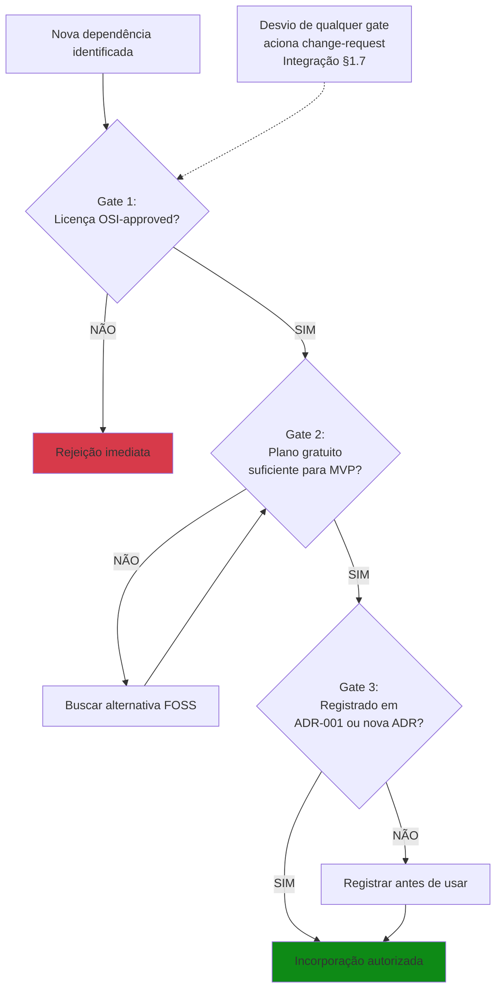

# 4: CUSTOS

**Plano de Gerenciamento de Custos**

**Projeto:** COGME — Conversor de Ganhos em Moeda Estrangeira
**Versão:** 1.2
**Data:** 21/09/2026
**Autores:** Leonardo David Silva Setti (GP), Fabricio de Lima Cabral, Edson Luis Silva
**Stakeholder-Avaliador:** Prof. Dr. Nivaldo Carleto — Fatec Taquaritinga / ADS

---

## 4.1 IDENTIFICAÇÃO E PROPÓSITO

Este Plano de Gerenciamento de Custos estabelece os mecanismos de governança para assegurar que o projeto COGME seja executado dentro da linha de base de custos aprovada: **R$ 0,00 (zero reais)**.

**Fundamentação:** Deriva diretamente das Premissas P2 (FOSS absoluto), P6 (hardware adequado) e **P9 (separação ontológica TAP ≠ EAP ≠ PDCA)**, e das Restrições de Custo do TAP (§8.4 e §11), respeitando os Domínios de Planejamento, Medição e Entrega do PMBOK® 7ª edição.

**Função ontológica:** O plano não duplica a auditoria de licenças (EAP N4.4) nem a seleção de stack (EAP N4.1) — estabelece a **governança** sobre esses artefatos, garantindo que 100% das ferramentas, bibliotecas e serviços permaneçam dentro do perímetro FOSS/Free Tier ao longo de todo o ciclo de vida.

**Domínios PMBOK 7ª:** Planejamento (prevenção de desvios de conformidade), Medição (métricas de conformidade como substituição de EVM) e Entrega (garantia de sustentabilidade econômica do produto).

**Processo PMBOK 6ª (dicionário, obsolescência assumida conforme Integração §1.2.4):** 7.1 Planejar o Gerenciamento de Custos. Os processos 7.2 (Estimar Custos), 7.3 (Determinar Orçamento) e 7.4 (Controlar Custos) são **inaplicáveis** no sentido tradicional, pois:

- Estimativa: não há custos a estimar (todos os recursos são gratuitos)
- Orçamento: linha de base = R$ 0,00
- Controle: métricas EVM (CPI, VAC) são matematicamente indeterminadas (AC = 0), conforme ADR-003

**Trade-off declarado:** Abre-se mão da formalidade de estimativa/orçamento em favor de auditoria contínua de conformidade FOSS, alinhado ao Princípio "Foco em Valor" (PMBOK 7ª) e à Restrição TAP §8.4.

---

## 4.2 ABORDAGEM DE GERENCIAMENTO DE CUSTOS

O gerenciamento de custos do COGME opera em três camadas de prevenção:

| Camada               | Objeto                           | Mecanismo de Controle                                       | Fonte Canônica   |
| -------------------- | -------------------------------- | ----------------------------------------------------------- | ----------------- |
| **Preventiva** | Seleção de stack e ferramentas | ADR-001 + Fase N4.1 (Seleção e Validação da Stack FOSS) | ADR-001; EAP N4.1 |
| **Normativa**  | Política de licenciamento       | Whitelist/blacklist de licenças (§4.5.1)                  | EAP N1.4          |
| **Detectiva**  | Auditoria de licenças           | Fase N4.4 (Auditoria de Licenças) + checklist OSI-approved | EAP N4.4          |

**Regra de ouro:** Nenhuma ferramenta, biblioteca, API ou serviço pode ser incorporado ao projeto sem:

1. Verificação de licença OSI-approved (whitelist §4.5.1)
2. Confirmação de plano gratuito suficiente para o MVP acadêmico
3. Registro na ADR-001 ou em ADR específica (se mudança de stack)

**Hierarquia de resolução de conflitos (aplicada a custos):**

1. Conformidade FOSS (restrição TAP §8.4)
2. Funcionalidade do MVP (TAP §3 — Produto)
3. Conveniência técnica (preferência do desenvolvedor)

**[FIG-1 — Fluxo de Prevenção de Custos]**
*Inserção obrigatória — Formato: Mermaid `flowchart TD`*

*Conteúdo:* Fluxograma vertical com três gates sequenciais e anotação sobre change-request.
*Necessidade real:* Materializa visualmente o mecanismo de prevenção de custos, demonstrando ao avaliador que "custo zero" não é ausência de governança, mas governança rigorosa sobre conformidade FOSS.

---

## 4.3 LINHA DE BASE DE CUSTOS

Conforme TAP §11, a linha de base de custos é:

| Categoria                   | Valor Aprovado    | Justificativa                                                                                                                              |
| --------------------------- | ----------------- | ------------------------------------------------------------------------------------------------------------------------------------------ |
| Recursos Humanos            | R$ 0,00           | Esforço acadêmico voluntário (3 membros)                                                                                                |
| Software e Ferramentas      | R$ 0,00           | 100% FOSS ou Free Tier (TAP §3 — Inovação)                                                                                             |
| Infraestrutura e Hospedagem | R$ 0,00           | Ambiente local/homologação (sem cloud paga)                                                                                              |
| Reserva de Contingência    | R$ 0,00           | Inaplicável — linha de base zero inviabiliza reserva financeira; riscos de custo mitigados por substituição FOSS (Plano de Riscos, M2) |
| Reserva de Gerenciamento    | R$ 0,00           | Inaplicável — mesma razão                                                                                                               |
| **TOTAL**             | **R$ 0,00** | Linha de base imutável sem CCB                                                                                                            |

**Regra de imutabilidade:** A linha de base só pode ser alterada via `change-request` + aprovação do CCB (GP como membro único, TAP v3 §1.c) + ADR + comunicação ao Prof. Dr. Nivaldo Carleto no marco subsequente (Integração §1.7.3).

**Premissa crítica (P2):** A disponibilidade contínua de ferramentas FOSS e Free Tier é assumida como verdadeira. Caso uma ferramenta essencial migre para modelo pago durante o projeto, aciona-se:

1. Busca imediata de alternativa FOSS equivalente
2. Se inexistente, redução de escopo (remoção da funcionalidade dependente)
3. Registro em ADR + lição aprendida

---

## 4.4 ESTRATÉGIAS DE MEDIÇÃO E CONTROLE

Dada a inaplicabilidade de EVM (Earned Value Management) — formalmente declarada como LEGADO na ADR-003 e na Integração §1.6.2, pois AC = 0 torna CPI e VAC matematicamente indeterminados —, o controle de custos opera por **métricas de conformidade**:

| Métrica                             | Fórmula/Definição                                                    | Meta                        | Frequência                                                          | Responsável     |
| ------------------------------------ | ----------------------------------------------------------------------- | --------------------------- | -------------------------------------------------------------------- | ---------------- |
| **% Dependências Auditadas**  | (Dependências com licença verificada / Total de dependências) × 100 | 100%                        | Por commit (CI, conforme pipeline definido no Plano de Integração) | Pipeline + GP    |
| **Desvios de Licenciamento**   | Número de dependências com licença não-OSI ou incompatível         | 0                           | Contínuo                                                            | GP               |
| **Custo Financeiro Acumulado** | Soma de todos os gastos realizados                                      | R$ 0,00                     | Semanal                                                              | GP (self-report) |
| **Alternativas FOSS Mapeadas** | Número de ferramentas críticas com ≥1 alternativa FOSS identificada  | ≥2 por ferramenta crítica | M2                                                                   | Equipe           |

**Gatilhos de ação corretiva:**

- Se `% Dependências Auditadas` < 100% → bloqueio de merge até auditoria concluída
- Se `Desvios de Licenciamento` > 0 → remoção imediata da dependência + `change-request`
- Se `Custo Financeiro Acumulado` > R$ 0,00 → reembolso imediato pela equipe + lição aprendida

## 4.5 REGRAS DE CONFORMIDADE FOSS

### 4.5.1 Licenças Aprovadas (Whitelist)

Apenas as seguintes licenças são permitidas no projeto COGME, conforme ADR-001 e EAP N1.4:

| Licença                                   | Família          | Restrições                                                                    |
| ------------------------------------------ | ----------------- | ------------------------------------------------------------------------------- |
| MIT                                        | Permissiva        | Nenhuma                                                                         |
| Apache 2.0                                 | Permissiva        | Nenhuma                                                                         |
| BSD (2-clause, 3-clause)                   | Permissiva        | Nenhuma                                                                         |
| GPL v2/v3                                  | Copyleft          | Exige que derivativos também sejam GPL (aceitável para MVP acadêmico)        |
| LGPL                                       | Copyleft fraco    | Incluída para completude da whitelist FOSS acadêmica; sem uso previsto no MVP |
| ISC                                        | Permissiva        | Equivalente à MIT                                                              |
| **PSF (Python Software Foundation)** | Permissiva        | **Adicionada para Python 3.11 (ADR-001)**                                 |
| **Public Domain**                    | Domínio público | **Adicionada para SQLite (ADR-001)**                                      |

**Licenças proibidas (Blacklist):**

- ❌ Proprietárias / Comerciais
- ❌ Shareware / Freeware (sem código-fonte)
- ❌ Creative Commons (não é licença de software)
- ❌ Licenças "Source Available" não-OSI (ex: SSPL, BSL)
- ❌ Licenças com restrições de uso comercial (violam definição OSI)

### 4.5.2 Governança da Auditoria de Licenças

**Delimitação de fronteiras (Área 4 vs Área 5):** Este plano estabelece a governança sobre conformidade FOSS (prevenção de custos ocultos por licenciamento inadequado), enquanto o Plano de Qualidade (Área 5) governa testes automatizados, coverage ≥ 80% e UAT (REQ-08 a REQ-10). A auditoria de licenças é compartilhada operacionalmente, mas a definição de whitelist/blacklist e os gatilhos de conformidade pertencem exclusivamente a esta Área de Custos, por derivação direta da Restrição TAP §8.4.

A execução operacional da auditoria de licenças é realizada pela **Fase N4.4 da EAP** (conforme Plano de Escopo §2.5), fundamentada na **Política de Licenciamento da Fase N1.4**. Este plano não duplica procedimentos operacionais de auditoria — estabelece a governança sobre N1.4 e N4.4:

| Aspecto de Governança                  | Definição                                                                            |
| --------------------------------------- | -------------------------------------------------------------------------------------- |
| **Responsável pela execução**  | Equipe técnica (conforme EAP N4.4)                                                    |
| **Responsável pela supervisão** | GP                                                                                     |
| **Frequência mínima**           | Por marco (M1–M4) + revalidação a cada nova dependência                            |
| **Artefato de saída**            | `/docs/dependencias/registro.md` (conforme EAP N4.4)                                 |
| **Critério de aceite**           | 100% das dependências com licença OSI-approved verificada                            |
| **Gatilho de escalation**         | Qualquer dependência não-conforme →`change-request` imediato (Integração §1.7) |

**[FIG-2 — Matriz de Rastreabilidade de Dependências]**
*Inserção obrigatória — Formato: Tabela Markdown*

| Dependência   | Versão   | Licença               | Conformidade | EAP N1.4/N4.4 | ADR-001 |
| -------------- | --------- | ---------------------- | ------------ | ------------- | ------- |
| FastAPI        | ≥0.100   | MIT                    | ✅           | N4.4          | ✅      |
| SQLite         | 3.x       | Public Domain          | ✅           | N4.4          | ✅      |
| WeasyPrint     | ≥59.0    | BSD-3                  | ✅           | N4.4          | ✅      |
| pytest         | ≥7.0     | MIT                    | ✅           | N4.4          | ✅      |
| GitHub Actions | Free Tier | Proprietário gratuito | ✅           | N1.4          | ✅      |
| llama.cpp      | 0.4.0-dev | MIT                    | ✅           | N4.4          | ✅      |

*Conteúdo:* Tabela visual com 6 exemplos reais da stack, usando ícones ✅ para conformes.
*Necessidade real:* Demonstra ao avaliador que "custo zero" é auditável e rastreável, não apenas declarado.

---

## 4.6 GESTÃO DE MUDANÇAS DE CUSTOS

Qualquer alteração que possa impactar a linha de base de custos (mesmo que o impacto seja R$ 0,00) segue o fluxo do Plano de Integração §1.7:

| Tipo de Mudança                                         | Exemplo                                                      | Nível de Formalidade                                                   |
| -------------------------------------------------------- | ------------------------------------------------------------ | ----------------------------------------------------------------------- |
| **Adição de dependência FOSS**                  | Incluir biblioteca`httpx` para chamadas HTTP assíncronas  | Registro em commit + atualização de`/docs/dependencias/registro.md` |
| **Troca de ferramenta FOSS**                       | Substituir FastAPI por Flask                                 | ADR específica (gatilho G2 — irreversibilidade prática)              |
| **Mudança de licença de dependência existente** | Biblioteca X migra de MIT para licença proprietária        | `change-request` + substituição imediata + ADR                      |
| **Violação acidental de conformidade**           | Dependência com licença não-OSI incorporada sem auditoria | `change-request` + remoção + lição aprendida                      |

**Regra de escalation:** Se uma dependência crítica (ex: FastAPI, SQLite) mudar de licença para não-FOSS durante o projeto, e não houver alternativa viável:

1. GP aciona `change-request` imediato
2. Avalia redução de escopo (remoção da funcionalidade dependente)
3. Comunica ao Prof. Dr. Nivaldo Carleto no marco subsequente
4. Registra como risco materializado (Plano de Riscos, M2)

---

## 4.7 PREMISSAS E RESTRIÇÕES APLICÁVEIS

**Premissas:**

- P2 (FOSS absoluto): Todas as ferramentas necessárias estão disponíveis sob licenças OSI-approved
- P6 (Hardware adequado): Não há necessidade de infraestrutura de nuvem paga
- **P9 (Separação ontológica):** O TAP é referência autorizativa congelada; este plano é leitura operacional que pode divergir textualmente sem constituir correção do TAP
- PA-C1 (Free Tier sustentável): APIs e serviços gratuitos (ex: GitHub Actions Free Tier) permanecem disponíveis durante todo o ciclo de vida

**Restrições:**

- TAP §8.4: Proibição absoluta de aquisições pagas
- TAP §11: Linha de base de custos = R$ 0,00 (imutável sem CCB)
- TAP §3 (Inovação): 100% das ferramentas devem ser FOSS ou Free Tier

---

## 4.8 CONDIÇÕES DE FRACASSO E ESCALATION

Derivadas do TAP §3.3, com distinção entre gatilhos de alerta preventivo (internos) e condições formais de fracasso (TAP):

| Tipo                        | Gatilho                                     | Limiar         | Ação                                        | Base         |
| --------------------------- | ------------------------------------------- | -------------- | --------------------------------------------- | ------------ |
| **Alerta preventivo** | Dependências não-OSI detectadas           | > 5%           | Auditoria emergencial + substituição ≤ 48h | GP (interno) |
| **Fracasso formal**   | Dependências incompatíveis com FOSS       | > 30%          | Condição de não sucesso do projeto         | TAP §3.3.e  |
| **Alerta preventivo** | Custo financeiro > R$ 0,00                  | Qualquer valor | Reembolso imediato + lição aprendida        | GP (interno) |
| **Alerta preventivo** | Dependência crítica sem alternativa FOSS  | 1 ocorrência  | Redução de escopo + ADR ≤ 72h              | GP + CCB     |
| **Fracasso formal**   | Falha na auditoria em 2 marcos consecutivos | 2 marcos       | Revisão de processo + treinamento            | GP           |

**Nota de reconciliação (NC-C2):** O limiar de 5% é um gatilho de alerta preventivo interno, mais restritivo que a condição formal de fracasso do TAP §3.3.e (30%). A intenção é detectar desvios precocemente, permitindo ação corretiva antes que o limiar formal seja atingido. Trade-off: maior rigor operacional em troca de margem de segurança.

---

## 4.9 DECLARAÇÃO DE RASTREABILIDADE

| Seção                  | Origem no TAP                           | Domínio PMBOK 7ª           | Processo PMBOK 6ª      |
| ------------------------ | --------------------------------------- | ---------------------------- | ----------------------- |
| 4.1 (Propósito; freeze) | §11 + §8 + Premissa P9                | Planejamento + Entrega       | 7.1                     |
| 4.2 (Abordagem)          | §3 (Inovação) + §8 + EAP N1.4, N4.1 | Abordagem de Desenvolvimento | 7.1                     |
| 4.3 (Linha de Base)      | §11 (Orçamento Zero)                  | Planejamento                 | 7.3                     |
| 4.4 (Métricas)          | §3 (Métricas) + §11 + ADR-003        | Medição                    | 7.4 (substituição)    |
| 4.5 (Conformidade FOSS)  | §3 (Inovação) + §8 + ADR-001        | Entrega                      | 8.3 (controle aplicado) |
| 4.6 (Mudanças)          | §3.3 + §10 + Integração §1.7       | Incerteza                    | 4.6 + 7.4               |
| 4.8 (Fracasso)           | §3.3.e (30%) + §3.2.b                 | Incerteza + Entrega          | 7.4                     |

**Verificação:** 100% das seções possuem rastreabilidade a ao menos uma premissa, restrição ou objetivo SMART do TAP.

---

## 4.10 NOTAS DE CONTEXTO E REGISTRO DE SANEAMENTO DOS ARTEFATOS VIVOS

**NC-C1 — Inaplicabilidade de Processos 7.2–7.4 do PMBOK 6ª:**
Este plano declara formalmente que os processos "Estimar Custos" (7.2), "Determinar Orçamento" (7.3) e "Controlar Custos" (7.4) são inaplicáveis no sentido tradicional, pois a linha de base é R$ 0,00. O plano substitui estes processos por: (a) governança sobre conformidade FOSS (N1.4 + N4.4), (b) prevenção de desvios de licenciamento, (c) métricas de conformidade (§4.4). Esta substituição é fundamentada na ADR-003 (EVM LEGADO) e é defensável academicamente pelo Domínio de Medição do PMBOK 7ª (métricas adaptadas ao contexto) e pela Restrição TAP §11.

**NC-C2 — Delimitação de Fronteiras (Área 4 vs Área 5 vs Escopo):**
A Fase N1.4 (Política de Licenciamento FOSS) e a Fase N4.4 (Auditoria de Licenças) são os artefatos canônicos de execução da conformidade FOSS. Este plano de custos estabelece exclusivamente a governança sobre N1.4 e N4.4 (whitelist/blacklist, gatilhos, métricas, escalation), sem duplicar procedimentos operacionais. Invasão de escopo prevenida por referência cruzada: "Conforme EAP N1.4 (política) e N4.4 (auditoria), governado por este plano §4.5". O Plano de Qualidade (Área 5) governa critérios de aceite de testes (coverage ≥ 80%, UAT), não conformidade de licenças.

**NC-C3 — Numeração de Processos no Glossário:**
O Glossário registra incorretamente "Processo 6.4 Estimar Custos". A numeração canônica é: Área 7 (Custos), Processo 7.2 (Estimar Custos). Esta inconsistência é registrada para saneamento na próxima revisão do Glossário (pós-M1).

**NC-C4 — Regime de Freeze do TAP (Diretriz D3):**
O TAP é referência autorizativa congelada (última versão: 18/09/2026, anterior a todos os planos). Divergências textuais entre este plano e o TAP são leituras operacionais, não correções do termo autorizativo. Toda divergência é registrada como Nota de Contexto nesta seção. Fontes: TAP Controle de Versões; Premissa P9; Glossário §11; PMBOK 6ª §4.1.

---

## CONTROLE DE VERSÕES

| Versão       | Data                 | Alteração                                                                                                                                                                                                                                                                                                                                                                                                                                                                                                                                                                                                | Responsável                   |
| ------------- | -------------------- | ---------------------------------------------------------------------------------------------------------------------------------------------------------------------------------------------------------------------------------------------------------------------------------------------------------------------------------------------------------------------------------------------------------------------------------------------------------------------------------------------------------------------------------------------------------------------------------------------------------- | ------------------------------ |
| 1.0           | 21/09/2026           | Emissão inicial: abordagem de custo zero, conformidade FOSS, métricas de substituição de EVM, FIG-1 e FIG-3                                                                                                                                                                                                                                                                                                                                                                                                                                                                                            | Leonardo D. S. Setti           |
| 1.1           | 21/09/2026           | Revisão crítica: P9 e Domínio de Medição incluídos; §4.5.2 reescrita como governança sobre N4.4 — zero invasão de escopo; remapeamento §4.9 de 8.3 para 7.1 + nota de interface com Qualidade; NC-C4 (freeze do TAP) adicionada; referência ao Plano de Integração no pipeline CI; reservas rejustificadas; ADR-003 referenciada; LGPL rejustificada; CCB com fonte TAP v3 §1.c; gatilho de marcos ajustado para 1; ADR-001 com status "quando emitida"                                                                                                                                     | Leonardo D. S. Setti           |
| **1.2** | **21/09/2026** | **Refinamento final:** N1.4 adicionada como fonte canônica junto a N4.4; whitelist expandida com PSF e Public Domain (ADR-001); delimitação de fronteiras com Qualidade inserida; FIG-2 reclassificada de "opcional" para "excluída" com justificativa GMV; NC-C2 aprimorada com reconciliação entre gatilho preventivo (5%) e fracasso formal (30%); tabela de abordagem expandida com coluna "Fonte Canônica"; seção 4.8 reestruturada com distinção alerta/fracasso; FIG-3 com exemplos reais da stack; texto não aderente removido; organização definitiva de tópicos e diagramas | **Leonardo D. S. Setti** |

---
